# PACT — Product Requirements Document
### The Accountability Layer for Human Behavior

**Version:** 1.0 — Implementation Ready
**Status:** Pre-seed / pre-build
**Audience:** Founding team, senior engineers, autonomous coding agents, design partners, compliance counsel
**Working name:** PACT (see §0 — recommended rename: **Cinch**)

> **Building now?** Read **Appendix A** first. It defines the lean v0 configuration (Supabase + Anthropic + GitHub only) and overrides §25.1, §36 Phases 0–4, and the auth parts of §26.

---

## How to read this document

This PRD is written to be executed, not admired. Three audiences use it differently:

| Audience | Read | Skip |
|---|---|---|
| Founder / design partner | §0–§3, §7, §22, §24, §39 | §26–§29 |
| Product designer | §3, §5, §10–§13, §18–§20 | §25–§29 |
| Senior engineer | §5–§8, §15, §25–§30, §36–§37 | §11–§13 |
| Coding agent | §24, §25, §26, §27, §28, §29, §36, §37, §38 | narrative sections |
| Compliance counsel | §7, §8, §16, §17, §22, and every ⚖️ flag | everything else |

**⚖️ symbol** marks a point that requires named legal review before code ships. There are 41 of them. They are not decorative.

**Opinionated stance:** wherever multiple paths exist, this document picks one and says why. Alternatives are listed as "rejected" with the reasoning, not as open options. Reopen them with evidence, not preference.

---

## Table of Contents

0. [Naming](#0-naming)
1. [Product Vision](#1-product-vision)
2. [Target Users](#2-target-users)
3. [Core Product Loop](#3-core-product-loop)
4. [AI Commitment Builder](#4-ai-commitment-builder)
5. [Commitment Types & Rules Engine](#5-commitment-types--rules-engine)
6. [Verification Engine](#6-verification-engine)
7. [Money & Stakes System](#7-money--stakes-system)
8. [Disputes](#8-disputes)
9. [Reputation System](#9-reputation-system)
10. [Social Graph](#10-social-graph)
11. [Viral Growth](#11-viral-growth)
12. [Gamification](#12-gamification)
13. [Commitment Marketplace](#13-commitment-marketplace)
14. [AI Accountability Coach](#14-ai-accountability-coach)
15. [Predictive Accountability](#15-predictive-accountability)
16. [Group Accountability](#16-group-accountability)
17. [Smart Contract / Crypto Version](#17-smart-contract--crypto-version)
18. [UX / UI — Screen by Screen](#18-ux--ui--screen-by-screen)
19. [Home Screen](#19-home-screen)
20. [Notifications](#20-notifications)
21. [Edge Cases](#21-edge-cases)
22. [Safety & Ethical Constraints](#22-safety--ethical-constraints)
23. [Monetization](#23-monetization)
24. [MVP](#24-mvp)
25. [Technical Architecture](#25-technical-architecture)
26. [Database Schema](#26-database-schema)
27. [Commitment State Machine](#27-commitment-state-machine)
28. [API Design](#28-api-design)
29. [Event System](#29-event-system)
30. [Security](#30-security)
31. [Analytics](#31-analytics)
32. [Experimentation](#32-experimentation)
33. [Competitive Landscape](#33-competitive-landscape)
34. [Moat](#34-moat)
35. [Roadmap](#35-roadmap)
36. [Coding Agent Implementation Plan](#36-coding-agent-implementation-plan)
37. [Repository Structure](#37-repository-structure)
38. [User Stories & Acceptance Criteria](#38-user-stories--acceptance-criteria)
39. [Final Product Recommendation](#39-final-product-recommendation)

---
---

# 0. NAMING

## 0.1 What the name has to do

The name carries four jobs, in priority order:

1. **Legal positioning.** The name is the first thing a payment processor's risk team, an App Store reviewer, and a state regulator will read. A name that sounds like wagering ("Ante," "Wager," "Stakes," "OddsOn") invites a gambling classification before anyone reads the terms. This alone eliminates roughly a third of the obvious candidates.
2. **Verb-ability.** Consumer network products win when the name becomes a verb or a noun users say to each other: "Venmo me," "we're on Strava." The name needs a natural sentence: "_____ me on this."
3. **Emotional register.** The product's emotional core is *self-binding with friends* — half-serious, half-playful. Too solemn ("Covenant," "Oath") and it feels churchy. Too cute ("Pinky") and no one stakes $100.
4. **Room to become infrastructure.** The long game is an accountability API. "GymBet" cannot become infrastructure. The name must survive the jump from consumer app to protocol.

**Problem with "PACT":** semantically perfect, commercially crowded. There are existing apps, a large apparel brand, a well-known NGO, and multiple SaaS products named Pact. The .com is gone, App Store search is contaminated, and it is nearly unregisterable in class 9/36/42. It also lacks a verb form ("pact me" doesn't work).

## 0.2 Twenty candidate names

| # | Name | Register | Verb form | Legal read | Notes |
|---|---|---|---|---|---|
| 1 | **Cinch** | Playful-serious | "cinch it" | Clean | Tighten a strap + "it's a cinch." Dual meaning is the whole product. |
| 2 | **Ballast** | Serious | "ballast your week" | Clean | Weight you add on purpose to stay upright. Infra-grade. |
| 3 | **Bond** | Serious | "post a bond" | Clean-ish | Bail bonds = money returned for showing up. Perfect legal analogy. Very generic. |
| 4 | **Reckon** | Confident | "reckon me" | Clean | Day of reckoning + reckoning as accounting. Southern warmth. |
| 5 | **Onus** | Sharp | "the onus is on me" | Clean | Short, means burden of responsibility. Slightly cold. |
| 6 | **Uphold** | Serious | "uphold it" | Clean | Literal. Slightly SaaS-flavored. |
| 7 | **Tether** | Neutral | "tether to Jake" | ⚠️ Collides with the stablecoin | Strong metaphor, fatal crypto collision. |
| 8 | **Keeper** | Warm | "be a keeper" | Clean | Keeper of your word. Also sports/fantasy connotation. |
| 9 | **Clause** | Cool/technical | "add a clause" | Clean | Programmable-contract energy. Cold for consumers. |
| 10 | **Anchor** | Serious | "anchor it" | Clean | Heavily used in fintech/banking already. |
| 11 | **Sworn** | Dramatic | "sworn on it" | Clean | Great logo, slightly courtroom. |
| 12 | **Handshake** | Warm | "handshake on it" | Clean | Collides with a large crypto/DNS project. |
| 13 | **Follow** | Ambiguous | "follow through" | Clean | Too generic, social-network collision. |
| 14 | **Rivet** | Industrial | "rivet it" | Clean | Memorable, mechanical, a bit hard. |
| 15 | **Vouch** | Social | "vouch for me" | Clean | Emphasizes the *partner* side beautifully. |
| 16 | **Attest** | Formal | "attest it" | Clean | Verification-forward, enterprise-leaning. |
| 17 | **Deadman** | Edgy | — | Clean | Deadman's switch. Too morbid for consumer. |
| 18 | **Lockstep** | Group-oriented | "in lockstep" | Clean | Great for team/group mode, weak for solo. |
| 19 | **Nudge** | Soft | "nudge me" | Clean | Owned conceptually by Thaler; too soft for staked money. |
| 20 | **Consequence** | Blunt | — | Clean | Honest but grim; long. |

**Explicitly rejected on legal grounds:** Ante, Wager, Stake(s), Parlay, OddsOn, PayUp, Forfeit (also an existing competitor), DoubleOrNothing, SkinInTheGame.

## 0.3 The best five, with positioning

### 1. **Cinch** — *recommended*
> **Positioning:** "Cinch it." The product is the strap you tighten around a promise.

The only candidate that carries the product's exact emotional duality: *cinch* means both to fasten tightly and "an easy thing." That is the entire user promise — make it binding, and it becomes easy. One syllable, spelled the way it sounds, verb-native, and it socializes cleanly ("cinch me on this," "who's cinching with me?"). It is warm enough for a 20-year-old and neutral enough to appear on a bank statement without alarming a risk analyst. Consumer-fintech naming precedent (Venmo, Cash App, Chime, Dave) rewards short, plain, slightly playful. It also scales to infrastructure: *Cinch Protocol*, *cinch.dev*, "verified by Cinch."
**Risk:** somewhat crowded in home-services and auto ("Cinch Home Services," "Cinch" car marketplace UK) — different classes, so trademark is workable in 9/42 but needs clearance. ⚖️

### 2. **Ballast**
> **Positioning:** "Add weight on purpose." For the serious, infrastructure-first version.

If the company decides its center of gravity is the *behavioral graph and verification API* rather than the consumer app, Ballast is the better name. It is a physics metaphor for exactly what a stake does: deliberately added weight that keeps you from capsizing. It reads credible to enterprise buyers and investors, has a beautiful mark (a keel line, a weighted circle), and has zero gambling adjacency. Weaker as a verb, weaker with 19-year-olds.

### 3. **Bond**
> **Positioning:** "Post a bond on yourself." The legally perfect name.

A bond is money you put up to guarantee you'll show up, returned when you do. That is *literally* the product's compliance architecture (§7). Naming the product after its own legal structure is a durable advantage: it teaches regulators, processors, and users the right mental model in one word. It is also warm — a bond between friends. **Fatal weakness:** unownable as a bare word. Viable only as a compound (Bondwork, Postbond, Bonded) which sacrifices the elegance.

### 4. **Vouch**
> **Positioning:** "Someone's watching." Centers the accountability partner, not the money.

The single best name if the company decides the *social* layer matters more than the *financial* layer — which is a defensible strategic bet, since §32's experiment list may well show that partner presence outperforms stake size. "Vouch for me" is a natural sentence a user says to a friend, which is the exact viral action. It also names the reputation product perfectly ("Vouch Score"). Weakness: it de-emphasizes the stake, which is the product's sharpest differentiator.

### 5. **Reckon**
> **Positioning:** "Every promise has a reckoning."

The most distinctive brand voice of the five. Carries consequence without menace, has an unmistakable moment-of-truth connotation, and the double meaning (to reckon = to calculate/settle accounts) maps to the ledger. Excellent for a bold, high-contrast visual identity. Weakness: regionally coded (reads as American Southern/Western), and "reckon me" is not a natural verb phrase.

**Decision: rename to Cinch before launch. Keep PACT as the internal codename until trademark clearance completes.** This document continues to use PACT for readability.

---
---

# 1. PRODUCT VISION

## 1.1 The core problem

People reliably know what they should do and reliably do not do it. This is not an information problem, a motivation problem, or a tooling problem. It is a **commitment device problem**.

Behavioral economics has a precise name for the gap: *present bias*. At 10pm on Tuesday, the version of you making plans values Wednesday's 6am gym session highly. At 5:52am Wednesday, a different decision-maker — one with a warm bed and a discounted view of the future — is holding the controls. The 10pm self has no way to bind the 5:52am self. Every intention-formation tool ever built (calendars, to-do lists, habit trackers, vision boards) serves the 10pm self. Almost nothing serves the problem of *binding* the 5:52am self.

The classical solution is the **commitment contract** — Odysseus lashed to the mast. It works: the academic literature on commitment devices is unusually strong for behavioral research. Savings commitment products (SEED in the Philippines), smoking-cessation deposit contracts (CARES), and gym-attendance incentive studies consistently show large, durable effects when three ingredients are present:

1. **A pre-committed consequence** the future self cannot unilaterally revoke.
2. **A third party** who observes and enforces.
3. **Verification** the committer cannot trivially fake.

No consumer product delivers all three. The infrastructure to do so — precise location, health data, calendar access, computer vision, instant payments — has only existed at consumer scale for about five years, and no one has assembled it.

## 1.2 Product thesis

> **A promise becomes real the moment it has a witness, a deadline, and a price. PACT is the machine that gives every promise all three.**

The thesis has three claims, each independently falsifiable:

**Claim 1 — Verification is the product, not the money.** Every prior attempt at this category (StickK, Beeminder, Forfeit) relies on self-reported or honor-system outcomes. Self-report destroys the commitment: if you can lie, you haven't bound yourself, you've bought a subscription to a guilt feeling. Automated, adversarially-robust verification converts a self-help ritual into an actual contract. **This is the technical moat and the reason the company is hard to build.**

**Claim 2 — Social presence does more work than money, but money makes social presence legible.** The $20 is not primarily a financial incentive; $20 changes almost no one's economic situation. The $20 is a **costly signal** that makes the commitment *legible and real to another person*. It converts "I'll probably go to the gym" into an event Jake now has a stake in and will notice. The money is a social protocol, not a financial one. This distinction drives most of the product design and all of the compliance design.

**Claim 3 — Commitments are inherently multiplayer, so distribution is free.** Every commitment requires at least one other human. The core action *is* the invite. This is the structural property that separates PACT from every habit tracker: habit trackers are solo, so they must buy users; PACT users bring their own enforcers.

## 1.3 Why existing habit trackers fail

| Product category | Failure mode | Why it's structural |
|---|---|---|
| Habit trackers (Streaks, Habitica, Way of Life) | Zero cost to lie; zero cost to quit | The checkbox is under the user's control. Marking "done" is easier than doing. The app has no opinion about truth. |
| Streak apps | Streak loss punishes, but only *after* value accrues | Retention comes from sunk cost, not behavior change. Day-1 user has nothing to lose, so activation is terrible. |
| Solo commitment contracts (Beeminder) | Great mechanics, no social layer, engineer-only UX | Beeminder is correct and beloved by ~thousands. It never crossed to consumer because it demanded that users be their own quantified-self data engineer. |
| StickK | Human referee, honor-system, 2008 web UX | Referee friction is enormous. Verification depends on a friend clicking a link days later. Most contracts silently die. |
| Fitness social (Strava) | Verification is excellent, but there is no *commitment* — only reporting | Strava tells you what you did. It never tells you what you said you'd do. Retroactive social proof ≠ prospective binding. |
| Corporate wellness | Extrinsic rewards, no personal ownership, opt-in tourism | Employer-funded incentives crowd out intrinsic motivation and generate compliance theater. |
| Betting/challenge apps (HealthyWage, DietBet) | Structured as wagers; narrow (weight loss); heavy compliance exposure | Prize-pool architecture is legally fragile and only works for a single outcome type. |
| AI coaching apps | Advice without consequence | An LLM telling you to go to the gym is a strictly worse version of your own inner monologue. |

The pattern: **every existing product optimizes intention-setting or after-the-fact reporting. None of them close the loop between the two with enforcement.**

## 1.4 Why social accountability changes behavior

Three distinct mechanisms, which the product should activate separately:

1. **Observation effect.** Behavior changes when observed, even by one person, even asynchronously. The product's job is to make the partner's attention *feel present at the decision moment* (5:52am), not at review time.
2. **Reputation stake.** People will pay more to avoid looking unreliable than to gain $20. The reputation layer (§9) is therefore a *stronger* incentive than the money layer for most users, and it is free to operate.
3. **Reciprocal obligation.** When Jake agrees to be your partner, he has spent something (attention, a moment of care). Failing becomes a small betrayal of Jake, not just of yourself. This is why *partner-accepted* commitments must outperform solo ones — and why the accept step should never be optional in the core flow.

## 1.5 Why financial consequences increase commitment

Loss aversion means a $25 downside is subjectively worth roughly a $50 upside. But the deeper reason to include money is **irreversibility**: an intention with a price attached cannot be renegotiated by the 5:52am self without a felt cost. Money is the cheapest available mechanism for making a decision unrevocable at scale.

Three design consequences follow:
- **The stake must be genuinely locked** (authorized/held) at creation. A stake the user can cancel at 5:52am is theater.
- **The stake must be small enough to be playful and large enough to sting.** Empirically the sweet spot for consumer commitment contracts is $10–$50; above ~$200, failure produces resentment and churn rather than compliance. Default to $20. Cap hard (§22).
- **The stake must never be the only mechanism**, because a meaningful fraction of users will not stake money at all. Points and reputation must be first-class, not a downgrade path.

## 1.6 Why verification is the critical technological moat

Verification is where this becomes a company rather than a feature. Four reasons:

1. **It is genuinely hard.** Fusing GPS, HealthKit, motion, calendar, screen-time, CV-on-photo, and social attestation into a single calibrated confidence score — adversarially robust against spoofers, collusion, and replay — is multi-year engineering with a real data flywheel.
2. **It compounds with data.** Every resolved commitment (especially every *disputed* one) is a labeled training example. After a million verifications, the false-accept and false-reject rates of a competitor starting from zero are not competitive.
3. **It is the trust substrate for money.** No payments partner, and no user, will accept automated fund movement on top of unreliable outcome determination. Verification quality gates the entire financial product.
4. **It is sellable separately.** "Did this human actually do this thing?" is an API that insurers, employers, courts (compliance/diversion programs), lenders, and coaches will pay for. That is the infrastructure business.

## 1.7 Why this could become a large consumer network

Four ingredients rarely co-occur:
- **Multiplayer by construction.** The core object requires ≥2 people.
- **Daily-relevant.** Commitments are recurring and time-boxed; the app has a legitimate reason to be opened every morning.
- **Emotionally high-stakes and inherently shareable.** "Jake owes Matt $20" is content. So is a 90-day streak.
- **Universal surface area.** Fitness, study, work, sobriety, screen time, and sales quotas are all the same object with different conditions.

## 1.8 Network effects

| Type | Mechanism | Strength | Timeline |
|---|---|---|---|
| **Direct (social)** | A commitment needs a partner; your partners must be on PACT | Very strong | Immediate |
| **Data / learning** | Verification and failure-prediction models improve with volume | Strong | 12–24 mo |
| **Reputation** | Your accountability score is only valuable where it's recognized | Very strong, slow | 24–48 mo |
| **Marketplace (2-sided)** | Creators publish protocols → users join → creators follow audience | Medium | 12–18 mo |
| **Integration** | More verification sources → more commitment types → more users → more partners integrate | Medium | 18–36 mo |
| **Financial** | Balances/credits in-network reduce friction for the next commitment | Weak-medium | 12 mo |

The **reputation effect is the one that matters long-term** and the one most likely to be undervalued in year one. A portable, verified record of "this person does what they say" has no incumbent. It is the asset that turns an app into infrastructure.

## 1.9 The behavioral graph

Every resolved commitment writes an edge:

```
(user) --[committed: gym@6:30, staked $25, verified GPS+HealthKit]--> (outcome: success)
(user) --[witnessed_by]--> (partner)
(user) --[reliability: 0.91 in category=fitness, morning, weekday]--> (context)
```

Over time this produces something no one else has: a **verified, longitudinal, context-conditional record of human follow-through.** Not self-reported personality data. Not survey data. Behavioral ground truth with money attached.

Legitimate downstream uses (each requiring its own consent, ethics, and legal review ⚖️):
- Portable trust score for peer-to-peer marketplaces, roommate matching, coaching relationships
- Underwriting signal for behavior-contingent products (gym contracts, treatment adherence programs)
- Personal insight: "you are 3.2× more likely to complete morning commitments on days you slept >7h"

**Hard constraint:** this data must never be sold to employers, insurers, or lenders for adverse individual decisions without explicit, revocable, per-use consent — and probably not even then (§22). The behavioral graph is a trust asset; the fastest way to destroy the company is to monetize it in a way that makes users feel surveilled.

## 1.10 Why this is infrastructure, not an app

The consumer app is the wedge that generates the two things that are hard to buy: **a verification engine calibrated on real adversarial data**, and **a reputation graph with real money behind it.** Both are horizontal.

The end state:

```
                    ┌─────────────────────────────────┐
                    │      PACT COMMITMENT API        │
                    │  "create a programmable         │
                    │   promise with consequences"    │
                    └─────────────────────────────────┘
                                   │
     ┌──────────────┬──────────────┼──────────────┬──────────────┐
     ▼              ▼              ▼              ▼              ▼
  PACT app      Gym / studio   Coaching      Corporate      Treatment /
 (consumer)     memberships    platforms     wellness       diversion
                                                            programs
```

A gym that can bind a member to attendance has a different business model. A coach who can verify homework has a different product. A recovery program with cryptographic attendance proof has a different outcome. None of them will build the verification stack. That is the company.

## 1.11 Product vision (one paragraph)

> **PACT turns promises into programmable contracts. You say what you'll do, who's watching, and what it costs if you don't — in one sentence, in plain English — and PACT translates it into an enforceable commitment that verifies itself using the sensors, apps, and people already around you. No honor system, no checkbox you can lie to, no vague intention that quietly dissolves at 5:52 in the morning. Your friends see it. Your money is on it. The world's most reliable referee — the phone in your pocket — settles it. Over time, every kept and broken promise builds something that has never existed: a verified record of whether you actually do what you say. PACT starts as the app your group chat uses to make each other show up, and becomes the accountability layer the rest of the internet builds on.**

## 1.12 Mission

> **Make it easy to keep your word.**

Ten-year expansion: *We're building the trust infrastructure for human follow-through — so that any promise, anywhere, can be made real.*

---
---

# 2. TARGET USERS

## 2.1 Persona matrix

Scored 1–5. **WTS** = willingness to stake real money. **K** = viral/referral potential. **Retention** = expected D90.

| # | Persona | Motivation | Core pain | Freq. | WTS | Typical commitments | K | Retention |
|---|---|---|---|---|---|---|---|---|
| P1 | **College students (18–22)** | Social status, peer play, self-image as disciplined | Unstructured time, roommate-scale chaos, no external forcing function outside class | Daily | 4 (small $: $5–25) | Wake-up, gym, library hours, no-Instagram windows, assignment deadlines | **5** | 3.5 |
| P2 | **Gym partners / lifting duos** | Reciprocal obligation; showing up together | Partner flakes; one person carries the habit | 4–6×/wk | 4 | Arrive-by + dwell-time, workout completion, 6am streaks | 4 | **4.5** |
| P3 | **Productivity professionals (24–35)** | Deep work, side projects, self-optimization | Calendar full, output empty; no consequence for slipping personal work | Daily–weekly | 4 ($25–100) | Deep-work blocks, screen-time caps, ship-by dates, no-phone mornings | 3 | 4 |
| P4 | **Founders / builders** | Shipping velocity; peer pressure from other founders | No boss; deadlines are self-imposed and therefore fake | Weekly | **5** ($50–250) | Ship by date, N sales calls, GitHub commits, investor updates sent | 4 | 4 |
| P5 | **Sales teams / SDRs** | Quota, competitive ranking | Activity discipline decays mid-quarter | Daily | 3 (employer-funded) | Outreach counts, CRM logged calls, meetings held | 3 | 4 (while employed) |
| P6 | **Roommates / households** | Chore equity, resentment reduction | "I always do the dishes" | 2–4×/wk | 3 (tiny $) | Chore proof-photos, trash night, quiet hours, no-delivery-food weeks | 4 | 3 |
| P7 | **Couples** | Shared goals, gentle enforcement | Nagging dynamic; one partner becomes the enforcer | 3–5×/wk | 3 | Shared workouts, no-phone dinners, savings contributions, date nights | 2 | **4.5** |
| P8 | **Coach ↔ client (1:1)** | Coach needs adherence; client needs structure | Coach can't see between sessions; homework compliance ~40% | Daily | 4 (client pays) | Meal photos, training sessions, cardio minutes, check-in forms | 3 | **5** |
| P9 | **Fitness communities / studios** | Retention, culture, member results | Churn from non-attendance; no lever between visits | 3–5×/wk | 3 | Class attendance, weekly frequency targets, challenge programs | 4 | 4 |
| P10 | **Sports teams (HS/college/club)** | Team standard; captain enforcement | Off-season and individual work is invisible to coaches | Daily in-season | 2 (minors ⚖️) | Lifts, conditioning, film study, curfew, weight targets ⚠️ | 4 | 4 |
| P11 | **Study groups** | Shared exam deadlines | Everyone procrastinates on the same schedule | Bursty (exam cycles) | 3 | Library dwell time, pages read, problem sets submitted | **5** | 2.5 (seasonal) |
| P12 | **Recovery / sobriety circles** | Life-or-death stakes; sponsor relationship | Honor system; relapse is invisible until it isn't | Daily | 2 | Meeting attendance, check-ins, avoid-geofence, daily contact | 2 | **5** |
| P13 | **Corporate teams** | Manager-driven OKR/habit programs | Wellness programs have ~5% real engagement | Weekly | 2 (company-funded) | Standup attendance, focus blocks, wellness targets | 2 | 3 |
| P14 | **Creators / challenge communities** | Audience monetization, engagement | Free challenges have ~8% completion | Campaign-based | 4 (audience stakes) | 75 Hard, 30-day programs, cohort challenges | **5** | 3 |
| P15 | **Solo self-improvers (no friends on app)** | Private discipline | Nobody to ask; embarrassed to invite | Daily | 3 | Charity-forfeit or deposit-return commitments | 1 | 3 |

## 2.2 Detailed profiles — the five that matter

### P2 — Gym partners (the retention engine)
- **Motivation:** the relationship *is* the product. Two people who already text each other "you coming tomorrow?" are running a manual version of PACT with worse tooling.
- **Pain:** asymmetric reliability. One person is the engine; when they travel, both stop.
- **Frequency:** 4–6 sessions/week, meaning 4–6 commitment resolutions/week — the highest natural event rate of any persona.
- **WTS:** high, small denominations. $10–25 per session or $50 weekly.
- **Verification fit:** near-perfect. Geofence + dwell + HealthKit workout = 90%+ auto-verification with no user action. **This persona never has to touch the app to resolve a commitment.** That is the magic demo.
- **K-factor:** each pair recruits one person, and gyms cluster socially.
- **Retention:** highest of all personas because the underlying behavior is already habitual and the app reduces friction rather than adding it.

### P4 — Founders (the willingness-to-pay engine)
- **Motivation:** velocity anxiety. Founders are structurally unaccountable and know it.
- **Pain:** self-imposed deadlines have no teeth; accountability groups decay into status updates.
- **WTS:** by far the highest. $100–250 stakes are normal; a founder will pay $500 to guarantee a shipped feature.
- **Verification fit:** medium-hard (GitHub commits ✅, "shipped the feature" ❌ needs AI/peer review).
- **Why they matter disproportionately:** they generate revenue, tolerate rough edges, evangelize loudly in high-signal networks, and are the natural buyers of the eventual API.
- **Risk:** small population. Great for revenue and credibility, wrong as beachhead for scale.

### P1 — College students (the growth engine)
- **Motivation:** it's *funny*. "Jake owes Matt $20" is group-chat content. Status and mild humiliation are the product.
- **Pain:** the 8am class, the 3am scroll, the semester that vanishes.
- **WTS:** high in frequency, low in amount. $5–20 is real money and low regret.
- **Density:** the single most important property. 200 people in one dorm means every invite lands warm and every leaderboard is meaningful within a week.
- **Risk:** ⚖️ significant fraction are 18–19; age gating and state gambling perception risk are elevated. Some are under 18 (transfer/early-enrollment) → hard 18+ gate on any monetary stake.
- **Retention:** decays over breaks. Seasonal pattern must be designed for, not fought.

### P8 — Coach ↔ client (the monetization engine)
- **Motivation:** coaches are paid on results and currently have no visibility between sessions. Adherence is their entire business risk.
- **Pain:** ~40% homework compliance; clients churn when results don't come; coach blames client, client blames coach.
- **WTS:** the *client* stakes; the coach configures. Willingness is high because the client already paid $200–800/mo and wants to protect that investment.
- **Retention:** the highest, because the coach re-creates commitments on the client's behalf — the hardest step is done by someone else.
- **This is the wedge into B2B2C and the marketplace (§13).**

### P12 — Recovery communities (the highest-stakes, highest-caution)
- **Motivation:** existential.
- **Verification fit:** meeting attendance (geofence/QR), daily check-ins, avoid-geofence for known triggers.
- ⚖️⚠️ **Extreme caution required.** Financial penalties for relapse are ethically dangerous and potentially harmful: penalizing someone in crisis for a health event is the opposite of care. **Recommendation: support this persona with points, streaks, and partner notification only — never monetary forfeits — and only in partnership with a licensed program.** Do not pursue in year one. Documented here so that it is deliberately excluded rather than accidentally included.

## 2.3 Beachhead recommendation

> **Launch into a single university, targeting gym-partner pairs and friend groups, seeded through campus fitness and Greek/club organizations. One campus. One semester. Nothing else.**

**Why this specific wedge:**

| Criterion | Why campus + gym pairs wins |
|---|---|
| **Density** | Network effects need geographic closure. A single campus reaches the "everyone I'd invite is already here" threshold in ~6 weeks. Nationwide launch never reaches it. |
| **Verification quality** | Campus gyms are fixed, well-defined geofences with predictable dwell times. Auto-verification works on day one with no ML. |
| **Frequency** | 4–6 events/week per user → fast learning loop, fast habit formation, fast data accumulation. |
| **Willingness to stake** | Small dollars, low regret, high social payoff. |
| **Virality** | Dorms, group chats, and shared schedules produce organic invitation without paid acquisition. |
| **Legal containment** | One state's regulatory regime to analyze first (⚖️), one age band to police, small dollar amounts. |
| **Content** | Campus users produce shareable artifacts constantly, which seeds the next campus. |

**Explicit anti-recommendation:** do **not** launch to founders/professionals first despite their higher WTP. They are geographically dispersed (no density), lower frequency (weekly not daily), and their commitments are the hardest to verify (shipping code, doing deep work). They are month 9, not month 1.

**Expansion sequence:** Campus 1 → 5 more campuses in the same conference/region (rivalry mechanics) → campus gyms & studios as partners → coaches/creators → founders/professionals → corporate → API.

---

# 3. CORE PRODUCT LOOP

## 3.1 The loop

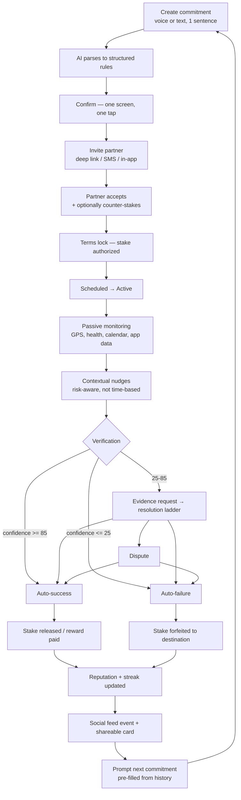

## 3.2 Friction budget

The loop dies at whichever stage has the most friction. Below is the per-stage budget and the specific mechanisms to hit it. **Time-to-first-commitment target: under 90 seconds from app open, including partner invite.**

| Stage | Friction budget | Design mechanisms |
|---|---|---|
| **1. Create** | ≤ 15s | Single text/voice field on home screen. No forms, no wizard, no category picker. Voice-first ("hold to speak"). Three tappable templates below the field seeded from the user's history and friends' recent commitments. |
| **2. Parse** | ≤ 2s perceived | Stream the structured result token-by-token so the user watches it assemble. Optimistic UI. Local template match for the top ~30 phrasings bypasses the LLM entirely (<200ms). |
| **3. Confirm** | ≤ 10s, 1 tap | One card. Editable chips, not a form: `📍 Equinox Wellesley` `⏰ by 6:30 AM` `⏱ 45 min` `💵 $25 → Ryan`. Tap any chip to edit inline. Big primary button: **Lock it in**. |
| **4. Invite** | ≤ 15s | Contact-picker prefilled with (a) people named in the sentence, matched against contacts; (b) frequent partners. Non-users get an SMS deep link that shows the full commitment *before* signup — they see the object, then create an account to accept. Never gate the invite behind the invitee's signup. |
| **5. Accept** | ≤ 10s for partner | Partner's job is one tap: **Accept**. Optional: counter-stake, add a condition, or add a taunt. Push + SMS fallback. Auto-expire in 12h → converts to solo/charity mode rather than dying. |
| **6. Lock/fund** | ≤ 10s, ideally 0 | Apple Pay / Google Pay for first funding. After first setup, funding is **zero-tap** — a saved payment method with a pre-authorized hold. This is the single highest-leverage friction removal in the product. |
| **7. Active** | 0s | Nothing required from the user. Ever. Passive monitoring is the whole promise. |
| **8. Nudge** | 0s | Risk-triggered, not time-triggered (§14, §15). One nudge with a useful action ("Directions — 18 min drive"), not a reminder. |
| **9. Verify** | 0s in the happy path | Target: **≥70% of commitments resolve with zero user interaction.** If evidence is needed, it's one tap from the notification (camera opens directly). |
| **10. Resolve** | 0s | Automatic. Money moves without a confirmation screen. User is told, not asked. |
| **11. Social** | ≤ 5s | Auto-generated result card, one-tap share to Stories/group chat. |
| **12. Re-create** | ≤ 5s, 1 tap | "Same again tomorrow?" appears in the result notification itself. **Repeat is the most important button in the app.** |

## 3.3 The five friction killers (ranked by impact)

1. **Zero-tap funding.** Save a payment method once; every subsequent stake is an authorization hold with no UI. Removing the payment sheet from the creation flow is worth more than any other single optimization.
2. **Zero-touch verification.** Every commitment type shipped must have a passive verification path. If a commitment type *requires* a manual photo, it converts and retains materially worse. Ship passive types first.
3. **Invite-before-signup.** The invitee sees a rich web preview of the actual commitment (with the stake, the deadline, the inviter's face) before creating an account. Conversion difference between "Alec sent you an invite" and "Alec bet you $25 he'll be at the gym at 6:30 — hold him to it" is enormous.
4. **Voice input.** The natural language sentence in this product is spoken, not typed. "Make sure I'm at Equinox by 6:30 tomorrow or I owe Ryan 25 bucks" takes 4 seconds to say and 25 to type.
5. **Repeat as the default next action.** ~60% of second commitments should be a copy of the first. Never make a returning user re-describe a recurring intention.

## 3.4 Loop instrumentation

Every stage emits an event (§29) and has a target conversion:

| Transition | Target | Alarm threshold |
|---|---|---|
| App open → create started | 45% | <25% |
| Create started → parsed successfully | 92% | <85% |
| Parsed → confirmed | 80% | <65% |
| Confirmed → partner invited | 75% | <55% |
| Invited → accepted (24h) | 60% | <40% |
| Accepted → funded | 90% | <80% |
| Funded → resolved without dispute | 95% | <88% |
| Resolved → next commitment (7d) | 55% | <35% |

---
---

# 4. AI COMMITMENT BUILDER

## 4.1 Objective

Convert one sentence of natural language into a validated, executable commitment specification — with high enough accuracy that the user's only job is to confirm, and with honest enough failure modes that the user is never surprised at resolution time.

**Design principle: the AI proposes, the schema disposes.** The LLM never produces the executable artifact directly. It produces a candidate JSON that is then validated, defaulted, safety-checked, and feasibility-checked by deterministic code. A commitment that money depends on cannot be the raw output of a language model.

## 4.2 Parsing architecture

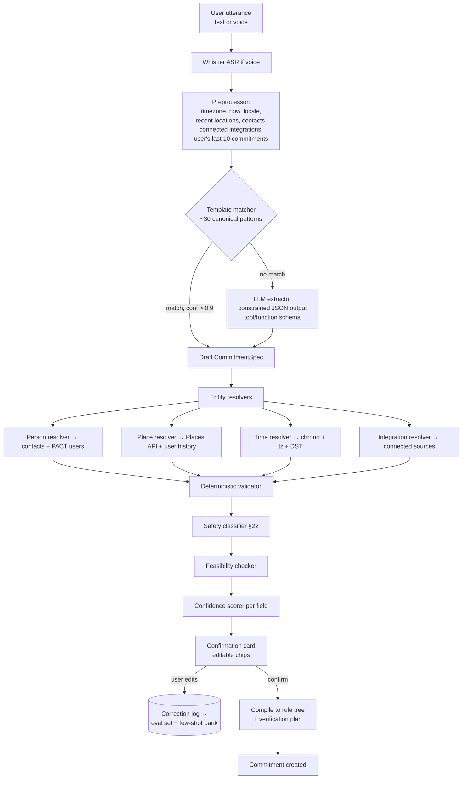

### Layer responsibilities

| Layer | Tech | Latency | Responsibility |
|---|---|---|---|
| ASR | Whisper / on-device Speech | 300–800ms | Voice → text. Bias vocabulary with contact names + saved place names. |
| Preprocessor | TS | <5ms | Injects context: `now`, IANA tz, home/work/gym coords, contact list hashes, connected integrations, last 10 commitments. **Context injection is 80% of accuracy.** |
| Template matcher | Regex + embedding kNN over canonical patterns | <50ms | Handles the head of the distribution without an LLM call. Rebuilt weekly from real utterances. |
| LLM extractor | Claude Sonnet-class, constrained tool-call schema, temp 0 | 1–2.5s | Handles the tail. Outputs `CommitmentSpec` JSON only. Never free text. |
| Entity resolvers | Places API, contacts, chrono-node, integration registry | 100–400ms | Turns strings into IDs and coordinates. Ambiguity → `needs_disambiguation`. |
| Validator | Zod schema + business rules | <5ms | Rejects impossible/incoherent specs before the user ever sees them. |
| Safety classifier | Rules + small classifier | 100ms | §22 forbidden categories. Hard block or downgrade. |
| Feasibility checker | Routing API + history | 200ms | "Can this person plausibly do this?" — travel time, sleep window, prior failure rate. |
| Confidence scorer | Per-field heuristics + model logprobs | <5ms | Drives which chips are highlighted for confirmation. |

**Why a two-tier (template + LLM) design:** cost and latency. At scale, ~70% of utterances are variations of a few dozen patterns. Serving those from templates cuts median latency to <300ms and cuts LLM spend by ~70%. It also gives a deterministic fallback when the LLM API is degraded.

## 4.3 The `CommitmentSpec` schema

```typescript
type CommitmentSpec = {
  version: "1.0";
  title: string;                       // "Gym by 6:30 AM"
  natural_language: string;            // original utterance, always preserved
  committer_id: UUID;

  partners: Array<{
    ref: string;                       // "Ryan" as spoken
    resolved_user_id: UUID | null;
    contact_hint: { name: string; phone_e164?: string } | null;
    role: "witness" | "beneficiary" | "verifier" | "co_committer";
    must_accept: boolean;
  }>;

  schedule: {
    timezone: string;                  // IANA, e.g. "America/New_York"
    start_at: ISO8601 | null;          // window opens
    deadline_at: ISO8601;              // hard deadline
    recurrence: RRULE | null;          // RFC 5545
    occurrences: number | null;        // for finite recurrence
    grace_period_seconds: number;      // default 0; user-visible if > 0
  };

  conditions: RuleNode;                // see §5 — AND/OR/NOT tree

  verification: {
    required_confidence: number;       // 0-100, default 85
    sources: VerificationSource[];     // ordered by weight
    fallback: "evidence_request" | "partner_confirm" | "auto_fail" | "auto_pass";
    evidence_window_seconds: number;   // default 3600 after deadline
  };

  stake: {
    kind: "fiat" | "points" | "none" | "stablecoin";
    amount_minor: number;              // cents
    currency: "USD";
    on_failure: {
      destination: "partner" | "charity" | "group_pool" | "platform_credit" | "forfeit_to_treasury";
      destination_id: UUID | null;
      charity_ein: string | null;
    };
    on_success: {
      action: "release_to_committer" | "reward_from_partner" | "release_and_bonus";
      reward_amount_minor: number;
    };
    funding_method: "saved_card" | "balance" | "apple_pay" | "wallet";
  };

  exceptions: Array<{
    kind: "illness" | "emergency" | "travel" | "device_failure" | "custom";
    description: string;
    resolution: "partner_approval" | "auto_void" | "not_allowed";
    max_uses: number;                  // per recurrence series
  }>;

  dispute_policy: {
    window_hours: number;              // default 24
    ladder: DisputeStep[];             // §8
    default_outcome_if_unresolved: "success" | "failure" | "void";
  };

  reminders: Array<{
    offset_seconds: number;            // negative = before deadline
    channel: "push" | "sms" | "email" | "partner_escalation";
    condition: "always" | "if_risk_above_50" | "if_not_yet_started";
  }>;

  visibility: "private" | "partners_only" | "friends" | "public";

  meta: {
    field_confidence: Record<string, number>;  // 0-1 per field
    assumptions: string[];                     // human-readable, always shown
    needs_disambiguation: string[];            // field paths
    safety_flags: SafetyFlag[];
    feasibility: { score: number; warnings: string[] };
  };
};
```

## 4.4 Confirmation UX

The confirmation card is the **only** screen between intent and a locked contract. Its rules:

1. **Chips, not forms.** Each extracted field is a tappable chip. Tapping opens a focused inline editor (time wheel, map, amount pad, contact list) — never a full form.
2. **Confidence is visible, not numeric.** Fields with confidence <0.75 render with a dotted underline and a subtle "tap to check" affordance. Never show "87% confident" to a consumer.
3. **Assumptions are stated in plain language, always.** A permanent line: *"I assumed: Equinox Wellesley (you went there 12 times), tomorrow = Thu Sep 3, 45 min measured from arrival."* This is the single most important trust mechanism in the product — it prevents the "the app cheated me" failure that kills money-attached apps.
4. **The verification plan is shown before locking.** *"I'll check: your location at the gym, that you stay 45 min, and your Apple Watch workout. If those don't line up, I'll ask for a photo."* Users must know how they'll be judged before they agree. **Non-negotiable.**
5. **One primary action: Lock it in.** Secondary: "Change something." Tertiary (text link): "Start over."
6. **Escape hatch, always.** "This isn't right" opens a chat-style refinement: the user speaks a correction and the spec re-renders.

**Anti-pattern explicitly rejected:** a multi-step wizard (type → condition → time → location → stake → partner). It tests better in usability studies with novices and performs dramatically worse in production, because the whole product promise is "say it once."

## 4.5 Ambiguity handling

| Ambiguity class | Example | Resolution strategy |
|---|---|---|
| **Ambiguous person** | "Sam" matches 3 contacts | Rank by: prior PACT partner > frequent contact > alphabetical. Show top choice as chip, tap → picker. |
| **Ambiguous place** | "the gym" | Resolve to most-frequent gym-category geofence in user history. If none, Places search biased to home/work. If still ambiguous → block confirm until resolved. |
| **Ambiguous time** | "tomorrow morning" | Resolve to a *window* (5:00–11:00) not a point, and say so: "by 11:00 AM." Never silently invent 9:00. |
| **Ambiguous quantity** | "a long run" | Ask. Do not guess quantities that determine outcome. Present 3 tappable options from the user's history (3mi / 5mi / 8mi). |
| **Ambiguous verification** | "study for 2 hours" | Offer the two feasible plans as a choice: "at the library (location + time)" or "screen-time in Notion/Books." User picks; this is a one-tap decision, not a form. |
| **Ambiguous stake direction** | "me and Jake, $20" | Default to *symmetric* (each stakes $20, each independently succeeds/fails). Show explicitly: "You each put up $20 on your own goal." |
| **Missing stake** | no money mentioned | Default to **points, not dollars**. Never insert a monetary stake the user didn't say. Offer "add money?" as a chip. |
| **Missing partner** | no person mentioned | Offer top 3 recent partners as chips + "no partner (charity forfeit)". Never auto-assign a person. |
| **Conflicting conditions** | "before 6am and after 7am" | Hard validation error, plain-language explanation, suggested fix. |

**Rule: never guess a field whose value determines whether money moves.** Guess formatting, defaults, and metadata freely. Never guess the deadline, the amount, the beneficiary, or the threshold.

## 4.6 Safeguards in the builder

| Safeguard | Trigger | Behavior |
|---|---|---|
| Safety classifier | Forbidden category (§22.2) | Hard refuse with explanation + suggest a safe reformulation |
| Stake ceiling | amount > user's tier cap | Clamp to cap, explain, offer cooling-off to raise |
| Velocity limit | >5 commitments created in 10 min | Soft interstitial: "That's a lot at once — review them together?" |
| Feasibility warning | Travel time > available time; wake-time <4h after typical sleep onset | Yellow banner: "This looks very tight — you'd need to leave by 5:58." Allow but flag. |
| Historical failure | user fails this pattern >60% | "You've missed this 7 of the last 10. Want a smaller stake or a later time?" Offer, don't block. |
| Escalating-stake guard | stake > 2× user's trailing median | Require an extra deliberate confirmation and a 10-minute cooling window for stakes >$100 |
| Third-party stake | stake destination is a person who hasn't accepted | Money cannot be committed to a non-consenting party. Partner must accept before funds route to them. |
| Minor detection | age <18 on file or signals | Points-only mode enforced at schema level; `stake.kind` forced to `"points"` ⚖️ |

## 4.7 Confidence scoring

Per-field confidence is a blend, computed deterministically:

```
field_confidence =
    0.40 * extraction_signal      // template exact-match = 1.0; LLM = normalized logprob
  + 0.30 * resolver_signal        // exact contact/place match = 1.0; fuzzy = 0.5; inferred = 0.3
  + 0.20 * prior_signal           // matches user's historical pattern for this field
  + 0.10 * explicitness_signal    // was the value literally in the utterance?
```

| Overall spec confidence | UX behavior |
|---|---|
| ≥ 0.90 | Show card, primary CTA enabled, assumptions in small text |
| 0.70–0.89 | Show card, low-confidence chips visually flagged |
| 0.50–0.69 | Show card with an explicit question above it: "Two things I'm not sure about —" |
| < 0.50 | Do not show a card. Ask one clarifying question in the composer, then re-parse. |

Overall = **minimum** of the confidences of *outcome-determining* fields (deadline, condition thresholds, stake amount, beneficiary), not the average. A spec is only as good as its weakest binding term.

## 4.8 Rule validation (deterministic, post-LLM)

```typescript
const validators = [
  schemaValid,                    // Zod
  deadlineInFuture,               // deadline_at > now + 60s
  windowCoherent,                 // start_at < deadline_at
  durationFitsWindow,             // min_duration <= (deadline - start)
  geofenceRadiusSane,             // 25m <= radius <= 2000m
  thresholdsPositive,             // steps/miles/pages > 0
  stakeWithinLimits,              // per-user, per-day, per-tier caps
  beneficiaryNotSelf,             // can't pay yourself on failure
  beneficiaryIsAdult,             // ⚖️
  verificationSourceAvailable,    // required integration is actually connected
  verificationPlanCanSucceed,     // ← critical: at least one source path can reach required_confidence
  noForbiddenCategory,            // §22
  recurrenceBounded,              // max 365 occurrences
  timezoneResolved,               // explicit IANA tz, never a UTC offset
  dstSafe,                        // flags commitments in a DST transition window
];
```

**`verificationPlanCanSucceed` is the most important validator in the system.** If a user says "read 30 pages" but has no Kindle/Books integration and no photo condition, the maximum achievable confidence is below threshold — the commitment is unwinnable. The builder must catch this *before* money is committed and either add a verification source or refuse. Shipping without this validator guarantees a class of user-facing injustice that destroys trust.

## 4.9 Thirty natural-language commitments → structured rules

Compact representation. `C` = condition tree, `V` = verification sources with weights, `S` = stake.

| # | Utterance | Parsed structure |
|---|---|---|
| 1 | "If I don't get to the gym before 6:30 tomorrow and stay at least 45 minutes, I owe Sam $30." | `C: AND[ enter_geofence(gym_equinox, r=100m, before=2026-09-03T06:30 ET), dwell(gym_equinox, >=45min) ]`<br>`V: gps_dwell .45, healthkit_workout .30, motion_pattern .15, wifi_ssid .10`<br>`S: $30 fiat → user:sam on failure; release on success` |
| 2 | "Wake up and be out of my house by 7am tomorrow or I owe Jake $20." | `C: exit_geofence(home, r=75m, before=07:00)`<br>`V: gps_exit .60, motion_transit .20, screen_unlock .10, step_count>200 .10`<br>`S: $20 → user:jake` |
| 3 | "Run 5 miles before noon on Saturday." | `C: activity_distance(type=run, >=5.0mi, window=[Sat 00:00, Sat 12:00])`<br>`V: healthkit_workout .60, strava .30, gps_track .10`<br>`S: none → points 100` |
| 4 | "Study at the library for two hours today." | `C: dwell(library_main, >=120min, window=[now, today 23:59])`<br>`V: gps_dwell .55, wifi_ssid .20, screen_time_reduction .15, checkin_qr .10`<br>`S: $15 → charity:default` |
| 5 | "Submit my econ assignment before 11:59 tonight or I owe Maria $50." | `C: manual_confirm + evidence_upload(type=screenshot\|document, before=23:59)`<br>`V: ai_document_check .50, exif_timestamp .20, partner_confirm .30`<br>`S: $50 → user:maria` |
| 6 | "Don't let me go to Shake Shack this week." | `C: NOT enter_geofence(shakeshack_*, r=60m, window=[Mon 00:00, Sun 23:59])`<br>`V: gps_negative .70, transaction_absence(Plaid, merchant=shake shack) .30` ⚖️<br>`S: $25 → charity` |
| 7 | "No Instagram between 9 and 5 on weekdays." | `C: app_usage(instagram, <=0min, window=[09:00,17:00], rrule=FREQ=WEEKLY;BYDAY=MO,TU,WE,TH,FR)`<br>`V: screen_time_api .80, device_shield_event .20`<br>`S: $10/violation → user:partner, cap $50/wk` |
| 8 | "Cold plunge every morning this month." | `C: recurring(30) evidence_upload(type=video, max_len=15s, window=[04:00,10:00])`<br>`V: ai_vision_scene(cold_water_immersion) .55, liveness_capture .25, exif_fresh .20`<br>`S: deposit $60, refund $2/day completed` |
| 9 | "Read 30 pages of Sapiens today." | `C: reading_progress(>=30 pages, book=sapiens)`<br>`V: kindle_api .70, manual+photo_of_page .30`<br>`S: points 50` |
| 10 | "10,000 steps every day this week or $5 a day to Chris." | `C: recurring(7) daily step_count(>=10000)`<br>`V: healthkit_steps .70, health_connect .70, phone_pedometer .30`<br>`S: $5/day → user:chris, max $35` |
| 11 | "Spend less than $200 on food delivery this month." | `C: spend_total(category=food_delivery, <$200, window=month)`<br>`V: plaid_transactions .90, manual_attest .10` ⚖️<br>`S: $40 → savings_goal (own account)` |
| 12 | "Be at the 10am standup every day this week." | `C: recurring(5) calendar_attendance(event~="standup", presence>=15min)`<br>`V: calendar_accept .25, gcal_meet_join .45, gps_office .20, host_confirm .10`<br>`S: $10/miss → team_pool` |
| 13 | "Send 50 cold emails by Friday 5pm." | `C: crm_activity(type=email_sent, count>=50, before=Fri 17:00)`<br>`V: hubspot_api .70, gmail_api .60, manual_screenshot .20`<br>`S: $100 → user:cofounder` |
| 14 | "Ship the onboarding redesign by Sunday night." | `C: OR[ github_pr_merged(repo=app, label=onboarding), partner_confirm(user:cto) ]`<br>`V: github_api .60, partner_confirm .40`<br>`S: $250 → user:cofounder` |
| 15 | "In bed with phone off by 11pm every night this week." | `C: recurring(7) AND[ device_idle(from<=23:00), dwell(home) ]`<br>`V: screen_time_last_use .50, healthkit_sleep_onset .35, gps_home .15`<br>`S: $7/night → charity` |
| 16 | "Meditate 10 minutes every morning for 21 days." | `C: recurring(21) mindfulness_minutes(>=10, window=[05:00,11:00])`<br>`V: healthkit_mindful .75, app_usage(headspace\|calm) .25`<br>`S: deposit $42, $2 back/day` |
| 17 | "Me and Tom both go to the 6am class Monday, loser pays $40." | `C: co_commitment(users=[me,tom], each: enter_geofence(studio, before=06:00) AND dwell(>=50min))`<br>`Settlement: if exactly one fails → failer pays $40 to succeeder; if both fail → both forfeit $40 to charity; if both succeed → both released`<br>`V: gps_dwell .50, healthkit .30, studio_qr .20` ⚖️ |
| 18 | "Don't let me open Twitter more than 5 times a day." | `C: app_open_count(twitter, <=5, per day)`<br>`V: screen_time_api .85, device_shield .15`<br>`S: $3/violation → user:partner` |
| 19 | "Do 100 pushups before I go to bed tonight." | `C: evidence_upload(video, before=today 23:59) OR healthkit_workout(type=functional_strength, >=8min)`<br>`V: ai_vision_count(pushup) .55, healthkit .30, partner_confirm .15`<br>`S: points 40` |
| 20 | "Attend my AA meeting Tuesday at 7." | `C: dwell(meeting_location, >=45min, window=[Tue 18:45, Tue 20:30])`<br>`V: gps_dwell .70, qr_checkin .30` — **visibility: private, stake.kind forced to `points`** ⚠️⚖️ |
| 21 | "Get to the airport by 5:30am Thursday." | `C: enter_geofence(BOS, r=800m, before=Thu 05:30)`<br>`V: gps .70, calendar_flight .20, impossible_travel_check .10`<br>`S: $75 → user:travel_partner` |
| 22 | "Practice guitar 30 minutes a day for 2 weeks." | `C: recurring(14) daily evidence_upload(audio\|video, >=30s sample) + self_report_duration(>=30min)`<br>`V: ai_audio_classify(guitar) .45, partner_confirm .30, app_usage(yousician) .25`<br>`S: deposit $28` |
| 23 | "If I'm late to work more than twice this week I owe the team lunch." | `C: count(enter_geofence(office, after=09:15)) <= 2 per week`<br>`V: gps .80, badge_api .20`<br>`S: $60 → group_pool:team` |
| 24 | "No alcohol for 30 days." | `C: recurring(30) daily self_attest(no_alcohol) + NOT transaction(category=bars_alcohol)`<br>`V: self_attest .40, plaid_negative .40, partner_spot_check .20` ⚖️<br>`S: deposit $150, refund on completion` |
| 25 | "Call my mom every Sunday this month." | `C: recurring(4) call_log_confirm OR partner_confirm(user:mom)`<br>`V: partner_confirm .70, manual .30`<br>`S: points 25/week` |
| 26 | "Hit 3 workouts a week for 8 weeks with the guys — $100 each in the pot." | `C: recurring(8 weeks) weekly workout_count(>=3)`<br>`Group pool: 5 members × $100 deposit; per-member refund on hitting weekly target; **forfeits → charity, not to other members** (see §16/§7 legal)`<br>`V: healthkit_workout .60, gps_dwell .30, photo .10` ⚖️ |
| 27 | "Wake up at 5am every weekday for the 5AM Club challenge." | `C: recurring(rrule=MO-FR) AND[ screen_unlock(before=05:15), NOT sleep_state(after=05:15) ]`<br>`V: healthkit_sleep_end .50, first_unlock .30, step_count .20`<br>`S: marketplace protocol, $30 entry, badge on completion` |
| 28 | "Be at Ryan's place by 8 tonight — if I'm late, drinks are on me." | `C: enter_geofence(ryan_home, r=100m, before=20:00)`<br>`V: gps .70, partner_confirm .30`<br>`S: $45 → user:ryan` |
| 29 | "Log every meal for 14 days." | `C: recurring(14) daily evidence_upload(photo, count>=3)`<br>`V: ai_vision_scene(food) .60, exif_fresh .25, timestamp_spread .15` — ⚠️ **eating-disorder safety screen applies (§22)**; no calorie/weight thresholds permitted<br>`S: points only` |
| 30 | "If I don't finish my thesis draft by the 15th, $500 to my roommate." | `C: evidence_upload(document, before=Sep 15 23:59) AND ai_document_check(min_words=8000, topic_match)`<br>`V: ai_document_check .50, word_count .25, partner_confirm .25`<br>`S: $500 → **exceeds default cap**; requires tier upgrade + 24h cooling-off (§22)` ⚖️ |

## 4.10 Four fully expanded specs

**#1 — "If I don't get to the gym before 6:30 tomorrow and stay at least 45 minutes, I owe Sam $30."**

```json
{
  "version": "1.0",
  "title": "Gym by 6:30 AM, 45 min",
  "natural_language": "If I don't get to the gym before 6:30 tomorrow and stay at least 45 minutes, I owe Sam $30.",
  "committer_id": "usr_alec",
  "partners": [{
    "ref": "Sam", "resolved_user_id": "usr_sam",
    "contact_hint": null, "role": "beneficiary", "must_accept": true
  }],
  "schedule": {
    "timezone": "America/New_York",
    "start_at": "2026-09-03T04:00:00-04:00",
    "deadline_at": "2026-09-03T06:30:00-04:00",
    "recurrence": null, "occurrences": null,
    "grace_period_seconds": 0
  },
  "conditions": {
    "op": "AND",
    "children": [
      { "type": "location.enter", "place_id": "plc_equinox_wellesley",
        "radius_m": 100, "before": "2026-09-03T06:30:00-04:00" },
      { "type": "location.dwell", "place_id": "plc_equinox_wellesley",
        "radius_m": 100, "min_seconds": 2700,
        "window": ["2026-09-03T04:00:00-04:00", "2026-09-03T09:00:00-04:00"] }
    ]
  },
  "verification": {
    "required_confidence": 85,
    "sources": [
      { "source": "gps.dwell",         "weight": 45, "required": false },
      { "source": "healthkit.workout", "weight": 30, "required": false },
      { "source": "motion.pattern",    "weight": 15, "required": false },
      { "source": "wifi.ssid_match",   "weight": 10, "required": false }
    ],
    "fallback": "evidence_request",
    "evidence_window_seconds": 3600
  },
  "stake": {
    "kind": "fiat", "amount_minor": 3000, "currency": "USD",
    "on_failure": { "destination": "partner", "destination_id": "usr_sam", "charity_ein": null },
    "on_success": { "action": "release_to_committer", "reward_amount_minor": 0 },
    "funding_method": "saved_card"
  },
  "exceptions": [
    { "kind": "illness", "description": "Sick day", "resolution": "partner_approval", "max_uses": 1 }
  ],
  "dispute_policy": {
    "window_hours": 24,
    "ladder": ["auto", "evidence", "partner", "ai_review", "human"],
    "default_outcome_if_unresolved": "failure"
  },
  "reminders": [
    { "offset_seconds": -32400, "channel": "push", "condition": "always" },
    { "offset_seconds": -2700,  "channel": "push", "condition": "if_not_yet_started" },
    { "offset_seconds": -1200,  "channel": "push", "condition": "if_risk_above_50" }
  ],
  "visibility": "friends",
  "meta": {
    "field_confidence": { "deadline_at": 0.97, "place_id": 0.88, "partners[0]": 0.94, "stake.amount_minor": 0.99 },
    "assumptions": [
      "Equinox Wellesley — you've been there 12 times",
      "Tomorrow = Thursday, September 3",
      "45 minutes measured from arrival"
    ],
    "needs_disambiguation": [],
    "safety_flags": [],
    "feasibility": { "score": 0.78, "warnings": ["You'd need to leave home by ~6:12 AM"] }
  }
}
```

**#7 — "No Instagram between 9 and 5 on weekdays."** (key deltas)
```json
{
  "conditions": { "type": "app.usage_max", "bundle_id": "com.burbn.instagram",
                  "max_seconds": 0, "daily_window": ["09:00","17:00"] },
  "schedule": { "recurrence": "FREQ=WEEKLY;BYDAY=MO,TU,WE,TH,FR", "occurrences": 20 },
  "verification": { "required_confidence": 80,
                    "sources": [{"source":"screentime.deviceactivity","weight":80},
                                {"source":"screentime.shield_event","weight":20}],
                    "fallback": "auto_pass" },
  "stake": { "kind":"fiat", "amount_minor":1000,
             "on_failure": {"destination":"partner","destination_id":"usr_ryan"},
             "per_violation": true, "period_cap_minor": 5000 }
}
```
Note `fallback: "auto_pass"` — for *negative* commitments (don't do X), missing data must default to **pass**, never fail. Punishing a user for absent telemetry is indefensible.

**#17 — Symmetric co-commitment** (settlement matrix)
```json
{
  "structure": "co_commitment",
  "participants": ["usr_alec","usr_tom"],
  "per_participant_conditions": { "op":"AND", "children":[
    {"type":"location.enter","place_id":"plc_studio","before":"2026-09-07T06:00:00-04:00"},
    {"type":"location.dwell","place_id":"plc_studio","min_seconds":3000}
  ]},
  "settlement": {
    "both_succeed":  "release_all",
    "both_fail":     "forfeit_all_to_charity",
    "one_fails":     "failer_stake_to_succeeder"
  },
  "stake": { "kind":"fiat", "amount_minor":4000, "per_participant": true }
}
```
⚖️ This is the structure closest to a wager and requires the §7.3 analysis: both parties stake, one may profit from the other's outcome. It is defensible because each outcome is determined solely by that participant's own controllable conduct (skill/effort, not chance) — but it is the highest-risk configuration in the product and should ship **after** legal sign-off, not in v1.

**#26 — Group pool** (legally restructured)
```json
{
  "structure": "group_program",
  "members": 5,
  "deposit_minor": 10000,
  "per_member_target": { "type":"activity.count","activity":"workout","min":3,"period":"week","weeks":8 },
  "refund_schedule": "pro_rata_by_week: member earns back 1/8 of deposit per week target met",
  "forfeit_destination": "charity",
  "note": "Forfeited funds do NOT redistribute to succeeding members in v1. Redistribution converts a deposit-return program into a prize contest (see §7.3, §16.4)."
}
```

## 4.11 Continuous improvement loop

Every user edit on the confirmation card is a labeled correction:

```
(utterance, context, predicted_spec, corrected_spec, field_path)
```

- Ship a **golden eval set** of 500 utterances with human-labeled specs before the LLM path goes live. Regression gate: field-level exact-match ≥ 94% on outcome-determining fields, ≥ 88% overall.
- Weekly: mine top corrected fields → add to few-shot bank → promote stable patterns into the template matcher.
- Track **`spec_edit_rate`** as a first-class product metric. Target: <25% of confirmations involve any edit; <5% involve editing an outcome-determining field.

---
---

# 5. COMMITMENT TYPES & RULES ENGINE

## 5.1 Design principle

A commitment is a **boolean expression over primitive conditions, evaluated against a stream of evidence, at or before a deadline.** Every product feature — gym, study, screen time, sales quota — is a configuration of the same engine. Building a special case for "gym commitments" is the mistake that caps the product at one vertical.

## 5.2 Primitive condition catalogue

Each primitive declares: parameters, evaluation function, evidence sources, and maximum achievable confidence.

### TIME
| Primitive | Params | Notes |
|---|---|---|
| `time.before` | `deadline_at` | Base deadline for nearly all commitments |
| `time.after` | `start_at` | Prevents pre-completion gaming |
| `time.window` | `start_at, end_at` | Event must occur inside window |
| `time.duration` | `min_seconds, max_seconds` | Composes with location/activity |
| `time.recurring` | `RRULE, occurrences, tz` | RFC 5545; each occurrence is an independent commitment instance |
| `time.streak` | `consecutive_n` | Meta-condition over instances |

### LOCATION
| Primitive | Params | Max confidence |
|---|---|---|
| `location.enter` | `place_id, radius_m, before/window` | 70 |
| `location.exit` | `place_id, radius_m, before` | 70 |
| `location.dwell` | `place_id, radius_m, min_seconds` | 75 |
| `location.avoid` | `place_id\|category, radius_m, window` | 60 (absence is weak evidence) |
| `location.route` | `from_place, to_place, max_seconds` | 65 |
| `location.category` | `poi_category (any gym), radius_m` | 60 |

### ACTIVITY / HEALTH
| Primitive | Params | Sources |
|---|---|---|
| `activity.steps` | `min_count, window` | HealthKit, Health Connect, pedometer |
| `activity.distance` | `type, min_distance, window` | HealthKit, Strava, Garmin |
| `activity.workout` | `type, min_seconds, min_active_energy` | HealthKit workout, Health Connect exercise |
| `activity.heart_rate` | `min_avg_bpm, min_minutes_in_zone` | Watch/wearable only |
| `activity.sleep` | `min_seconds, onset_before, wake_before` | HealthKit sleep, Oura, Whoop |
| `activity.mindful` | `min_seconds` | HealthKit mindful minutes |
| `activity.wake` | `wake_before` | Sleep-end + first unlock + motion |

### DIGITAL / SCREEN
| Primitive | Params | Sources |
|---|---|---|
| `app.usage_max` | `bundle_id, max_seconds, window` | iOS DeviceActivity / Android UsageStats |
| `app.usage_min` | `bundle_id, min_seconds` | ditto |
| `app.open_count` | `bundle_id, max_opens` | ditto |
| `device.idle` | `from_time, min_seconds` | Screen state |
| `device.total_screen_time` | `max_seconds` | ditto |

### DIGITAL ACTION (third-party)
| Primitive | Params | Sources |
|---|---|---|
| `calendar.attendance` | `event_match, min_presence_seconds` | Google/Microsoft Calendar + Meet/Zoom presence |
| `code.commit` | `repo, branch, min_commits\|pr_merged` | GitHub/GitLab |
| `crm.activity` | `provider, activity_type, min_count` | HubSpot, Salesforce |
| `email.sent` | `min_count, match` | Gmail/Outlook API |
| `task.completed` | `provider, task_id` | Todoist, Linear, Asana, Notion |
| `doc.submitted` | `provider, assignment_id` | Canvas, Google Classroom |
| `reading.progress` | `book_id, min_pages` | Kindle, Apple Books |

### PROOF
| Primitive | Params | Notes |
|---|---|---|
| `proof.photo` | `prompt, freshness_seconds, liveness` | Must be captured in-app; camera-roll uploads carry a confidence penalty |
| `proof.video` | `max_seconds, prompt` | Best for physical acts (pushups, plunge) |
| `proof.selfie` | `with_context` | Face + scene |
| `proof.qr_scan` | `code_id` | Venue-issued; very strong |
| `proof.nfc_tap` | `tag_id` | Physical tag at location; strongest passive proof |
| `proof.ble_beacon` | `beacon_uuid, min_seconds` | Gym/studio partner hardware |

### SOCIAL
| Primitive | Params |
|---|---|
| `social.partner_confirm` | `user_id, deadline` |
| `social.group_vote` | `group_id, threshold_pct, quorum` |
| `social.coach_confirm` | `coach_id` (weighted higher by role) |
| `social.copresence` | `user_ids[], min_seconds` (two phones near each other at a place) |

### AI
| Primitive | Params |
|---|---|
| `ai.vision_scene` | `expected_scene, min_score` (is this a gym? cold water? a plate of food?) |
| `ai.vision_count` | `object, min_count` (pushups, pages, laps) |
| `ai.document_check` | `min_words, topic, format` |
| `ai.semantic_proof` | `claim, evidence[]` — LLM judges whether evidence supports the claim |
| `ai.anomaly` | (always-on) fraud/consistency scoring |

### FINANCIAL ⚖️
| Primitive | Params | Notes |
|---|---|---|
| `spend.max` | `category\|merchant, max_minor, window` | Plaid; read-only; heavy privacy consent |
| `save.contribution` | `min_minor, account` | Transfer verification |

## 5.3 Rule tree

```typescript
type RuleNode =
  | { op: "AND"; children: RuleNode[] }
  | { op: "OR";  children: RuleNode[] }
  | { op: "NOT"; child: RuleNode }
  | { op: "AT_LEAST"; n: number; children: RuleNode[] }   // "3 of these 5"
  | { op: "WEIGHTED"; threshold: number; children: Array<{ node: RuleNode; weight: number }> }
  | ConditionLeaf;
```

Constraints: max depth 4, max 12 leaves, `NOT` may not wrap `OR` (produces unintelligible semantics for users). Every tree must render to a plain-English sentence — **if the renderer can't describe it, the user can't agree to it, and it must be rejected.**

### Example

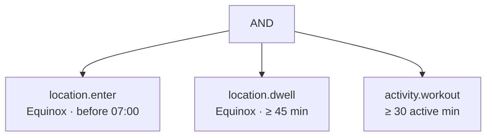
Renders as: *"Get to Equinox before 7:00 AM, stay at least 45 minutes, and log 30+ active minutes."*

## 5.4 Evaluation semantics

- **Streaming, not batch.** Evidence arrives continuously; each leaf holds a running state (`unknown | satisfied | violated | indeterminate`) with a confidence.
- **Early termination.** As soon as a leaf is *irrecoverably* violated (deadline passed without entry), the tree short-circuits to failure. Users find out immediately, not at midnight. Immediate honest failure is better UX than suspense.
- **Positive vs negative conditions.**
  - Positive (`do X`): absent evidence → `unknown` → falls to the evidence/dispute ladder → default **failure** if unresolved.
  - Negative (`don't do X`): absent evidence → **pass**. Never fail a user for missing telemetry on a negative condition.
- **Idempotency.** Every leaf evaluation is a pure function of `(evidence_set, params)`. Re-running must produce identical results — required for dispute replay and audit.
- **Snapshot rules at lock time.** Condition parameters, geofence coordinates, weights, and the app version of the evaluator are frozen into the commitment at lock. If we change verification logic next month, existing commitments still resolve under the terms the user agreed to. **This is a contract-integrity requirement, not a nice-to-have.**

## 5.5 Recurring commitments

A recurring commitment is a **template + N instances**. Each instance resolves and settles independently.

```
commitment (template, RRULE)
 ├─ instance 2026-09-03  → success  → $0 forfeited
 ├─ instance 2026-09-04  → failure  → $5 forfeited
 └─ instance 2026-09-05  → active
```

Funding options for recurring:
| Model | Mechanics | Recommendation |
|---|---|---|
| Per-instance authorization | Auth hold created 24h before each instance | ✅ **Recommended.** Lowest float, cleanest legally, clearest to users |
| Full-series prepay | One charge for `N × stake` into escrow | Higher lock-in, but holds user funds → regulatory burden (§7) |
| Post-pay | Charge only on failure | Highest default risk; card decline rate ~8% on penalties |

---

# 6. VERIFICATION ENGINE

> This is the hardest and most valuable system in the product. Everything else is assemblable from off-the-shelf parts. This is not.

## 6.1 Architecture

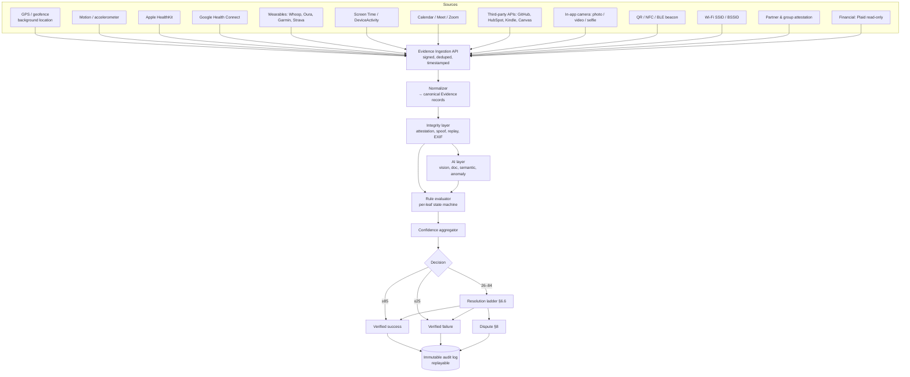

## 6.2 The Evidence record

```typescript
type Evidence = {
  id: UUID;
  commitment_instance_id: UUID;
  source: EvidenceSource;
  captured_at: ISO8601;          // device clock
  received_at: ISO8601;          // server clock — divergence is a fraud signal
  server_clock_skew_ms: number;
  payload: JSONB;                // source-specific
  device_id: UUID;
  device_attestation: {
    platform: "ios" | "android";
    attested: boolean;           // App Attest / Play Integrity
    jailbroken_signal: boolean;
    mock_location_flag: boolean; // Android provides this directly
    debugger_attached: boolean;
  };
  integrity: {
    signature: string;           // HMAC over payload+nonce with device key
    nonce: string;               // server-issued, single-use — prevents replay
    integrity_score: number;     // 0-100
    flags: IntegrityFlag[];
  };
  storage_ref: string | null;    // encrypted object storage for media
  hash: string;                  // SHA-256 of raw payload/media
};
```

**Server-issued nonce is mandatory for all high-value evidence.** Client requests a nonce when starting a capture; the nonce expires in 120 seconds and is single-use. This defeats replay of previously captured media, which is otherwise the single easiest attack on the product.

## 6.3 Confidence model

Each source contributes a weighted score. The aggregate is **not** a naive sum — that would let a user reach 100 by stacking weak, correlated signals.

```
raw   = Σ (weight_i × quality_i × freshness_i)          for satisfied sources
penalty = Σ integrity_penalty_j                          for flagged evidence
corr  = correlation discount for signals sharing a failure mode
confidence = clamp(0, 100, raw × (1 − corr) − penalty)
```

- `quality_i ∈ [0,1]`: GPS horizontal accuracy, HR sample density, image sharpness, etc.
- `freshness_i ∈ [0,1]`: decays for evidence captured long after the event window.
- `corr`: **critical.** GPS, Wi-Fi SSID, and motion all come from the same phone. If the phone is spoofed or left at the gym, all three fail together. Signals from the same *device or trust root* are discounted: two same-device sources contribute at most `max(w) + 0.5 × second(w)`. Independent trust roots (a partner's phone, a venue's NFC tag, a wearable, a third-party API) receive full weight. **The engine should be biased hard toward independent trust roots.**

### Source weight reference table

| Source | Base weight | Independent root? | Spoof difficulty | Notes |
|---|---|---|---|---|
| Venue NFC tap | 45 | ✅ Venue | Very hard | Requires physical presence at the tag |
| Venue QR (rotating code) | 40 | ✅ Venue | Hard | Static QR is much weaker (screenshot-able) → 20 |
| BLE beacon dwell | 40 | ✅ Venue | Hard | Requires partner hardware |
| GPS dwell ≥ target | 40 | ❌ Phone | Medium (mock loc) | Backbone of location commitments |
| GPS single-point entry | 25 | ❌ Phone | Medium | Weak alone |
| Wearable workout (Watch/Whoop/Garmin) | 30 | ✅ Wearable | Hard | HR + motion on a second device |
| HealthKit workout (phone-recorded) | 20 | ❌ Phone | Medium | Manually-added workouts → weight 5 |
| Heart-rate elevation profile | 20 | ✅ Wearable | Hard | Excellent anti-"phone left at gym" signal |
| Step count | 15 | ❌ Phone | Easy (shaker) | Supporting only |
| Motion/activity classification | 15 | ❌ Phone | Medium | Distinguishes "at gym" from "phone stationary in locker" |
| Wi-Fi BSSID match | 15 | ⚠️ Semi | Medium | BSSID (not SSID) is location-specific |
| Screen Time / DeviceActivity | 40 | ❌ OS | Hard on iOS | On-device, privacy-preserving, high trust |
| Calendar + Meet/Zoom join | 35 | ✅ 3rd party | Hard | Strong for meetings |
| Third-party API (GitHub, HubSpot, Kindle, Canvas) | 45 | ✅ 3rd party | Hard | Best available for digital work |
| Plaid transaction (presence/absence) | 35 | ✅ Bank | Very hard | Heavy consent burden ⚖️ |
| In-app photo, fresh + attested | 25 | ❌ Phone | Medium | Depends entirely on CV + freshness |
| In-app video with liveness | 30 | ❌ Phone | Hard | Best proof primitive for physical acts |
| Camera-roll upload | 5 | ❌ | Trivial | Effectively decorative; never sufficient alone |
| Partner confirmation | 30 | ✅ Human | Collusion-prone | Weight scaled by partner reputation & collusion score |
| Coach confirmation | 40 | ✅ Human | Lower collusion | Verified professional role |
| Group vote (≥3, quorum) | 35 | ✅ Humans | Harder to collude | Only for group commitments |
| Copresence (2 phones together) | 25 | ⚠️ Semi | Medium | Both must independently be at place |

### Worked example — the canonical gym commitment

| Signal | Weight | Observed | Contribution |
|---|---|---|---|
| GPS dwell at Equinox 6:12–7:05 | 40 | ✅ accuracy 8m | 40 × 1.0 × 1.0 = **40** |
| Apple Watch workout 6:20–7:02, 145 avg HR | 30 | ✅ | **30** |
| Motion classified "workout/stationary-active" | 15 | ✅ | 15 × 0.5 (same-device corr. with GPS) = **7.5** |
| Wi-Fi BSSID matches known Equinox AP | 15 | ✅ | 15 × 0.5 (same-device corr.) = **7.5** |
| Integrity penalties | — | none | 0 |
| **Total** | | | **85 → Auto-verified** ✅ |

**Failure variant — phone left in locker:** GPS ✅ 40, Watch workout ❌ 0, motion = "stationary" ❌ 0, Wi-Fi ✅ 7.5 → **47.5 → ambiguous** → evidence request ("quick gym selfie?") → +25 → 72.5 → partner confirm → 85 ✅.

**Fraud variant — mock location:** GPS ✅ 40 but `mock_location_flag = true` → −60 penalty → **−20 → auto-fail + integrity incident.**

### Thresholds

| Band | Action |
|---|---|
| ≥ 85 | Auto-verify success. Notify. Settle. |
| 70–84 | Success, but log for calibration review; if stake > $100, request one cheap confirming signal |
| 26–69 | **Ambiguous** → resolution ladder (§6.6) |
| ≤ 25 | Auto-fail. User may dispute (§8). |
| Any integrity flag ≥ critical | Route to manual review regardless of score |

`required_confidence` scales with stake: $0–25 → 80; $26–100 → 85; $101+ → 90 and at least one independent trust root required.

## 6.4 Per-type verification recipes

| Commitment | Primary | Secondary | Fallback | Realistic auto-verify rate |
|---|---|---|---|---|
| Gym arrival + dwell | GPS dwell | Wearable workout, HR | Photo + partner | 85% |
| Wake up / leave house | Geofence exit | Sleep-end, first unlock, steps | Selfie | 90% |
| Run distance | HealthKit/Strava workout | GPS track | Screenshot + AI check | 92% |
| Library study | GPS dwell | Wi-Fi BSSID, screen-time reduction | QR checkin | 80% |
| Screen-time limit | DeviceActivity | Shield events | none (auto-pass) | 97% |
| Meeting attendance | Meet/Zoom join event | Calendar accept, GPS office | Host confirm | 85% |
| Cold plunge | In-app video + AI vision | Freshness, liveness | Partner confirm | 70% |
| Pages read | Kindle API | — | Photo of page + AI | 55% (weak — set expectations) |
| Assignment submitted | Canvas/Classroom API | Screenshot + AI doc check | Partner confirm | 75% |
| Sales outreach | HubSpot/Gmail API | — | Screenshot | 88% |
| Spend limit | Plaid | — | Self-attest | 90% ⚖️ |
| Avoid a place | GPS negative | Transaction absence | none (auto-pass) | 88% |
| Chore done | In-app photo + AI vision | Roommate confirm | Group vote | 65% |

**Product rule:** display each commitment type's expected auto-verify rate at creation time. *"I can usually verify this automatically. About 1 in 4 times I'll need a photo."* Setting expectations before the money is committed is worth more than 5 points of accuracy.

## 6.5 Fraud prevention

| Attack | Detection | Response |
|---|---|---|
| **GPS spoofing (mock location)** | Android `isFromMockProvider`; iOS: jailbreak detection + App Attest; physically impossible accuracy values; zero jitter in the position series (real GPS always jitters) | Hard fail + integrity incident |
| **Impossible travel** | Speed between consecutive fixes > 900 km/h, or gym→home in 40s | Discard fix, flag account |
| **Teleport / location jump** | Position discontinuity without intermediate fixes | Require corroborating signal |
| **Phone left at venue** | GPS present + zero step count + zero motion variance + no HR elevation | Downgrade GPS weight to 15; request active proof |
| **Friend carries your phone** | Gait signature mismatch vs. user's motion baseline; simultaneous copresence with an implausible pattern | Flag; request selfie with liveness |
| **Old photo / camera roll** | EXIF `DateTimeOriginal` vs. now; missing EXIF; screenshot dimensions; hash matches previously-seen media (perceptual hash DB) | Reject; require in-app capture |
| **Screenshot of a screenshot** | Moiré detection, screen-bezel detection, CV screenshot classifier | Reject |
| **Re-used media across users** | Global perceptual-hash (pHash) index over all submitted evidence | Reject + investigate both accounts |
| **Fake workout entry** | HealthKit `wasUserEntered == true`; missing HR series; impossible calorie/duration ratios; workouts with no motion data | Weight → 5 |
| **Shaking phone for steps** | Step cadence uniformity, absent GPS displacement, absent HR change | Discount step evidence |
| **Time manipulation** | Device clock vs. server clock skew > 60s; NTP mismatch | Use server time exclusively for all deadline evaluation ✅ **always** |
| **Emulator / rooted device** | Play Integrity, App Attest, hardware-attestation failure | Block staked commitments entirely on unattested devices |
| **Collusion (partner rubber-stamps)** | Reciprocal-confirmation graph analysis: A confirms B, B confirms A, always within 30s, always success; confirmation latency distribution; partner-diversity entropy | Reduce partner weight → 5; require third-party evidence; shadow-flag pair |
| **Sock-puppet partner** | Device fingerprint overlap, same IP, same payment instrument, contact-graph isolation | Block money flow between accounts |
| **Money-laundering pattern** | Structured repeated commitments designed to move funds A→B with guaranteed failure | Velocity limits, transaction monitoring, SAR process ⚖️ |
| **Dispute farming** | Dispute rate > 20% with high win rate against low-reputation partners | Reputation penalty, dispute deposit requirement, escalate to human |
| **Duplicate evidence within a series** | Same pHash for day 3 and day 7 of a 30-day challenge | Auto-reject, notify user |
| **Chargeback abuse** | Successful commitment → later chargeback | Block from staked commitments; recover from balance ⚖️ |

### Integrity scoring
Every device carries a rolling `integrity_score` (0–100). Below 50, staked commitments require independent trust-root evidence (NFC/QR/wearable/third-party API); below 25, monetary stakes are blocked entirely.

## 6.6 Ambiguity ladder

When confidence lands in 26–84, escalate in this order. **Each rung is cheap for the user before it is expensive.**

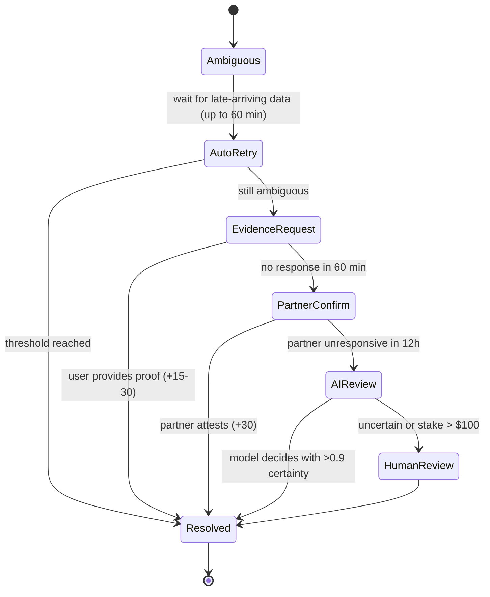

**Late data is the #1 cause of ambiguity, not fraud.** HealthKit sync can lag 30+ minutes; Strava can lag hours. The engine must hold a 60-minute reconciliation window before declaring failure on any health-data-dependent commitment, and must re-evaluate on late arrival even after a provisional decision (reversing a provisional failure is fine; reversing a settled payment is not — hence the settlement delay in §7.5).

## 6.7 Behavior under ambiguity — governing principles

1. **Never fail a user for the system's failure.** Missing telemetry due to a permissions revocation, an OS bug, an integration outage, or a dead battery is not a user failure. Default to `void` (stake returned, streak preserved, no reputation change) when the failure is attributable to the platform. Track `void_rate`; if it exceeds 5%, the verification plan for that type is broken.
2. **Ask for the cheapest sufficient evidence.** Never request a video when a tap suffices.
3. **Show the user what you saw.** *"I saw you at Equinox 6:34–7:02 but no workout data. Quick selfie to confirm?"* Opacity is what makes users feel cheated.
4. **The partner is the referee of last resort before humans.** Escalation is: data → user evidence → partner → AI → human.
5. **Errors default toward the committer only when the committer controls the evidence.** For positive commitments the burden is on the committer (they chose the verification plan). For negative commitments and platform failures the burden is on the platform.

## 6.8 Privacy architecture for verification

| Data | Storage | Retention |
|---|---|---|
| Raw location traces | **Never leave the device.** On-device geofence evaluation; the device uploads only `{entered: true, at: T, accuracy: 8m, place_id}` | Device-local, 7 days |
| Location for disputes | Encrypted, minimal points only, uploaded only on dispute | 90 days post-resolution |
| Health metrics | Only the specific metric the commitment needs (workout duration — not the full HR series) | 90 days |
| Screen-time | iOS DeviceActivity is on-device by design; upload only the boolean outcome | Outcome only |
| Photos/videos | Encrypted at rest (per-object key), presigned short-lived URLs, visible only to committer + accepted partners | 30 days default, then delete original and retain pHash + decision |
| Financial (Plaid) | Category totals only; never raw transaction descriptions | 90 days |

**Design commitment: PACT should be able to verify "you were at the gym" without ever storing where you were the rest of the day.** This is a genuine differentiator and should be stated publicly.

---
---

# 7. MONEY & STAKES SYSTEM

> ⚖️ **Everything in this section requires review by qualified counsel in payments, money transmission, and gaming law before implementation.** This document is product architecture written to make that review cheap and fast, not legal advice. The recommendations below are structured to *minimize* the surface area counsel must clear.

## 7.1 The governing constraint

**Assume the company cannot legally hold user funds.** Pooling consumer money in a company-controlled account, and moving it between users, is money transmission in most U.S. states and requires state-by-state MTLs (~$1–5M and 18–36 months to obtain) or a sponsor/agent arrangement. Design as if that license will never exist.

Three architectural consequences, applied throughout:

1. **Money should move as few hops as possible**, ideally one: from the committer's card directly to a terminal destination.
2. **The platform should never be the beneficial owner of user funds in transit.** Use a licensed partner's escrow/custody rails, or avoid escrow entirely.
3. **The lowest-risk product is one where money never moves between two consumers.** Ship that first.

## 7.2 Economic models compared

| # | Model | Mechanics | Behavioral strength | Legal risk | Ops complexity | Verdict |
|---|---|---|---|---|---|---|
| 1 | **Charity forfeit** | Fail → charge card → donate to user-chosen 501(c)(3) via a DAF partner | High | **Low** | Low | ✅ **MVP core** |
| 2 | **Refundable deposit** | Pre-authorize $X; success → void the auth; fail → capture | Very high | **Low** (auth hold, no custody) | Low | ✅ **MVP core** |
| 3 | **Platform-retained forfeit** | Fail → PACT keeps it (disclosed as a fee) | High | Low-medium (looks like a penalty fee; ⚠️ perception) | Low | ⚠️ Limited use only |
| 4 | **Peer payout (A pays B)** | Fail → funds to partner | Highest social | **Medium-high** (money transmission) | High | 🟡 V2 via licensed partner |
| 5 | **Symmetric escrow duel** | Both stake; one collects | Highest | **High** (closest to a wager) | High | 🟡 V2, post-counsel |
| 6 | **Group pool w/ redistribution** | Losers' money splits among winners | Very high | **High** (prize contest / possible wagering) | High | 🔴 Restructure (§16.4) |
| 7 | **Group pool w/ charity forfeit** | Losers' money → charity; winners get deposits back | High | Low | Medium | ✅ **Recommended group model** |
| 8 | **Anti-charity** | Fail → donate to a cause the user dislikes | Very high | **High** (reputational, processor, potential funding of extremist orgs) | Medium | 🔴 **Do not build** |
| 9 | **Reward model** | Partner/coach pays user on success | Medium | Medium (payouts to consumers = 1099 ⚖️) | Medium | 🟡 V3 |
| 10 | **Subscription-funded rewards** | PACT pays winners from subscription revenue | Medium | **Low** (no consideration → not a wager) | Medium | ✅ Good for challenges |
| 11 | **Points / credits only** | No fiat at all | Medium | **Very low** | Very low | ✅ **Ship in MVP alongside money** |
| 12 | **Stablecoin escrow** | USDC in a smart contract | High | **High** (custody, MSB, state VC rules, sanctions) | Very high | 🟡 V3, jurisdiction-limited |
| 13 | **Self-directed savings** | Fail → money moves to *user's own* savings goal | Medium | Low | Medium | ✅ Nice V2 add |

### Recommendation

> **MVP = models 1, 2, 11, and 3-in-limited-form. Peer payouts (4) ship in V2 only through a licensed partner. Redistribution pools (6) and anti-charity (8) do not ship.**

This is a real product concession: "I owe Jake $20" is the pitch, and the MVP initially routes that $20 to charity instead of Jake. **Mitigation that preserves ~90% of the behavioral effect:** Jake still gets the notification, the feed event, the reputation credit, and the bragging right. The social contract is intact; only the cash destination changes. Test this directly (§32, Experiment 4) — the hypothesis is that *"Jake found out"* does nearly all the work and *"Jake got $20"* does very little. If that holds, peer payout may never need to ship, and the company avoids its single largest compliance burden permanently. **That is potentially the most valuable experiment in the entire roadmap.**

## 7.3 Why this is not gambling (and where it becomes gambling)

Most U.S. states define illegal gambling by three elements. All three must be present:

| Element | Commitment contract | Analysis |
|---|---|---|
| **Consideration** | ✅ Present (user risks money) | Unavoidable in any staked model |
| **Chance** | ❌ **Absent** | The outcome is determined entirely by the committer's own volitional conduct. This is the load-bearing distinction. |
| **Prize** | ⚠️ Depends on structure | Absent in deposit-return and charity-forfeit. **Present** in redistribution pools and peer payouts. |

Design rules that keep the product on the right side of that line:

1. **The outcome must be within the committer's control.** Never permit commitments contingent on external events (weather, sports results, another person's behavior, market prices). The AI builder must reject these categorically. This is what removes *chance*.
2. **A user must never profit from another user's failure in v1.** Removing *prize* is the second independent defense. Deposit-return and charity-forfeit have no prize at all.
3. **Never take a rake on forfeited stakes in a peer or pool context.** A platform cut of a pot is the archetypal indicium of illegal bookmaking. Monetize with subscriptions and flat processing fees (§23), disclosed up front.
4. **No odds, no house, no lines, no parlays, no "bet" language anywhere in the product.** Copy is a compliance surface. Use *commit, stake, deposit, forfeit, pledge* — never *bet, wager, odds, win, pot, payout* in consumer-facing text.
5. **No sweepstakes structure without a proper AMOE**, free-entry alternative, and state-by-state review. ⚖️
6. **Jurisdiction gating.** ⚖️ Certain states have unusually broad gambling or contest statutes and unusually aggressive enforcement postures. Counsel must produce an allow-list before any peer-payout or pool feature launches; geofence and IP/address-gate accordingly. Do not assume nationwide launch for money features.
7. **18+ for any monetary stake, no exceptions.** Minors get points-only mode, enforced at the schema level. ⚖️

### The "is this lending?" question
It is not, provided PACT never extends credit. Consequences: **no post-pay stakes** (charge on failure without a prior hold), **no stake-now-pay-later**, **no negative balances**. Every stake must be pre-authorized or pre-funded. This also removes any Reg Z / state small-loan exposure. ⚖️

### The "is this insurance?" question
Deposit-return with a refund on success is not insurance (no risk transfer from a fortuitous event). But a "commitment insurance" product — pay $3 so we cover your $30 forfeit — **would** likely be insurance and must not be built. ⚖️

## 7.4 Recommended payment architecture

### V1 — no peer money movement

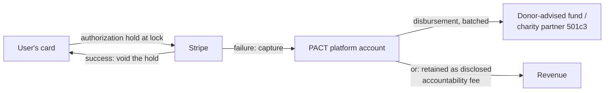

- **Instrument:** Stripe PaymentIntent with `capture_method: manual`. Authorization holds last 7 days on most card networks — sufficient for the overwhelming majority of commitments.
- **Long or recurring commitments (>7 days):** do not hold. Instead, create a per-instance authorization 24 hours before each deadline. Cleanest and lowest-float.
- **Success:** cancel the PaymentIntent. The hold disappears. **The user is never actually charged.** This is a substantially better consumer experience than charge-and-refund and materially reduces chargeback risk.
- **Failure:** capture. Funds land in PACT's Stripe balance; charity portion is disbursed in nightly batches to the DAF partner.
- **PACT is merchant of record for a service fee + a charitable disbursement**, not a money transmitter, because funds never move to another consumer. ⚖️ *(confirm with counsel — this is the pivotal legal assertion of the MVP.)*

### V2 — peer payouts via licensed partner

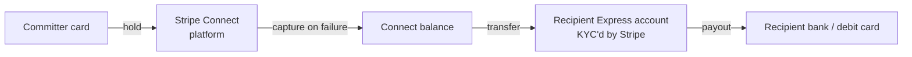
- Recipient must onboard as a Stripe Connect **Express** account: identity verification handled by Stripe, tax reporting handled by Stripe. ⚖️
- Onboarding friction is real (name, DOB, SSN last-4, bank account). **Mitigation: default the recipient's proceeds to platform credit (no KYC needed), and offer "cash out" as an optional flow that triggers Express onboarding only when the user actually wants the money.** Most users won't bother, which is fine — the social signal already landed.
- Threshold: KYC required before cash-out; hard cap on lifetime uncashed credit.
- ⚖️ 1099-K/1099-MISC analysis required. Recipients receiving >$600/yr may need reporting.

### Rails comparison

| Rail | Cost | Speed | UX | Chargeback risk | Verdict |
|---|---|---|---|---|---|
| **Card (Stripe) + Apple/Google Pay** | 2.9% + $0.30 | Instant auth | Best | High | ✅ **Primary** |
| ACH (Stripe/Plaid) | $0.25–0.80 | 1–3 days | Poor for micro-stakes | Low (but returns) | ✅ For top-ups >$50 |
| PayPal / Venmo | 2.9%+ | Instant | Familiar to students | Medium | 🟡 V2 as alt funding |
| Custodial wallet (PACT holds balance) | — | Instant | Best | — | 🔴 **Requires MTL. Do not build.** |
| Non-custodial crypto wallet | Gas | Minutes | Poor for consumers | None | 🟡 V3 (§17) |
| Stablecoin (USDC) | ~$0.01 on L2 | Seconds | Poor mainstream | None | 🟡 V3, non-US-first |

**Explicit recommendation:** cards + Apple/Google Pay only in the MVP. Do not build a wallet. Do not build ACH. Do not build crypto.

## 7.5 Money mechanics

| Mechanic | Rule |
|---|---|
| **Minimum stake** | $5 (below this, processing economics break and the stake is not behaviorally meaningful) |
| **Maximum stake** | $100 default; $250 for verified users with 20+ resolved commitments; $500 absolute ceiling with a 24h cooling-off period. **No exceptions, ever.** (§22) |
| **Daily aggregate cap** | $250 at risk across all active commitments (tier 1) |
| **Auth timing** | At `lock`, or T-24h for recurring instances |
| **Auth failure** | Commitment cannot lock. Notify both parties; offer points-mode instead. Never lock an unfunded commitment. |
| **Settlement delay** | **60 minutes after resolution** before any capture. Absorbs late-arriving health data, gives the user a window to dispute pre-settlement. Non-negotiable — reversing a capture is far worse than delaying it. |
| **Dispute hold** | On dispute, extend to 7 days; the auth is maintained (re-authorized if near expiry) but never captured until resolved |
| **Refunds** | Full refund for: platform failure, voided commitment, successful dispute, cancellation before start |
| **Chargebacks** | Contest with the full evidence packet (signed commitment terms, timestamped evidence, verification trace, acceptance record). Account blocked from monetary stakes after 1 unfounded chargeback ⚖️ |
| **Failed capture** | Retry ×3 over 72h (day 1, 2, 4). On final failure: mark commitment `failed_unsettled`, reputation records the failure, no debt is created, monetary stakes disabled until resolved. **Never pursue collection; never create a receivable.** |
| **Platform fee** | V1: $0 on stakes. Revenue from subscription. See §23. Introducing a rake on forfeits early is both a legal risk and a trust risk. |
| **Charity disbursement** | Nightly batch to a single DAF partner; user's chosen charity recorded as the DAF grant recommendation. Receipt emailed to the user. ⚖️ Note: the donor is arguably PACT, not the user — **do not promise the user a tax deduction** without counsel sign-off. |
| **Currency** | USD only in V1 |

## 7.6 Ledger design

Even with no custody, a double-entry ledger is mandatory — for reconciliation, disputes, audits, and eventual licensing.

```
ledger_entries (append-only, immutable)
  id, txn_id, account_id, account_type, direction (debit|credit),
  amount_minor, currency, commitment_id, external_ref, created_at

Account types:
  user_pending        (authorized, not captured)
  user_credit         (platform credit balance)
  platform_revenue
  charity_payable
  partner_payable
  psp_settlement
  chargeback_reserve
```

Every money event writes a balanced pair. `SUM(debits) == SUM(credits)` is asserted continuously; any imbalance pages on-call. The PSP (Stripe) is the source of truth for cash; the ledger is the source of truth for *intent and obligation*, and the two are reconciled nightly with an automated report and a hard alert on any discrepancy.

## 7.7 Compliance checklist ⚖️

| Area | Question for counsel | Blocking? |
|---|---|---|
| Money transmission | Does charity-forfeit (V1) avoid MT classification in all 50 states? Does peer payout via Stripe Connect? | **Blocks V1 / blocks V2** |
| Gambling | Is a self-determined commitment contract exempt from wagering statutes in each target state? Which states are excluded? | **Blocks V1** |
| Contests/sweepstakes | Do group programs with entry fees + non-cash rewards require registration/bonding? | Blocks group v1 |
| KYC/AML | At what payout threshold does KYC trigger? Do we need a written AML program, and who is the compliance officer? | Blocks V2 |
| Minors | Age verification standard; COPPA; parental consent; state contract-capacity rules for 18-year-olds | **Blocks V1** |
| Chargebacks | Enforceability of the commitment terms as a consumer contract; Reg E/Z exposure | Blocks V1 |
| Charitable solicitation | State charitable solicitation registration; DAF partner terms; is PACT a "commercial co-venturer"? | Blocks V1 |
| Taxes | 1099 obligations for peer payouts; user deductibility claims; nexus | Blocks V2 |
| Escrow | Does an auth hold constitute escrow? (Should be no — funds never leave the issuer.) | **Blocks V1** |
| Lending | Confirm no credit is extended anywhere in the flow | Blocks V1 |
| Insurance | Confirm deposit-return is not risk transfer | Advisory |
| Crypto | MSB registration, state VC licenses, OFAC screening, Travel Rule | Blocks V3 |
| Data privacy | Location + health = sensitive categories; CCPA/CPRA, BIPA (if any face processing ⚠️), GDPR if EU | **Blocks V1** |
| Consumer protection | UDAP: are terms clear and conspicuous? Auto-renew laws for subscriptions | Blocks V1 |
| App Store | Apple 3.1.1/3.2.1 rules on real-money transactions and physical-service payments; Apple has historically scrutinized apps handling user-to-user money | **Blocks launch** |

**Sequencing recommendation:** engage a payments/fintech firm for a 3-week structured memo covering the V1 architecture *before writing payment code*. It is far cheaper than rebuilding, and its conclusions determine whether §7.4 V1 or a pure points-only launch is correct.

## 7.8 Points system (ships alongside money on day one)

Points are not a consolation prize; for a large minority of users they are the entire product.

- **Earned:** completing commitments (scaled by difficulty and streak), verifying for others, being a reliable partner.
- **Staked:** identical mechanics to dollars, zero legal surface.
- **Spent:** cosmetics, streak freezes (limited), challenge entries, charity match (PACT donates $ on the user's behalf from marketing budget — a good deed and a good story).
- **Never:** cashable, tradeable, or purchasable with money. The moment points can be bought or sold, they become a currency and inherit every problem in §7.3. **This is a bright line.**

---

# 8. DISPUTES

## 8.1 Why disputes decide whether the product survives

Users forgive a wrong verdict once. They do not forgive an unexplained one. Every dispute is an opportunity to either destroy trust permanently or to convert a frustrated user into an advocate. Target: **<3% of commitments disputed, >85% of disputes resolved without a human, median resolution <4 hours.**

## 8.2 Resolution ladder

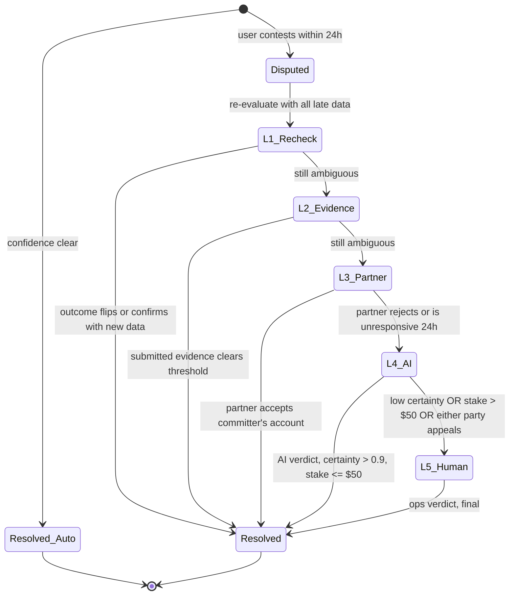

| Level | Handler | SLA | Cost | Applies when |
|---|---|---|---|---|
| **L0** | Automatic re-check with late-arriving data | 60 min | $0 | Always, before anything else |
| **L1** | Evidence submission by committer | 2h window | $0 | Ambiguous confidence |
| **L2** | Partner adjudication (accept/reject with a reason) | 24h | $0 | Two-party commitments |
| **L3** | AI review of the full evidence packet | 15 min | ~$0.05 | Partner unresponsive/deadlocked, stake ≤ $50 |
| **L4** | Human ops review | 24h | ~$4 | Stake > $50, appeals, integrity flags, any fraud signal |
| **L5** | Commitment Court (community panel) | 72h | ~$0 | Opt-in, public commitments, non-monetary or ≤$25 |

**AI review must never be the final word on a contested monetary outcome above the micro threshold.** Any user who appeals an AI verdict gets a human. Say so in the terms. The cost is small and the trust value is enormous.

## 8.3 Evidence packet

Every dispute assembles a complete, replayable packet visible to both parties (with privacy redaction):

```
1. The commitment as agreed: exact terms, timestamped, both signatures/acceptances
2. The verification plan shown to the user at lock time
3. All evidence records with source, timestamp, integrity flags
4. The confidence computation, itemized line by line
5. The decision and which rule produced it
6. Both parties' statements
7. Relevant history: prior similar commitments, dispute record, reputation
```

Item 4 — **the itemized confidence breakdown, shown to the user in plain language** — resolves most disputes without escalation. *"GPS put you at Equinox from 6:34 to 6:58 — that's 24 minutes, and you committed to 45."* Users argue with verdicts; they rarely argue with data they can see.

## 8.4 Commitment Court

An opt-in community adjudication layer for cases where human judgment beats sensors ("did that photo actually show a made bed?").

**Design:**
- Panel of 5 randomly selected jurors from a pool of users with reputation > 700, ≥ 20 resolved commitments, and no social-graph edge to either party (2-hop exclusion).
- Fully anonymized packet: no names, no faces (auto-blurred), no locations beyond category ("a gym").
- Jurors vote pass/fail with a one-line rationale. Majority decides; unanimity is not required.
- Jurors earn points for participating, with a bonus for agreeing with the eventual consensus/human review. **Jurors are never paid cash** — cash-paid adjudication of monetary outcomes is a materially worse legal position ⚖️.
- Either party may opt out to human review at any time.

| Benefits | Risks | Mitigation |
|---|---|---|
| Scales without headcount | Brigading / bias | Random selection, 2-hop social exclusion, anonymization |
| Feels legitimate ("judged by peers") | Slow (72h) | Only for non-urgent, low-stake cases |
| Creates engagement + status | Privacy exposure | Aggressive redaction; opt-in only; never for private commitments |
| Generates labeled training data for AI review | Inconsistent standards | Publish a short adjudication rubric; measure juror–human agreement; remove low-agreement jurors |
| Community ownership of norms | Harassment vector | No juror↔party communication ever; no identities revealed either direction |

**Recommendation: build in V3, not earlier.** It requires a large, high-reputation user base to work and is a distraction before that exists. But design the data model for it now (`dispute_panels`, `juror_votes`) so it can be added without migration pain.

## 8.5 Reputation weighting

- Partner attestations are weighted by the partner's `attestation_reliability` — historical agreement between their calls and independently verified outcomes.
- A partner who has rubber-stamped 40 straight successes for the same person carries near-zero weight (collusion signal, §6.5).
- Frivolous disputes (lost at L4/L5 with no new evidence) cost reputation and, after 3, require a **refundable dispute deposit** to file. ⚖️ *Note: a non-refundable dispute fee is a consumer-protection risk; refundable-on-good-faith is the safer construct.*
- Honest self-reporting is rewarded: a user who proactively reports "I didn't make it, don't bother verifying" gets a small reputation credit. **Rewarding honesty is cheaper than detecting dishonesty.**

## 8.6 Dispute-prevention design (worth more than dispute resolution)

1. Show the verification plan **before** lock (§4.4). Most disputes originate in surprise, not disagreement.
2. Emit real-time progress: *"You're at Equinox — 23 of 45 minutes."* A user who sees the clock running rarely disputes the result.
3. Warn before the failure is locked in: *"You left after 31 minutes. Going back within 10 minutes still counts."*
4. Build in a small, honest grace: 2-minute buffer on arrival deadlines, disclosed at creation. Rigid to-the-second enforcement generates disputes with no behavioral upside.
5. Ship a "life happens" pass: **1 free void per 30 days**, no questions asked, partner notified. This is the single highest-ROI trust feature in the product. It costs almost nothing and prevents the resentment spiral that causes churn.

---
---

# 9. REPUTATION SYSTEM

## 9.1 The asset

The Accountability Score is the product's long-term defensible asset: a verified, portable measure of whether a person does what they say. Nothing like it exists. It must be built carefully enough that people want to carry it, and not so aggressively that it becomes a mechanism of harm.

## 9.2 Score composition

Range **300–900**, deliberately echoing a credit-score shape for legibility (and deliberately *not* claiming to be one ⚖️ — never call it a credit score, never use it for credit decisions).

| Component | Weight | Definition |
|---|---|---|
| **Completion rate** | 35% | Verified successes ÷ resolved commitments, Bayesian-smoothed toward 0.5 with a prior of 10 (protects new users from volatility) |
| **Verification quality** | 20% | Share of successes verified by independent trust roots vs. self-attestation. Rewards using real verification. |
| **Consistency** | 15% | Variance of weekly completion over 12 weeks. Steady beats spiky. |
| **Difficulty** | 10% | Population-relative difficulty of attempted commitments (5am wake-ups score higher than 11pm ones), capped so it can't be gamed by attempting impossible things |
| **Volume / tenure** | 10% | log(resolved commitments) × tenure factor. Diminishing returns. |
| **Integrity** | 10% | Dispute rate, fraud flags, collusion signals, chargebacks. **Only component that can go sharply negative.** |

Deliberately **excluded**: dollars staked. Including it would make the score buyable, correlate it with wealth, and turn it into a discriminatory instrument. Show total staked as a separate vanity stat; keep it out of the score.

### Recency
30-day half-life on individual events, floored so that a strong long-term record cannot be erased by one bad week. A user who was 95% reliable for a year and misses three days should not drop 100 points.

### Category sub-scores
Reliability is context-dependent and users find this genuinely useful:
```
Fitness      912  ▲   Mornings   940
Study        640  ▼   Evenings   580
Work         810  ─   Weekends   490
```

## 9.3 Profile display

```
┌──────────────────────────────────────┐
│  Alec                                │
│  Accountability Score                │
│         843                          │
│  ●●●●●●●●○○  Top 8%                  │
│                                      │
│  92%   commitments completed         │
│  41    day streak 🔥                 │
│  187   commitments kept              │
│  $4,200 successfully staked          │
│                                      │
│  Strongest: Morning fitness (912)    │
│  Working on: Evening study (640)     │
└──────────────────────────────────────┘
```

## 9.4 What the score creates

| Effect | Mechanism |
|---|---|
| **Identity** | "I'm an 840" becomes self-descriptive, which is the strongest form of behavior change (identity-based habit) |
| **Status** | Public, comparative, hard to fake — the three requirements for a real status good |
| **Retention** | Losing a score built over months is a far stronger retention force than losing a streak built over days |
| **Competition** | Friend leaderboards, category rankings, percentiles |
| **Trust** | Partners can assess reliability before agreeing to a mutual commitment; coaches can screen clients |
| **Network effect** | The score is only meaningful where it is recognized. Its value grows with adoption, and it cannot be exported to a competitor. |
| **Portability** | Long-term: a shareable, verifiable credential — the beginning of the infrastructure business |

## 9.5 Ethical guardrails — non-negotiable

The obvious failure mode is building a social credit system. Concrete protections:

1. **No adverse third-party use.** Never sold or provided to employers, insurers, landlords, or lenders for individual decisions. Written into the ToS and the privacy policy as an affirmative commitment. ⚖️
2. **Score is private by default.** The user chooses whether to display it, and to whom. Friends see it only if shared.
3. **Floor and recovery.** Score cannot drop below 300. A "reset" is available once per year that archives history and starts fresh (with the reset itself disclosed to close friends only). **People must be able to recover from a bad period.**
4. **No dark patterns around loss.** Never send "your score will drop in 2 hours!" notifications. Loss framing on a *status* metric is coercive in a way that loss framing on a *stake* is not — the user chose the stake; they did not choose to have their identity scored at them.
5. **Illness, bereavement, and emergencies do not count.** The void mechanism (§8.6) removes the event from scoring entirely.
6. **No discriminatory inputs.** No demographics, no location beyond commitment context, no device price, no social-graph inference. Audit annually for disparate impact across available proxies. ⚖️
7. **Transparency and correction.** Every score change is itemized and viewable. Users can see exactly why the number moved and contest any event.
8. **Cap the punishment.** A single failure can never cost more than 15 points. There is no cliff.
9. **No coercion mechanics.** Nothing in the product may condition access to core functionality on score (no "you need 700 to make commitments"). Score unlocks *higher stake limits* and *juror eligibility* — nothing else.

---

# 10. SOCIAL GRAPH

## 10.1 Entities

| Entity | Definition | Cardinality |
|---|---|---|
| **Friend** | Mutual connection; can see friends-visibility commitments | Many |
| **Accountability partner** | Friend attached to a specific commitment as witness/beneficiary/verifier | Per commitment |
| **Close circle** | Up to 8 friends with elevated visibility + escalation rights | 1 per user |
| **Group** | Named, persistent set with shared programs and a feed | Many |
| **Follower** (V3) | One-way, for creators and public challenges | Many |

**Design decision: friendship is mutual and explicit; following is one-way and only for creator accounts.** A symmetric graph produces the intimacy and reciprocal obligation the product depends on. Asymmetric follow graphs produce performance, which is a different (worse, for this product) dynamic.

## 10.2 Feed

Three tabs, defaulting to **Friends**:

| Tab | Content | Purpose |
|---|---|---|
| **Friends** | Commitments created, kept, broken, streaks, milestones from friends | Core loop; social pressure and encouragement |
| **You** | Your active commitments, upcoming deadlines, recent results | Utility |
| **Discover** (V2) | Public challenges, creator protocols, trending commitments | Growth and marketplace |

### Feed event types
```
🎯  Ryan committed to a 6 AM workout — $25 on the line     [React] [Match this]
✅  Ryan completed his 6 AM workout · verified 4 min ago    [🔥] [👏] [Comment]
💔  Chris broke his 14-day streak                          [Send encouragement]
💸  Jake owes Matt $20                                     [React]
🏆  Sarah completed 30 commitments this month              [Congratulate]
🤝  Alec and Tom both showed up. Nobody paid.              [React]
⚡  Maria is on a 62-day streak — top 1%                    [React]
📣  Ben is looking for a partner: gym at 6:30 tomorrow      [I'm in]
```

**Every feed item carries an action, not just a reaction.** "Match this" (create the same commitment), "I'm in" (join), "Hold me to it too." The feed is a commitment-creation surface disguised as a social feed. This is the single most important design decision in the social layer.

### Feed tone rules
- Failures are reported **factually, never mockingly.** "Chris broke his 14-day streak" — not "Chris flaked again 💀." The system stays neutral; friends can be as brutal as they like in the comments, and they will be. The platform must never be the one doing the shaming. This is both an ethical and a retention requirement.
- Reactions on failure default to supportive options (👊 💪 🫡) with a "send encouragement" prompt.
- A user can hide any single failure from the feed, once per week, no explanation. Autonomy over one's own public record is a precondition for staking anything meaningful.

## 10.3 Privacy model

Four levels, set per commitment, defaulting to **Partners only**:

| Level | Who sees the commitment | Who sees the result | Who sees the stake amount |
|---|---|---|---|
| **Private** | Only you | Only you | Only you |
| **Partners only** ← default | Participants | Participants | Participants |
| **Friends** | Friends | Friends | Hidden unless opted in |
| **Public** | Anyone with the link | Anyone | Hidden unless opted in |

Additional rules:
- **Stake amounts are hidden by default even from friends.** Money is more sensitive than behavior; showing dollar amounts publicly by default creates class dynamics and pressure to over-stake.
- **Location is never shown, only place names**, and only for places the user explicitly named. Never "Alec is at 42.29, -71.29"; never even a map pin in the feed.
- **Health data is never displayed**, only the boolean outcome. "Completed his workout," never "burned 412 calories."
- **Category-level muting:** a user can make all commitments in a category (e.g. "Health," "Recovery") permanently private with one switch.
- **Retroactive privacy:** a user can make any past commitment private at any time; it disappears from others' feeds.
- **Minors:** discovery and public visibility are hard-disabled ⚖️.

---

# 11. VIRAL GROWTH

## 11.1 Structural advantage

The core action requires another person. Unlike a habit tracker that must bolt on a share button, PACT's invite *is* the product's fourth step. Optimizing the invite is optimizing the product.

## 11.2 Twenty-two mechanisms

| # | Mechanism | Trigger | Est. K contribution | Notes |
|---|---|---|---|---|
| 1 | **Partner invite (SMS deep link)** | Every commitment creation | **0.35–0.6** | The core loop. Rich preview shows the real commitment before signup. |
| 2 | **"Hold me to it" link** | Share to group chat | 0.15 | One link, multiple potential partners; first to accept becomes witness |
| 3 | **Shareable result card** | Every resolution | 0.08 | Auto-generated image: commitment, verified badge, streak, time |
| 4 | **Streak milestone card** | 7/30/100 days | 0.05 | High-status, low-frequency |
| 5 | **"Jake owes Matt $20" card** | Failure with peer stake | 0.10 | The funniest artifact the product produces; highest organic share rate |
| 6 | **Profile "bet me" page** | Passive | 0.05 | `pact.app/alec` — anyone can challenge you; creators love this |
| 7 | **Group challenge link** | Group creation | 0.20 | One creator brings 4–20 people |
| 8 | **QR challenge poster** | Gym/dorm/office | 0.10 | Physical distribution in the exact context |
| 9 | **Leaderboard invite** | "Only 3 of your friends are on here" | 0.05 | Contextual, not spammy |
| 10 | **Creator-published protocols** | Marketplace | 0.30 (bursty) | One creator → thousands of installs |
| 11 | **Contact-sync suggestions** | Onboarding | 0.10 | "5 friends already here" |
| 12 | **Referral: free stake insurance** | Post-first-success | 0.06 | Both parties get one "void" credit |
| 13 | **Campus/team leaderboards** | Location-based | 0.12 | Institutional rivalry is a growth engine |
| 14 | **"Match this commitment"** | Feed action | 0.08 | Converts a viewer into a participant in one tap |
| 15 | **Witness request to non-user** | Verification | 0.15 | Non-user gets an SMS to confirm; sees the whole object; converts well |
| 16 | **Public failure feed (opt-in)** | Resolution | 0.04 | "Wall of shame," strictly opt-in, dark-humor merchandising |
| 17 | **Duo/pair streaks** | Two-person streaks | 0.07 | Mutual retention; each protects the other's streak |
| 18 | **Coach/client seat invites** | Coach onboarding | 0.25 (B2B2C) | One coach → 20 clients |
| 19 | **Instagram/TikTok Story integration** | Auto-generated vertical card | 0.10 | Native share sheet with pre-rendered 9:16 asset |
| 20 | **Apple/Google Watch complication** | Passive display | 0.02 | Ambient visibility, conversation starter |
| 21 | **"Roast" comments on failures** | Social | 0.03 | Engagement, not acquisition — but drives re-open |
| 22 | **Corporate/team seed accounts** | B2B | 0.15 | One manager → a team |

## 11.3 Which reach K > 1

K = invites sent × conversion rate. Realistically K ≈ 0.8–1.1 in the first year — enough for very cheap growth, not enough for pure exponential. The four mechanisms that most plausibly push above 1:

1. **#1 Partner invite** — this alone must be excellent, because it fires on *every single commitment*. If a user makes 3 commitments a week and 40% involve a new partner who converts at 45%, that's ~0.5 K from one mechanism. **Optimizing the SMS preview page is worth more than every other growth project combined.**
2. **#7 + #13 Group and campus challenges** — nonlinear: one organizer brings 5–50 people, and campus density means those people already know each other.
3. **#10 + #18 Creators and coaches** — a coach with 20 clients or a creator with 50k followers produces step-function growth. Requires the marketplace (§13).
4. **#15 Witness request to non-user** — uniquely powerful because the non-user is asked to do something *for a friend* (help them), not to try an app. Highest-intent cold entry point in the product.

## 11.4 The invite page (highest-leverage single screen)

When Alec invites Ryan, Ryan gets an SMS with a link to a web page — no app required:

```
        [Alec's photo]
   Alec is committing to something.

   ┌─────────────────────────────────┐
   │  🏋️  Gym by 6:30 AM             │
   │  Tomorrow · Equinox Wellesley   │
   │  Stay at least 45 minutes       │
   │                                 │
   │  If Alec doesn't make it,       │
   │  he owes you $25.               │
   └─────────────────────────────────┘

   Alec wants you to hold him to it.

   [   Hold him to it   ]   ← primary
   [ What is this? ]

   Alec has kept 91% of his commitments.
```

Rules: full commitment visible before any signup gate; a single primary action; signup happens *after* the tap, prefilled from the SMS number; the accept completes in ≤3 taps total. **The invitee's first experience of the product is being given power over a friend, not being asked to try software.**

---

# 12. GAMIFICATION

## 12.1 Philosophy

Gamification here is dangerous in a specific way: the product already involves real money and real self-worth. Layering compulsion loops on top of loss aversion produces something genuinely harmful. The rule: **game mechanics may amplify intrinsic motivation; they may never manufacture anxiety.**

## 12.2 Mechanics

| Mechanic | Design | Healthy-design constraint |
|---|---|---|
| **Streaks** | Consecutive days with ≥1 kept commitment | **Streak freezes:** 2 free per month, auto-applied. Illness/travel/emergency never break a streak. No "your streak dies in 1 hour" notifications. |
| **XP** | Per completion, scaled by difficulty and verification independence | No XP for opening the app. No daily-login XP. XP tracks behavior, never engagement. |
| **Levels** | 1–50, log curve | Cosmetic + stake-limit unlocks only. Never gates functionality. |
| **Badges** | ~60 achievements ("Dawn Patrol: 20 pre-6am commitments", "Ironclad: 30 without a dispute") | Behavior-based, never spend-based. No badge for staking more money. |
| **Trophies** | Seasonal, rare | Awarded for completion, not for beating others |
| **Accountability Score** | §9 | See §9.5 guardrails |
| **Challenge ranks** | Bronze→Diamond within a specific challenge | Scoped to the challenge; expires with it; no permanent caste |
| **Seasons** | 8-week cycles with themes and a soft reset of leaderboards | Provides fresh starts — crucial for users who fell behind |
| **Friend leaderboards** | Friends only, opt-in, weekly | **Never global by default.** Global leaderboards in a money product create pressure to over-stake. |
| **Duo streaks** | Shared streak between two partners | Beautiful mechanic; also the highest-guilt one — cap the escalation, allow either party to pause |

## 12.3 Explicitly banned mechanics

- Loot boxes, gacha, or any randomized reward — introduces *chance*, which is the exact element §7.3 depends on excluding. **Categorically prohibited, for legal as well as ethical reasons.**
- Streak-loss panic notifications
- "You're falling behind your friends" comparisons
- Pay-to-restore streaks (monetizing loss aversion on an emotional asset)
- Infinite feed scroll
- Escalating stake suggestions after a failure ("double it to make it back") — this is loss-chasing, the core mechanic of problem gambling. **Hard-banned in the AI coach.**
- Any notification designed to produce a return visit without giving the user something useful

## 12.4 Healthy-engagement instrumentation

Track and alert on:
- Sessions/day > 15 → surface a "you're checking a lot" nudge
- Stake escalation velocity → cooling-off (§22)
- Failure streaks ≥ 4 → switch coach tone to supportive, suggest lowering difficulty, offer a break
- Late-night usage spikes → soften notifications
- Post-failure immediate re-stake at higher amount → **hard block + cooling-off period**

---

# 13. COMMITMENT MARKETPLACE

## 13.1 Concept

A **protocol** is a publishable, reusable commitment program: a template plus conditions, schedule, verification plan, and social structure. Users install a protocol the way they'd join a challenge, and it materializes as a series of commitments configured to their own life (their gym, their timezone).

## 13.2 Anatomy of a protocol

```json
{
  "protocol_id": "prot_75hard",
  "title": "75 Hard",
  "author": { "type": "creator", "id": "usr_coach_x", "verified": true },
  "duration_days": 75,
  "daily_commitments": [
    { "template": "activity.workout", "params": { "min_seconds": 2700, "count": 2 } },
    { "template": "proof.photo", "params": { "prompt": "progress photo" } },
    { "template": "reading.progress", "params": { "min_pages": 10 } }
  ],
  "failure_policy": "restart_from_day_1",
  "stake_model": { "kind": "deposit", "amount_minor": 7500, "refund": "on_completion" },
  "social": { "cohort": true, "cohort_size_max": 200, "leaderboard": true },
  "safety_review": { "status": "approved", "notes": "no dietary restriction; no weight targets" }
}
```

## 13.3 Launch catalogue

| Protocol | Duration | Verification | Stake model | Persona |
|---|---|---|---|---|
| 5 AM Club | 30d | Sleep-end + first unlock | $30 deposit | P1, P3 |
| 30-Day Gym Challenge | 30d | Geofence + wearable | $50 deposit | P2, P9 |
| 75 Hard | 75d | Multi-condition | $75 deposit | P14 |
| Dry January | 31d | Self-attest + transaction absence | $100 deposit | P3, P7 ⚠️ |
| 30-Day Study Challenge | 30d | Library dwell / screen-time | Points | P1, P11 |
| Founder Deep Work Sprint | 14d | Screen-time + calendar blocks | $150 deposit | P4 |
| 10K Steps Daily | 30d | HealthKit | $25 deposit | Everyone |
| Cold Shower Challenge | 21d | Video + AI vision | Points | P1, P14 |
| Sales Outreach Sprint | 20 business days | CRM API | Employer-funded | P5 |
| No-Phone Mornings | 14d | Screen Time | $20 deposit | P3 |

## 13.4 Creator model

| Creator type | What they publish | Monetization |
|---|---|---|
| **Fitness influencer** | Branded 30/75-day programs | Entry fee revenue share |
| **Coach** | Client-specific protocols | Client seats (SaaS) |
| **Gym/studio** | Attendance & retention programs | B2B subscription |
| **University org** | Campus challenges | Free (growth) |
| **Company** | Team wellness programs | Enterprise seats |
| **Author/expert** | Book-companion programs | Rev share |

## 13.5 Monetization

| Stream | Rate | Notes |
|---|---|---|
| Challenge entry fee | 15% platform / 85% creator | ⚖️ **Entry fee + prize = contest law.** Safest: entry fee buys *access to the program*, and any reward is non-cash (badge, merch) or funded by PACT rather than the pot. |
| Creator subscription | $49–199/mo | For cohort tools, analytics, branding |
| Coach seats | $12/client/mo | Highest-quality revenue in the model |
| Gym/studio B2B | $200–2000/mo | Attendance-driven retention product |
| Sponsored protocols | CPM/CPA | Brand-funded challenges (a supplement brand funds "30-Day Movement") |

**Recommendation: ship the marketplace read-only first** (PACT-authored protocols, no third-party publishing) to validate that protocol-installed commitments retain as well as user-created ones. Open publishing in month 12+, gated by identity verification and a safety review queue (§22).

---

# 14. AI ACCOUNTABILITY COACH

## 14.1 Role

Not a chatbot. A **background process with intervention rights**, which occasionally speaks. Its job is to increase the probability that a commitment the user already made gets kept — using timing, context, and specificity rather than motivation.

## 14.2 Capabilities

| Capability | Example | Trigger |
|---|---|---|
| **Contextual intervention** | "You're 18 minutes from Equinox and you have 35 minutes. Traffic is light — leave by 6:07." | Risk model + location + routing |
| **Pattern insight** | "You've missed 5 of the last 8 Monday workouts, but 11 of 12 Wednesdays. Move Mondays to 7:30?" | Weekly analysis |
| **Difficulty calibration** | "This is your 4th failed 5am commitment. 6:15 has a 78% success rate for you." | Post-failure |
| **Stake calibration** | "$10 hasn't been enough on Fridays. Try $25?" — with a hard ceiling and never after a failure | Pattern-based, cooling-off-aware |
| **Schedule optimization** | "Your gym commitments succeed 3× more often when you sleep before 11:30." | Cross-signal correlation |
| **Pre-commitment planning** | "Tomorrow's 6:30 is tight given your 11pm flight. Push to Thursday?" | Calendar conflict detection |
| **Partner suggestion** | "Ryan does 6am workouts too. Want to pair up?" | Graph + schedule overlap |
| **Post-mortem** | "You made 5 of 6 this week. The miss was Thursday after the late meeting." | Weekly digest |
| **Recovery** | "Three misses in a row. Want to shrink the goal for a week?" | Failure streak |

## 14.3 Tone rules

The coach speaks in **specific, actionable, non-judgmental** sentences.

| ✅ Do | ❌ Never |
|---|---|
| "Leave in 8 minutes to make it." | "Don't be a quitter." |
| "You've missed 3 in a row. Want to make this easier?" | "You're failing. Ryan is at 94%." |
| "This is your best window historically." | "Do you even want this?" |
| "Skipping is fine. Want to void it?" | "Your streak dies in 42 minutes!!" |
| Silence when there's nothing useful to say | Daily check-ins with no information |

**Frequency discipline:** at most 2 proactive coach messages per day and 1 weekly digest. The coach earns the right to speak by being useful; a coach that speaks constantly becomes noise and gets muted, at which point it can never help again.

## 14.4 Coercion guardrails

The coach has real power over a user's money and self-image. Hard constraints:

1. **Never suggest raising a stake within 24h of a failure.** Loss-chasing prevention. Non-negotiable.
2. **Never suggest a stake above the user's trailing 30-day median × 1.5.**
3. **Never use shame, comparison to friends, or identity attacks.**
4. **Always offer a de-escalation path** alongside any escalation suggestion.
5. **Never discourage voiding, skipping, or quitting.** If a user wants out, help them out cleanly.
6. **Detect distress and stand down.** Signals of crisis, disordered eating, self-harm framing, or compulsive escalation → coach goes silent, surfaces support resources, and the safety system takes over (§22).
7. **Fully mutable and disable-able**, per-category and globally, in one tap, from any coach message.
8. **Never invent a fact.** All coach claims are computed from the user's actual data and are tappable to see the underlying numbers.

## 14.5 Implementation

- Deterministic insight generation (SQL/feature-store computations on the user's history) → LLM used **only for phrasing**, never for deciding what's true. This makes the coach cheap, fast, verifiable, and hallucination-free.
- A ranked candidate queue of possible interventions, scored by `expected_uplift × urgency × novelty`, throttled to the frequency budget.
- Interventions are A/B tested against no-intervention holdouts and measured on **commitment completion rate**, not on open or click rate. An intervention that gets tapped but doesn't change behavior is noise.

---

# 15. PREDICTIVE ACCOUNTABILITY

## 15.1 The model

`P(fail | commitment, user, context, t)` — a live probability, recomputed as the deadline approaches.

**Model choice:** gradient-boosted trees (XGBoost/LightGBM) on tabular features, not a neural net. Reasons: small data at launch, tabular features, need for explainability (the coach must say *why*), and cheap retraining. Cold-start via a population-level prior blended with the user's own history as it accumulates (empirical Bayes shrinkage).

## 15.2 Features

| Group | Features |
|---|---|
| **Historical** | Completion rate overall / by category / by hour / by weekday / by location; current streak; days since last failure; count of similar prior commitments |
| **Temporal** | Hour of day, day of week, days until deadline, time since creation, holiday flag, exam-period flag |
| **Behavioral (live)** | Current distance from target location; is user moving; time since last phone unlock; is user still asleep (HealthKit); has user opened the app today |
| **Contextual** | Weather (precipitation and temperature genuinely predict morning gym attendance); commute travel time right now; calendar density; travel/away-from-home flag |
| **Physiological** | Last night's sleep duration and onset time; resting HR deviation; prior-day activity load |
| **Commitment** | Stake amount; partner present or not; difficulty percentile; number of conditions; recurrence position (day 3 of 30) |
| **Social** | Partner's own completion rate; has partner viewed the commitment; group participation rate |

## 15.3 Applications

| Application | Mechanism | Value |
|---|---|---|
| **Dynamic reminders** | Fire when `P(fail)` crosses 0.5, not at a fixed offset | A reminder at the moment of actual risk is worth ~5 scheduled ones |
| **Leave-by-now alerts** | Combine `P(fail)` with routing ETA | The single most useful notification in the product |
| **Stake suggestion** | Recommend a stake that puts predicted success at 75–85% (challenging, achievable) | Prevents both trivial and doomed commitments |
| **Schedule optimization** | Surface the user's highest-probability windows at creation time | Improves outcomes before the commitment exists |
| **Partner escalation** | At `P(fail) > 0.8` with 60+ min remaining, optionally ping the partner | Highest-impact intervention; **strictly opt-in at creation** |
| **Feasibility gate** | Block/warn at creation if `P(success) < 0.15` | Prevents predictable failure and the resentment it causes |
| **Difficulty calibration** | Feed the difficulty component of the reputation score | Fair scoring |
| **Displayed probability** | "72% likely to complete" on the commitment card | ⚠️ Use carefully — see below |

**On showing probability to users:** it is motivating when high and demoralizing when low. **Recommendation: show it only above 40%, and below that show an action instead of a number** ("Leave in 6 minutes to make this"). Test explicitly (§32).

## 15.4 Ethical constraints
- Never use the model to *increase* the probability of failure to extract forfeits. **Test for this explicitly in the metrics review**: if forfeit revenue ever correlates with model interventions, that is a five-alarm fire.
- Never expose one user's failure probability to another user without consent.
- Never use the model to set stakes automatically. Suggest; never act.

---
---

# 16. GROUP ACCOUNTABILITY

## 16.1 Why groups matter

Group commitments have the best unit economics in the product: one creation action produces N users, N× the commitments, and a self-reinforcing social structure that retains far better than pairs. A group that survives its first 4 weeks is close to permanently retained.

## 16.2 Group types

| Type | Size | Structure | Example |
|---|---|---|---|
| **Squad** | 3–8 | Shared program, mutual visibility | 5 friends, 3 workouts/week |
| **Team** | 8–30 | Captain/admin role, roster | Club sports off-season lifting |
| **Cohort** | 20–500 | Time-boxed, protocol-driven, leaderboard | 75 Hard cohort |
| **Org** | 30–5000 | Hierarchical, admin-configured | Company wellness, fraternity, dorm |
| **Class** | 10–200 | Instructor-configured | Study group, seminar |

## 16.3 Group program mechanics

```
Program: "September Fitness"
  Members:      5
  Deposit:      $100 each
  Target:       16 workouts in 30 days (per member)
  Verification: geofence + wearable
  Refund:       $6.25 returned per workout completed, up to $100
  Forfeit:      unearned deposit → group's chosen charity
  Social:       shared leaderboard, daily feed, group chat
```

Key design choices:
- **Per-member targets, not group targets.** A shared target creates free-rider dynamics and lets one member's failure punish everyone — which generates real interpersonal conflict.
- **Incremental refund, not all-or-nothing.** A member who misses week 1 in an all-or-nothing structure has zero incentive for weeks 2–4 and quits. Incremental refunds keep everyone engaged to the last day. This single choice is worth more than any other group mechanic.
- **Public progress, private amounts.**
- **Group void budget:** the group collectively holds 3 "life happens" passes per month.

## 16.4 ⚖️ The redistribution problem

The intuitive design — *"users who succeed split the forfeited funds from users who fail"* — is the most legally dangerous construct in this entire document. It has all three gambling elements: consideration (the deposit), a prize (other people's money), and — critically — **an outcome partly determined by events outside each participant's control** (whether *others* fail). It also closely resembles both a pari-mutuel pool and an unregistered prize contest.

| Option | Structure | Risk | Verdict |
|---|---|---|---|
| A | Forfeits split among succeeders | Consideration + prize + partial chance | 🔴 **Do not build** |
| B | Forfeits → charity; deposits returned on success | No prize | ✅ **Recommended** |
| C | Forfeits → platform; PACT funds separate non-cash rewards | No prize from the pool | ✅ Acceptable |
| D | Non-cash prizes (merch, badges) funded by PACT | No cash prize | ✅ Good for engagement |
| E | Subscription-funded cash rewards, free to enter | No consideration | ✅ Cleanest cash reward |
| F | Redistribution, but only in states cleared by counsel, with registration and bonding | Full contest-law compliance burden | 🟡 Post-Series A, if ever |

**Recommendation: Option B for v1, with Option D layered on for the emotional payoff.** The winner's reward is a badge, a leaderboard position, and the return of their own money — plus the knowledge that the flakes funded a charity. Communicated well ("your group donated $340 to the food bank because Kevin skipped leg day"), this is arguably *more* fun than a cash split and eliminates the largest single legal exposure in the product.

## 16.5 Segment notes

| Segment | Opportunity | Watch-out |
|---|---|---|
| Fraternities/sororities | Extremely high density and social pressure | ⚠️ Hazing adjacency — group-imposed commitments must be individually consented. Never allow an admin to create a staked commitment *for* a member. Ever. |
| Dorms/RAs | Institution-blessed distribution | Age verification; likely some minors |
| Sports teams | Coach-driven, high compliance | ⚖️ NCAA rules on required activities; minors on HS teams; **never permit weight-target commitments** (§22) |
| Companies | Budget, seat-based revenue | ⚖️ Employer-mandated wellness with financial stakes touches ADA/GINA/HIPAA wellness-program rules. Voluntary + employer-funded only; employees must never stake their own money at an employer's direction. |
| Founder groups | High WTP, high evangelism | Small TAM |
| Classes | Instructor as the natural admin | FERPA if grades are involved |

**Universal group safety rule: an admin can propose, but only the individual can accept and only the individual can stake their own money.** No exceptions. This prevents the entire class of coercion failures.

---

# 17. SMART CONTRACT / CRYPTO VERSION

## 17.1 Honest assessment

Crypto is **not** the MVP, is **not** V2, and may never be necessary. The reasoning, stated plainly:

1. The bottleneck in this product is **verification**, not settlement. A smart contract still needs an oracle telling it whether you went to the gym. That oracle is the trusted party. Decentralizing settlement while centralizing truth solves nothing — it moves the trust, it doesn't remove it.
2. The target user (a college student, a gym partner) has no wallet, does not want one, and abandons at seed-phrase setup.
3. Crypto *adds* regulatory surface — MSB registration, state virtual-currency licenses, OFAC screening, Travel Rule, tax reporting — rather than removing it. The common assumption that crypto sidesteps compliance is backwards for a consumer product.
4. Every crypto integration is engineering time not spent on verification accuracy, which is the actual moat.

**Recommendation: optional infrastructure in V3+, positioned for three specific cases where it genuinely wins:**
- **Non-US markets** where card rails are poor and stablecoins are already in use
- **Large or long-duration stakes** where users want cryptographic guarantees that PACT can't touch the money
- **Programmatic/API customers** building commitment products who want composable, self-custodied settlement

## 17.2 Reference architecture (if built)

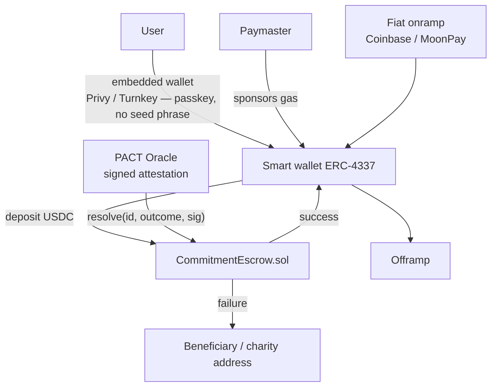

### Choices

| Decision | Recommendation | Why |
|---|---|---|
| Chain | **Base** (or Arbitrum) | Sub-cent fees, strong USDC support, best consumer tooling and onramps |
| Asset | **USDC only** | Volatile assets in a commitment stake are a disaster: a user could lose 30% by succeeding |
| Wallet | **Embedded smart wallet (ERC-4337) via Privy/Turnkey**, passkey-secured, no seed phrase | Seed phrases are fatal to consumer conversion |
| Gas | **Sponsored via paymaster** | User must never see gas |
| Oracle | **Signed attestation from PACT's verification service**, with an escape hatch: a 2-of-3 multisig (PACT, the counterparty, an independent arbiter) can resolve if the oracle is down for >72h | The oracle is the trust bottleneck; the multisig prevents permanent lockup |
| Recovery | Passkey + social recovery guardians | Lost-key support burden is otherwise fatal |
| Onramp | Coinbase Onramp / MoonPay | Do not build |

### Contract sketch
```solidity
struct Commitment {
    address committer; address beneficiary; address charity;
    uint256 amount; uint64 deadline; uint64 resolveBy;
    bytes32 termsHash;      // hash of the full off-chain CommitmentSpec
    Status status;          // Funded, Succeeded, Failed, Refunded, Expired
}
function create(bytes32 termsHash, address beneficiary, uint64 deadline) external payable;
function resolve(uint256 id, bool success, bytes calldata oracleSig) external;
function claimExpired(uint256 id) external;  // if unresolved past resolveBy, refund committer
```
`claimExpired` defaulting to **refund the committer** is the correct fail-safe: if the oracle disappears, users get their money back rather than losing it.

## 17.3 Blockchain vs. traditional ledger

| Dimension | Postgres ledger | Smart contract |
|---|---|---|
| Settlement cost | 2.9% + $0.30 | ~$0.01 + onramp fees (2–4%) |
| Speed | Instant auth, T+2 settle | Seconds |
| Chargebacks | Yes (a real cost) | None (a real benefit) |
| Consumer UX | Excellent | Poor–fair even with abstraction |
| Regulatory | Payments (well-trodden) | Payments **plus** crypto (novel, hostile) |
| Trust guarantee | Trust PACT | Trust PACT's oracle (i.e., still PACT) |
| Global reach | Weak outside US/EU | Strong |
| Dev cost | Low | High (audits, ~$50–150k) |
| Failure modes | Card decline | Lost keys, congestion, contract bugs, permanent loss |

**Verdict: the ledger wins on every dimension that matters for the beachhead.** Build crypto only when a specific customer segment demands it and will pay for it.

---

# 18. UX / UI — SCREEN BY SCREEN

## 18.1 Visual identity

Reference points are Robinhood (clarity of financial state), Strava (verified achievement), BeReal (unglamorous authenticity), Cash App (playfulness with money). The synthesis should be original, not a blend.

**Direction: "Institutional Warmth" — the seriousness of a contract, the warmth of a friendship.**

| Element | Spec |
|---|---|
| **Core metaphor** | The card as a physical document — a signed, stamped, sealed artifact with weight |
| **Palette** | Ink `#0A0A0B` base (dark-first). Paper `#F7F5F0` for commitment cards — a deliberate warm off-white against the dark UI, so a commitment reads as a physical object placed on a desk. Accents: Seal Red `#D93F2B` (stakes, failure), Verified Green `#0F9D58`→`#00C853` gradient (success), Signal Amber `#FFB300` (at-risk) |
| **Type** | Display: a high-contrast grotesque with real personality (e.g. Söhne, Gambetta, or a licensed serif for numerals). Body: Inter. **Numerals are the hero** — countdowns and dollar amounts get large tabular figures. |
| **Motion** | Physical: cards stamp, seal, and settle. Verification is a *stamp*, not a checkmark animation. Failure is a subtle tear, never a red X explosion. |
| **Texture** | Subtle paper grain on commitment cards. One tactile detail carries the whole identity. |
| **Sound/haptic** | A single, distinctive "stamp" haptic + sound on verification. This becomes the product's signature — the Venmo "ka-ching" equivalent. |
| **Photography** | Unstyled, real, phone-camera quality. Never stock fitness imagery. |

**Anti-brief:** no gradients-on-everything, no glassmorphism, no neon "crypto" aesthetic, no cartoon mascots, no confetti on success (overused, and cheapens a real achievement).

## 18.2 Screen specifications

Format: **Purpose → Hierarchy → Elements → Primary CTA → Secondary → Empty → Error.**

---

### S1. Onboarding
- **Purpose:** get to a first commitment in <3 minutes, with only the permissions that first commitment needs.
- **Hierarchy:** (1) value prop in one line, (2) phone auth, (3) name/photo, (4) *first commitment creation*, (5) permissions in context, (6) partner invite.
- **Elements:** 3 value screens (max), phone + OTP, profile capture, contact permission with a clear reason, an inline first-commitment composer.
- **Primary CTA:** "Make your first commitment"
- **Secondary:** "Browse challenges"
- **Empty:** n/a
- **Error:** OTP failure → resend + "call me instead"; contacts denied → manual phone entry for the partner, never a dead end.
- **Critical rule:** **request no permission before it is needed.** Location is requested during the first location-based commitment, with a one-sentence explanation of exactly what it's used for. Requesting Always-Allow location on screen 2 destroys grant rates and trust simultaneously.

---

### S2. Home (see §19 for full layout)
- **Purpose:** answer "what am I on the hook for right now?" in under one second.
- **Primary CTA:** the composer field.

---

### S3. Create Commitment (composer)
- **Purpose:** capture intent in one utterance.
- **Hierarchy:** input field (dominant) → templates → recent partners.
- **Elements:** large text field with a mic button (hold to speak), 3 suggested templates from history, "from a challenge" link.
- **Primary CTA:** send/parse (auto-fires on speech end).
- **Secondary:** template tap; manual builder (buried, for power users).
- **Empty:** placeholder rotates through real examples: *"Gym by 6:30 tomorrow or I owe Ryan $25"*.
- **Error:** parse failure → "I didn't catch a deadline. When does this need to happen?" — a single question, never a form.

---

### S4. AI Composer / Confirmation
- **Purpose:** show the parsed commitment and get one confident tap.
- **Hierarchy:** title → chips → verification plan → stake → assumptions → CTA.
- **Elements:** editable chips (what/when/where/how long/who/stake), a "How I'll check" expandable section, an assumptions line, feasibility warning if applicable.
- **Primary CTA:** **Lock it in**
- **Secondary:** "Change something" · "Start over" · "Make it points instead"
- **Error:** unresolvable place → inline map search; unverifiable plan → "I can't reliably check this. Add a photo proof?"

---

### S5. Invite Partner
- **Purpose:** attach a human in ≤15s.
- **Hierarchy:** suggested partners → search → share link.
- **Elements:** recent partners as avatar chips (top row, one tap), contact search, "share link" for group chats.
- **Primary CTA:** "Send to [Name]"
- **Secondary:** "Copy link" · "Skip — charity instead"
- **Empty:** no contacts → prominent share-link.
- **Error:** invite send failure → auto-fallback from push to SMS.

---

### S6. Commitment Detail
- **Purpose:** the single source of truth for one commitment.
- **Hierarchy:** countdown (largest element) → status → terms → verification progress → participants → activity.
- **Elements:** live countdown, progress ring for duration-based conditions, "how I'll verify" list with live check states, stake display, partner avatars, comment thread, share button.
- **Primary CTA:** contextual — "Get directions" (pre-deadline) / "Submit proof" (evidence needed) / "Dispute" (post-failure).
- **Secondary:** void request · edit (pre-lock only) · cancel (pre-start only).
- **Empty:** n/a
- **Error:** verification source disconnected → prominent banner + reconnect CTA. **This must be loud** — a silently disconnected HealthKit is a guaranteed unfair failure.

---

### S7. Active Commitments
- **Purpose:** manage everything in flight.
- **Hierarchy:** sorted by urgency (soonest deadline first), grouped Today / Tomorrow / This week / Recurring.
- **Elements:** compact cards with countdown, stake, status dot, partner avatar.
- **Primary CTA:** new commitment (FAB).
- **Empty:** "Nothing on the line right now." + one-tap "repeat last week's" suggestions.

---

### S8. Verification / Proof Upload
- **Purpose:** capture evidence in the fewest possible taps.
- **Hierarchy:** what's being asked → camera → submit.
- **Elements:** **camera opens immediately** (not a picker), prompt overlay ("show your gym check-in"), retake, optional note.
- **Primary CTA:** "Submit proof"
- **Secondary:** "Ask [partner] to confirm instead" · "I didn't make it" (honest failure — always available, always dignified)
- **Error:** upload failure → queue offline, retry, and **extend the evidence window by the outage duration**. Never penalize a user for a network failure.

---

### S9. Wallet
- **Purpose:** show money state with zero ambiguity.
- **Hierarchy:** "At stake right now" (hero number) → this month's kept/forfeited → payment method → history.
- **Elements:** at-stake total, month summary (kept vs. forfeited vs. donated), payment method, charity receipts, transaction list.
- **Primary CTA:** manage payment method.
- **Secondary:** set stake limits · download receipts · view charity impact.
- **Empty:** "You haven't staked anything yet."
- **Error:** card declined → prominent banner listing exactly which commitments are affected.

---

### S10. History
- **Purpose:** the record. This is where identity forms.
- **Hierarchy:** stats header → calendar heatmap → chronological list with filters.
- **Elements:** completion rate, streak history graph, category breakdown, filterable list.
- **Primary CTA:** "Repeat this" on any past commitment.
- **Empty:** "Your record starts with your first commitment."

---

### S11. Profile / Accountability Score
- **Purpose:** identity and status.
- **Hierarchy:** avatar + name → score → key stats → category strengths → badges → recent public commitments.
- **Elements:** score with percentile, streak, completion %, total staked, category radar, badge shelf, share button.
- **Primary CTA:** "Share profile"
- **Secondary:** privacy settings · edit profile.
- **Empty (new user):** score shown as "Building — 4 more commitments to establish your score." Never show a low score to a new user; show progress toward having one.

---

### S12. Friend Profile
- **Purpose:** assess and engage.
- **Elements:** their score/stats (if shared), shared history with you ("you've made 12 commitments together, you're 8–4"), their active public commitments.
- **Primary CTA:** **"Challenge [Name]"** — the highest-value button on the screen.
- **Secondary:** "Be their partner" · message · mute · remove.

---

### S13. Groups
- **Purpose:** group state and program progress.
- **Hierarchy:** program progress → member leaderboard → group feed → chat.
- **Elements:** progress bars per member, pool/deposit state, feed, chat, invite.
- **Primary CTA:** contextual (log/verify today's, or invite).
- **Empty:** "Start a group program" with templates.

---

### S14. Challenges / Discover
- **Purpose:** find a protocol to join.
- **Elements:** featured protocols, category filters, cohort start dates, friends-already-in badges, difficulty and average-completion stats (honest ones).
- **Primary CTA:** "Join challenge"
- **Empty:** curated defaults.

---

### S15. Notifications
- **Purpose:** inbox for actionable items.
- **Hierarchy:** action-required (pinned, top) → social → system.
- **Elements:** grouped by day; action-required items have inline buttons (Confirm / Deny / Submit proof).
- **Primary CTA:** inline per item.
- **Empty:** "You're all caught up."

---

### S16. Disputes
- **Purpose:** resolve fairly and legibly.
- **Hierarchy:** the disputed commitment → **what the system saw (itemized)** → your statement → status/timeline.
- **Elements:** evidence timeline, itemized confidence breakdown in plain language, statement field, additional-evidence upload, current ladder stage with an ETA.
- **Primary CTA:** "Submit dispute" / "Add evidence"
- **Secondary:** "Accept the result" · "Escalate to a human"
- **Error:** dispute window expired → clearly explained, with contact-support as an out.

---

### S17. Settings
Sections: Account · Notifications (granular per type) · **Privacy** (default visibility, data sharing, location retention) · **Limits** (max stake, daily cap, cooling-off, self-exclusion) · Integrations (connect/disconnect each source, with what each is used for) · Payment methods · Data & export · Support · Legal.

**"Limits" must be prominent, not buried under Advanced.** In a product where users voluntarily risk money, easy access to self-imposed constraints is both an ethical obligation and a trust signal.

---

# 19. HOME SCREEN

## 19.1 Layout

```
┌─────────────────────────────────────────┐
│  ●  Alec              843  ●  🔥 41     │  ← 44pt header: avatar, score, streak
├─────────────────────────────────────────┤
│                                         │
│   $75  at stake today                   │  ← Hero. 48pt tabular numerals.
│   3 commitments active                  │     Seal Red if any at-risk.
│                                         │
├─────────────────────────────────────────┤
│  ┌───────────────────────────────────┐  │
│  │ 🏋️  Gym by 6:30 AM                │  │  ← NEXT UP card, paper texture,
│  │     Equinox · 45 min              │  │     visually dominant
│  │                                   │  │
│  │        4h 12m                     │  │  ← 40pt countdown
│  │     ●●●●●○○○  72% likely          │  │  ← risk bar (hidden if <40%)
│  │                                   │  │
│  │  $25 → Ryan        [Directions]   │  │
│  └───────────────────────────────────┘  │
│                                         │
│  ┌──────────────┐ ┌──────────────┐      │  ← horizontal scroll of
│  │📚 Library 2h │ │📱 No IG 9–5  │      │     other commitments today
│  │  8h 40m      │ │  ✓ on track  │      │
│  │  $30 charity │ │  $10         │      │
│  └──────────────┘ └──────────────┘      │
├─────────────────────────────────────────┤
│  ┌─────────────────────────────────────┐│
│  │  ✍️  What are you committing to?    ││  ← ALWAYS VISIBLE composer
│  │                              🎤     ││
│  └─────────────────────────────────────┘│
├─────────────────────────────────────────┤
│  FRIENDS                                │
│  ✅ Ryan completed his 6 AM workout     │
│     verified 4 min ago      [🔥] [Match]│
│  💔 Chris broke his 14-day streak       │
│                     [Send encouragement]│
│  🎯 Maria committed: 10k steps · $20    │
│                              [Match it] │
└─────────────────────────────────────────┘
   Home    Feed    [+]    Groups   Profile
```

## 19.2 Rationale

| Element | Position | Why |
|---|---|---|
| **$ at stake today** | Hero | This is the emotional core. One number that answers "what's on the line?" Users will open the app just to see it. |
| **Next Up card** | Dominant | 80% of sessions concern exactly one commitment: the next one. Everything else is secondary. |
| **Countdown** | Largest text on the card | Urgency is the mechanism. Time remaining, not time elapsed. |
| **Risk bar** | Below countdown | Actionable at a glance. Hidden below 40% (§15.3) — replaced by an action ("Leave in 6 min"). |
| **Composer** | Always visible, mid-screen | Creation must never be more than zero taps away. A FAB adds a tap and hides the primary action. |
| **Friends feed** | Below the fold | Social pressure and inspiration, but never above the user's own obligations. |
| **Score + streak** | Header, small | Persistent identity anchor without dominating. |

### State variations
| State | Change |
|---|---|
| Nothing today | Hero becomes "Nothing on the line today" + 3 one-tap repeat suggestions from history |
| At risk (P(fail) > 0.6) | Hero and Next Up card turn Signal Amber; a "Leave in 6 minutes" action bar appears |
| Verification pending | Next Up becomes an action card: "Quick photo?" with the camera one tap away |
| Just succeeded | Full-bleed stamp animation, then a share card, then "Same again tomorrow?" |
| Just failed | Calm, factual result. Stake outcome shown plainly. Two options: "Dispute" and "Try again tomorrow." **No shame language, no red alarm.** |
| Brand new user | Hero replaced by a single large composer with an example, plus "Start with a challenge" |

---

# 20. NOTIFICATIONS

## 20.1 Principles

1. **Every notification carries information or an action.** No "come back!" pings.
2. **Risk-triggered beats time-triggered.** One notification at the right moment beats five at fixed offsets.
3. **Escalation must be pre-consented at creation time**, never a surprise.
4. **Quiet hours are absolute**, except for commitments the user explicitly scheduled in that window.
5. **Hard cap: 6 push notifications per user per day**, excluding user-initiated actions.

## 20.2 Matrix

| Event | Push | SMS | Email | Partner escalation | Timing | Priority |
|---|---|---|---|---|---|---|
| Invite received | ✅ | ✅ (non-users) | — | — | Immediate | High |
| Commitment accepted | ✅ | — | — | — | Immediate | High |
| Partner declined | ✅ | — | — | — | Immediate | High |
| Funding failed | ✅ | ✅ | ✅ | — | Immediate | **Critical** |
| Commitment starting | ✅ | — | — | — | At start | Low (opt-in) |
| 24h remaining | ✅ | — | — | — | T-24h | Low |
| 1h remaining | ✅ | — | — | — | T-1h, only if not yet satisfied | Medium |
| **Risk detected** | ✅ | — | — | Opt-in | `P(fail) > 0.6` | **High** |
| **Leave-by-now** | ✅ | — | — | — | ETA + buffer = deadline | **Critical** |
| Progress update | ✅ | — | — | — | Milestone (e.g. 50% of dwell) | Low |
| Verification requested | ✅ | ✅ | — | — | At resolution | **Critical** |
| Verification succeeded | ✅ | — | — | — | Immediate | Medium |
| Commitment failed | ✅ | — | ✅ | — | At resolution +60min | High |
| Stake released | ✅ | — | — | — | With result | Medium |
| Stake forfeited | ✅ | — | ✅ (receipt) | — | At settlement | High |
| Partner completed | ✅ | — | — | — | Immediate | Low |
| Partner failed | ✅ | — | — | — | Immediate | Low |
| You owe / you're owed | ✅ | — | ✅ | — | At settlement | High |
| Confirmation requested (you're the witness) | ✅ | ✅ | — | — | Immediate | **Critical** |
| Dispute opened | ✅ | — | ✅ | — | Immediate | High |
| Dispute resolved | ✅ | — | ✅ | — | Immediate | High |
| Streak milestone | ✅ | — | — | — | Immediate | Low |
| Streak at risk | ✅ | — | — | — | **Only if a commitment exists today** | Low |
| Friend joined | ✅ | — | — | — | Batched daily | Low |
| Weekly digest | — | — | ✅ | — | Sunday 6pm | Low |
| Coach insight | ✅ | — | — | — | Max 2/day | Medium |
| Group program update | ✅ | — | — | — | Batched | Low |
| Integration disconnected | ✅ | — | ✅ | — | Immediate | **Critical** |

## 20.3 Copy examples

| Type | Copy |
|---|---|
| Leave-by-now | **"Leave in 6 minutes"** — Equinox is 18 min away. Deadline 6:30. $25 with Ryan. |
| Risk | **"Cutting it close"** — You're still home and you have 35 minutes. |
| Verification request | **"Did you make it?"** — Quick photo and you're done. Tap to open the camera. |
| Success | **"Verified. 45 minutes at Equinox."** — Your $25 is released. 42-day streak. 🔥 |
| Failure | **"You didn't make this one."** — $25 goes to Ryan. Tap to dispute, or set up tomorrow. |
| Partner confirm | **"Alec says he made it to the gym."** — Was he there? [Yes] [No] [I don't know] |
| Escalation (opt-in) | **"Alec is at risk of missing his 6:30 gym commitment."** — Nudge him? |

## 20.4 Escalation design

Partner escalation is powerful and easily abused. Rules:
- Opt-in **at commitment creation**, by the committer, visible to both parties in the terms.
- Maximum one escalation per commitment.
- Fires only at `P(fail) > 0.8` with ≥30 minutes remaining (enough time to act).
- The partner gets a nudge button, not an obligation.
- Instantly revocable by the committer at any time, including mid-commitment.

---
---

# 21. EDGE CASES

**Governing principle: when the system cannot determine the truth, and the ambiguity is not the user's fault, the commitment is voided — stake returned, streak preserved, no reputation change.** Voiding is cheap. Wrongly taking someone's money is not.

## Device & sensor (1–14)

| # | Case | Behavior |
|---|---|---|
| 1 | Phone battery dies before deadline | If last-known state showed the condition satisfied → success. If insufficient data → **void**. Track battery level as evidence metadata. |
| 2 | Phone dies after arriving but before dwell completes | Partial dwell + wearable data → evaluate. If <threshold with no other signal → evidence request → partner confirm → void if unavailable. |
| 3 | GPS unavailable (indoor/underground) | Fall back to Wi-Fi BSSID, motion, wearable. Never fail solely on GPS absence — GPS is unreliable indoors, which is where gyms are. |
| 4 | Location permission revoked mid-commitment | Immediate critical notification. Commitment converts to manual-proof mode. If deadline passes with no proof → **void**, not failure. |
| 5 | Phone left at the gym | Motion + step + HR signals absent → confidence drop → evidence request → partner confirm. |
| 6 | Phone left at home while user goes to gym | No location evidence → evidence request (photo) → partner confirm. Void if neither. |
| 7 | Two devices on one account | Merge evidence, prefer the device with motion+HR. Flag if the two devices are in different places (possible fraud). |
| 8 | User swaps phones mid-commitment | Re-attest new device. Grace: allow evidence from either device for 24h. |
| 9 | Airplane mode / no connectivity | Queue evidence locally with signed timestamps; upload on reconnect; **extend the evidence window by the offline duration.** |
| 10 | Wearable not worn | HR/workout weight → 0. Fall back to other sources. Notify user pre-deadline: "no watch data yet." |
| 11 | HealthKit sync delayed | 60-min reconciliation window before any decision; re-evaluate on late arrival; provisional decisions are reversible pre-settlement. |
| 12 | Screen Time API returns nothing (iOS bug) | Auto-pass negative commitments. Never fail on absent screen-time data. |
| 13 | Device clock manipulated | Server time is authoritative for all deadline evaluation, always. Clock skew >60s is an integrity flag. |
| 14 | Motion sensor failure / accessibility device | Detect at commitment creation; propose an alternative verification plan; never build a plan that requires an unavailable sensor. |

## Time & scheduling (15–24)

| # | Case | Behavior |
|---|---|---|
| 15 | Timezone change (user travels) | Deadlines are stored as absolute instants with the IANA zone captured at lock. On tz change, notify: "You're in PT now — your 6:30 AM commitment is still 6:30 ET (3:30 AM here). Adjust?" One-tap adjust, partner must approve if a stake exists. |
| 16 | DST spring-forward (2:30 AM doesn't exist) | Validator flags at creation; resolve to the next valid instant; disclose in assumptions. |
| 17 | DST fall-back (1:30 AM occurs twice) | Use the first occurrence; disclose. |
| 18 | Leap second / leap day | Absolute-instant storage handles it. Feb 29 recurrence → skip in non-leap years, disclosed at creation. |
| 19 | Commitment created after its own deadline | Hard validation error at creation. |
| 20 | Commitment created 30 seconds before the deadline | Minimum 5-minute lead time for staked commitments; hard rule. |
| 21 | Recurring commitment crosses a DST boundary | Recompute each instance in local time from the RRULE; never add fixed offsets. |
| 22 | User is asleep when the commitment starts | Expected for wake commitments. |
| 23 | Deadline falls during a scheduled maintenance window | Auto-extend all deadlines by the outage duration + 30 min buffer; notify all affected users. |
| 24 | Very long commitments (>90 days) | Auth holds cannot span this. Convert to per-instance auth or per-milestone deposits. Warn at creation. |

## Verification & evidence (25–38)

| # | Case | Behavior |
|---|---|---|
| 25 | Evidence uploaded after the window closes | Reject with an explanation, unless the delay is attributable to an outage or offline queue. |
| 26 | Photo is unrecognizable / too dark | AI returns low scene confidence → "I can't tell what this is — retake?" One free retake, always. |
| 27 | AI vision false negative (real proof rejected) | User taps "This is real" → routes to partner → human. **Track false-negative rate as a top-line quality metric.** |
| 28 | AI vision false positive (fake proof accepted) | Partner can contest within 24h; pHash and anomaly detection catch repeats. |
| 29 | Duplicate photo used twice in a series | pHash match → reject → notify → integrity flag. |
| 30 | Third-party API outage (Strava, HubSpot, Canvas) | Detect via health checks; extend the evidence window; if unrecoverable → **void**. |
| 31 | Third-party API returns stale data | Compare `updated_at` to expectation; treat stale as absent. |
| 32 | Integration disconnected/token expired | Critical notification at detection. Any commitment depending on it and resolving in the next 48h is flagged; if unfixed → void, not failure. |
| 33 | Geofence too small (GPS drift causes flapping) | Enforce minimum 50m radius; hysteresis on enter/exit (require 60s of continuous presence); debounce. |
| 34 | Geofence too large (user's home is inside the "gym" fence) | Validator warns if home/work is inside the target geofence; require a smaller radius or an additional condition. |
| 35 | Gym has multiple locations | Place resolver disambiguates at creation; user may select "any [chain] location" explicitly. |
| 36 | Venue moved / closed permanently | Place data refresh; on failure to locate → notify + offer to re-point the commitment. |
| 37 | Partner confirms falsely (favor) | Collusion detection reduces their attestation weight; repeated patterns flag both accounts and can invalidate the outcome. |
| 38 | Partner refuses to confirm truthfully (spite) | Escalate to AI then human review; partner's rejection reliability is tracked; malicious rejection is a ToS violation with account consequences. |

## Social & participant (39–50)

| # | Case | Behavior |
|---|---|---|
| 39 | Partner never accepts | Auto-expire in 12h → convert to solo/charity mode (stake preserved) or cancel with full release. User chooses at creation. |
| 40 | Partner deletes their account mid-commitment | Commitment continues; beneficiary reassigns to the user's chosen charity; both parties notified. |
| 41 | Partner blocks the committer | Commitment voids immediately; stake released; no reputation impact for either. |
| 42 | Partner is a minor | ⚖️ Blocked at creation — monetary stake cannot route to a minor. |
| 43 | Partner in a restricted jurisdiction | ⚖️ Money features blocked; points-only fallback offered. |
| 44 | Two users create identical mirrored commitments | Allowed; linked as a co-commitment if both consent. |
| 45 | User invites 50 people to one commitment | Cap partners at 8 per commitment; use a group program above that. |
| 46 | Harassment via commitment invites | Rate-limit invites to non-friends; block/report available on the invite screen itself; repeat offenders lose invite rights. |
| 47 | Someone creates a commitment "for" another person | Impossible by design — only the committer can create and stake on their own behavior. Others may only *propose* (a suggestion the target must accept and fund themselves). |
| 48 | Group member leaves mid-program | Their deposit settles pro-rata to their progress at exit; group target unaffected (per-member targets, §16.3). |
| 49 | Group admin leaves | Admin auto-transfers to the longest-tenured member; group never becomes orphaned. |
| 50 | Coach's client relationship ends | Coach loses visibility immediately; existing commitments continue with the client alone. |

## Money & payments (51–63)

| # | Case | Behavior |
|---|---|---|
| 51 | Card declined at lock | Commitment cannot lock. Both parties notified. Offer points mode or another card. |
| 52 | Card expires mid-commitment | Detect at T-48h; notify; require update; if unresolved → convert to points mode, not failure. |
| 53 | Auth hold expires before the deadline (>7 days) | Re-authorize at T-24h. If re-auth fails → convert to points, notify both parties. |
| 54 | Capture fails after failure | Retry ×3 over 72h → `failed_unsettled`. Reputation records the behavioral failure; **no debt is created; no collection.** Monetary stakes disabled until resolved. |
| 55 | Chargeback on a legitimate forfeit | Contest with the full evidence packet. Account blocked from monetary stakes pending resolution. ⚖️ |
| 56 | User disputes with their bank instead of in-app | Same as 55; add an in-app prompt: "Contact us first — we'll usually fix it faster." |
| 57 | Refund needed after charity disbursement | PACT covers from a reserve; never claw back from the charity. Maintain a reserve ≥5% of monthly disbursements. |
| 58 | User stakes more than they can afford | Hard caps (§22), daily aggregate cap, cooling-off, and self-exclusion. Decline-rate monitoring triggers a soft check-in. |
| 59 | Duplicate charge from a retry bug | Idempotency keys on every payment operation; automatic reconciliation; auto-refund on detection. |
| 60 | Currency/locale mismatch | USD only in V1; block creation outside supported regions with a clear message. |
| 61 | Stripe outage at resolution time | Queue settlement; resolution and notification proceed; money moves when Stripe recovers; users see "settling." |
| 62 | Charity is deregistered / loses status | Validate against IRS Pub 78 monthly; block and prompt reselection. |
| 63 | Refund requested for a completed forfeit ("I changed my mind") | Not refundable — terms were agreed and verified. One exception: the goodwill void allowance (§8.6) and documented emergencies. |

## Life events & fairness (64–73)

| # | Case | Behavior |
|---|---|---|
| 64 | User gets injured | "Something came up" flow → void with partner approval; auto-approved if the user has voids remaining. **Never require proof of injury.** |
| 65 | Genuine emergency (accident, death in family) | Void, streak preserved, stake released, no reputation impact. Support can void retroactively up to 30 days. |
| 66 | User is hospitalized and can't act | Support-initiated void; auto-void all active commitments on request; a trusted contact may request it. |
| 67 | Severe weather makes travel unsafe | Weather API check at resolution; if conditions exceed a safety threshold on a travel-dependent commitment → auto-void. **Never make a commitment a reason to drive in a blizzard.** |
| 68 | Flight delayed / travel disruption | Calendar + flight-status integration; auto-void travel-conflicting commitments with notification. |
| 69 | Illness (non-emergency) | Standard void allowance; partner notified, not asked for proof. |
| 70 | User accidentally creates a commitment | **5-minute cancellation window, no questions, full release.** Non-negotiable. |
| 71 | User created it while impaired | Cooling-off for stakes above the median; 5-minute window; support can void within 24h on request. |
| 72 | User wants out of a 30-day program at day 12 | Exit permitted anytime: deposits settle pro-rata to progress. Never trap a user in a program. |
| 73 | User's account is compromised | Freeze all money movement, void active staked commitments, notify partners, require re-authentication. |

## Abuse, integrity & system (74–86)

| # | Case | Behavior |
|---|---|---|
| 74 | GPS spoofing detected | Hard fail + integrity incident + monetary stakes suspended pending review. |
| 75 | Rooted/jailbroken device | Staked commitments blocked; points mode allowed. |
| 76 | Collusion ring (mutual rubber-stamping) | Graph detection → attestation weights → 0 for the ring; money movement between them blocked; manual review. |
| 77 | Money-laundering pattern (guaranteed-fail transfers A→B) | Velocity + graph monitoring; freeze; SAR process. ⚖️ |
| 78 | Commitment used for illegal/harmful activity | Safety classifier at creation; report flow on every commitment; immediate removal + account action. |
| 79 | Commitment used to coerce another person | Since only self-commitments exist, coercion appears as "someone made me create this." Detection: repeated commitments proposed by one account and accepted under pressure patterns; report flow; support escalation. |
| 80 | Self-harm or eating-disorder framing | Blocked at creation by the safety classifier; support resources surfaced; **never** a plain "request denied" (§22). |
| 81 | User attempts an impossible commitment to farm sympathy/disputes | Feasibility gate at creation; dispute-rate monitoring. |
| 82 | Dispute spam | After 3 lost disputes with no new evidence: refundable good-faith deposit required to file. ⚖️ |
| 83 | Evidence containing another person without consent | On-device face blurring for non-committer faces by default; report flow; auto-delete on report pending review. |
| 84 | Illegal content uploaded as evidence | Automated CSAM/illegal-content scanning on all uploads, mandatory reporting, immediate ban. ⚖️ |
| 85 | Database/verification-service outage during many deadlines | Circuit breaker: auto-extend all affected deadlines; never mass-fail. A mass-failure incident is an extinction-level trust event. |
| 86 | LLM parsing outage | Fall back to the template matcher; if that fails, show the manual builder. Creation must never be fully blocked. |

## Additional (87–92)

| # | Case | Behavior |
|---|---|---|
| 87 | User deletes the app but has active staked commitments | Commitments resolve as scheduled; email + SMS notification; settlement proceeds per terms. Reinstall restores state. |
| 88 | User requests account deletion with money at stake | Block deletion until all commitments resolve, or offer immediate void-and-release of everything. Never hold a user's data hostage. |
| 89 | Deleted account's historical feed items | Anonymize to "a former member"; preserve the counterparty's own history. |
| 90 | Crypto network congestion (V3) | Retry with escalating priority fee; sponsor gas; if unresolvable in 24h, `claimExpired` refunds the committer. |
| 91 | User in two conflicting commitments (be in two places at once) | Feasibility checker flags at creation: "This conflicts with your 6:30 gym commitment." Warn, allow with confirmation. |
| 92 | Partner and committer are the same person (alt account) | Device/payment/IP fingerprinting blocks money flow; points allowed. |

---

# 22. SAFETY AND ETHICAL CONSTRAINTS

## 22.1 Why this section is load-bearing

This product combines financial loss, social pressure, behavioral tracking, and automated judgment. Every one of those is a vector for harm, and they compound. A commitment app that pushes someone into disordered eating, financial distress, or compulsive escalation is a worse product *and* an existential legal and reputational risk. Safety is not a compliance checkbox here; it is a core product surface with its own engineering budget.

## 22.2 Forbidden commitment categories

Detected by a classifier at creation, blocked before any money is committed. **Hard-blocked, non-overridable:**

| Category | Examples | Response |
|---|---|---|
| **Self-harm** | Any commitment involving self-injury, or a penalty structured as self-punishment | Block. Surface crisis resources warmly. Never lecture. |
| **Disordered eating** | Weight targets, calorie-restriction targets, fasting-duration targets, body-measurement goals, "don't eat" commitments, purging or compensatory-exercise framing | Block. Offer a behavior-based alternative (e.g. "cook at home 4× this week") with no numeric body or intake targets. Surface support resources. |
| **Unsafe fitness** | Extreme heat/cold exposure durations, exercising through injury, no-water or no-rest challenges, extreme daily-volume escalation | Block or require a substantially safer reformulation. |
| **Sleep deprivation** | Commitments to stay awake, or wake-times that would produce severely inadequate sleep given the user's data | Block; suggest an achievable time. |
| **Substance-related** | Commitments to consume alcohol or drugs; penalties paid in substances | Block. (Commitments to *abstain* are permitted, with points-only stakes and a support-resources surface — see §2.2/P12.) |
| **Illegal activity** | Anything unlawful as the committed act or the penalty | Block. |
| **Harassment / humiliation** | Public shaming as the penalty, forced disclosure of private information, degrading forfeits | Block. |
| **Coercive interpersonal** | Commitments where the "consequence" is another person's behavior; relationship ultimatums; anything resembling control of a partner | Block. |
| **Financial self-harm** | Stakes clearly beyond means; borrowing to stake; "all my savings" framing | Block; surface limits and resources. |
| **Third-party outcomes** | Anything contingent on events outside the committer's control | Block (also required by §7.3). |
| **Minors + money** | Any monetary stake by or to a user under 18 | Block at the schema level. ⚖️ |

**Response design matters enormously.** A blocked request must never read as a scolding or a refusal. The pattern:
> *"I can't set that one up. If you're working on something around food and your body, I'd rather help you commit to something like cooking at home three nights this week — and here are some people who are better help than I am: [resources]."*

For self-harm and eating-disorder detections, the classifier's action is: **block, offer resources (National Alliance for Eating Disorders helpline; 988 Suicide & Crisis Lifeline in the US), do not moralize, do not log the content for training, and do not surface anything about it socially.** Route a de-identified signal to a trained trust-and-safety reviewer only.

## 22.3 Coercion protections

| Protection | Implementation |
|---|---|
| **Only self-commitment** | A user may only commit to their *own* behavior and only stake their *own* money. Structurally eliminates most coercion. |
| **No admin-imposed stakes** | Group admins, coaches, employers, and captains may only *propose*. The individual accepts and funds. |
| **Consent to be a partner** | Being named as a witness/beneficiary requires explicit acceptance. |
| **Revocable escalation** | Partner-nudge rights are revocable instantly by the committer. |
| **No employer-mandated personal stakes** | ⚖️ Employees may never stake their own money at an employer's direction. Corporate programs are employer-funded and voluntary. |
| **Exit is always available** | Any user can void, exit a program pro-rata, or self-exclude at any time, in ≤2 taps. |
| **Report on every surface** | Every commitment, invite, group, and comment has a report action. |

## 22.4 Compulsive-behavior protections

| Signal | Intervention |
|---|---|
| Stake escalation >2× trailing median | Cooling-off period (10 min for >$100, 24h for >$250) + explicit confirmation |
| Re-stake at a higher amount within 24h of a failure | **Hard block.** This is loss-chasing. |
| >5 commitments created in 10 minutes | Interstitial review screen |
| Total at-risk approaching the daily cap | Warning, then hard block at the cap |
| Sessions/day > 15 for 3 consecutive days | Gentle check-in: "You're checking in a lot. Everything okay?" |
| 4+ consecutive failures | Coach switches to supportive mode; suggests reducing difficulty; offers a break; **no stake-increase suggestions permitted** |
| Late-night creation spikes | Cooling-off applied to stakes created 12am–5am |
| User-requested limits | Honored immediately, **raisable only after a 7-day delay**, lowerable instantly |
| Self-exclusion | 30/90/365-day or permanent options; blocks all monetary stakes; irreversible within the chosen period ⚖️ |

## 22.5 Stake limits

| Tier | Requirement | Max single stake | Daily aggregate |
|---|---|---|---|
| New (0–4 resolved) | Verified 18+ | $25 | $50 |
| Standard (5–19) | — | $100 | $250 |
| Established (20+, no integrity flags) | — | $250 | $500 |
| Elevated | Explicit opt-in + 24h cooling-off + reconfirmation | $500 | $750 |
| **Absolute ceiling** | — | **$500** | **$750** |

No user, at any tier, for any reason, may exceed the absolute ceiling. There is no VIP tier. The moment a product like this has high rollers, it is a different and much worse product.

## 22.6 Vulnerable-user protections

- **Age:** 18+ for money, verified via a payment instrument plus a self-attested DOB; heightened checks on signals of underage use. Under-18 accounts (if supported at all) are points-only with public discovery disabled. ⚖️ **Recommendation: 18+ only at launch.** Supporting minors doubles the compliance burden for a segment that can't be the beachhead anyway.
- **Distress detection:** commitment text, dispute statements, and coach interactions are screened for crisis language. Detection → coach silence, resources surfaced, human review.
- **Never penalize a health event.** Injury, illness, and mental-health crises void commitments.
- **Recovery/sobriety commitments:** points-only, private-only, no financial stakes, no public feed, no leaderboards.
- **Accessibility:** every commitment type must have a non-sensor verification path so that users with disabilities are not excluded from the product or unfairly failed by it.

## 22.7 The ethics review gate

Any new commitment type, protocol, or gamification mechanic must pass a written review before ship:

1. Could this harm someone in a mental-health crisis?
2. Could this be used to control another person?
3. Could a user lose more than they can afford?
4. Does it manufacture anxiety rather than support intent?
5. Does it punish someone for something outside their control?
6. Would we be comfortable if it appeared on a front page?
7. Does it create pressure to stake more?

Any "yes" blocks the ship until redesigned. **Owner: a named person, not a committee.**

---

# 23. MONETIZATION

## 23.1 Principles

1. **Never take a cut of forfeited stakes in a peer context.** It is a legal indicium of bookmaking (§7.3) and it aligns PACT's revenue with user failure — the single most corrosive incentive the company could adopt. **This is a permanent constraint, not a phase-one one.**
2. **Revenue must be aligned with user success.** Subscriptions, seats, and creator tools all get better when users succeed.
3. **The free tier must be genuinely good.** Growth depends on invites, and gated invites don't spread.

## 23.2 Streams

| Stream | Model | Price | Start | Notes |
|---|---|---|---|---|
| **PACT Pro (subscription)** | Consumer sub | $6.99/mo, $49/yr | Month 6 | Unlimited active commitments (free: 3), advanced verification sources, AI coach, analytics, custom stakes, streak insurance |
| **Processing fee** | Flat fee on staked commitments | $0.50 per staked commitment (or 2%, whichever is greater), **disclosed at creation, charged regardless of outcome** | Month 4 | Charging regardless of outcome is the critical design choice: revenue is decoupled from failure. |
| **Coach seats** | B2B2C SaaS | $12/client/mo | Month 9 | Highest-quality revenue; retention >90% |
| **Gym/studio** | B2B | $199–1,999/mo | Month 12 | Attendance-driven retention product; NFC/QR hardware |
| **Creator challenge fees** | Marketplace take | 15% of entry fees | Month 12 | ⚖️ contest-law review |
| **Creator subscription** | SaaS | $49–199/mo | Month 15 | Cohort management, branding, analytics |
| **Enterprise** | Seats | $5–9/employee/mo | Month 18 | Wellness/team programs |
| **Premium analytics** | Add-on | Included in Pro | — | — |
| **API access** | Usage | $0.05/verification, $0.50/commitment | Month 24 | The infrastructure business |
| **Sponsored protocols** | Brand | CPA/flat | Month 18 | Must be labeled; no health claims ⚖️ |
| **Crypto fee** | Spread | 0.5% | Month 30 | Only if §17 ships |

## 23.3 Three-year roadmap

| Period | Focus | Streams live | ARR target | Key metric |
|---|---|---|---|---|
| **Y1 H1 (mo 0–6)** | Product-market fit. **Monetize nothing.** | none | $0 | W4 retention, commitments/WAU |
| **Y1 H2 (mo 7–12)** | Introduce Pro + processing fee | Pro, processing | $150k–400k | Free→Pro conversion (target 6–9%) |
| **Y2 H1 (mo 13–18)** | B2B2C: coaches, studios, creators | + coach seats, gyms, marketplace | $1.5M–3M | Seats sold; coach retention |
| **Y2 H2 (mo 19–24)** | Enterprise + marketplace scale | + enterprise, sponsored | $5M–9M | Enterprise logos; GMV through protocols |
| **Y3 (mo 25–36)** | Infrastructure | + API, international, crypto | $18M–35M | API customers; verifications/day |

**Deliberate choice: no monetization for six months.** In a network product with a fragile early graph, a paywall in month 2 costs more in growth than it earns in revenue. Charge once the loop is proven.

## 23.4 Unit economics (year 2 targets)

| Metric | Target |
|---|---|
| CAC (organic-dominant) | $3–8 |
| CAC (paid, supplementary) | $18–30 |
| Free→Pro conversion | 7% |
| ARPU (blended, all users) | $1.40/mo |
| ARPU (Pro) | $6.99/mo |
| Gross margin | 78% (payment processing + AI inference are the main COGS) |
| Payback | <4 months |
| LTV:CAC | >4:1 |

---

# 24. MVP

## 24.1 The MVP thesis

> **One sentence creates a verified gym commitment with a friend and $25 on the line, and it resolves itself without either person touching the app.**

If that single flow works, is delightful, and produces a second commitment, the company exists. Everything else in this document is elaboration.

## 24.2 P0 — must ship (weeks 1–10)

| Area | Scope |
|---|---|
| **Auth** | Phone + OTP. Nothing else. No email, no OAuth, no username/password. |
| **Profile** | Name, photo, that's it |
| **Friends** | Contact sync + phone-number invite. No friend requests UI beyond accept/decline. |
| **Creation** | Natural-language composer (text + voice) → LLM parse → confirmation card |
| **Commitment types** | **Exactly three:** (1) location arrive-by, (2) location arrive-by + dwell, (3) leave-a-place-by (wake up). All three are location-based, all three verify passively, all three cover the beachhead. |
| **Verification** | GPS geofencing (on-device evaluation) + HealthKit workout + motion. Photo proof as the fallback. |
| **Confidence engine** | Weighted scoring, thresholds, ambiguity ladder through partner-confirm |
| **Stakes** | Card via Stripe (auth hold / capture), $5–$100, **charity forfeit or platform-retained only** — no peer payout. Plus points mode. |
| **Partner** | Invite via SMS deep link + web invite page; accept; confirm-when-asked |
| **Resolution** | Auto-verify, evidence request, partner confirm, settle |
| **Disputes** | Simple: contest → evidence → partner → human ops (email-based ops tooling is fine) |
| **Notifications** | Push: invite, accepted, 1h remaining, leave-by-now, verification request, result |
| **Home** | At-stake hero, next-up card, composer, friends feed |
| **History** | List + completion rate |
| **Streaks** | Basic consecutive-day streak with 2 monthly freezes |
| **Safety** | Forbidden-category classifier, stake caps, 5-min cancel window, void allowance, self-exclusion |
| **Admin** | Internal ops console: view commitment, view evidence, override outcome, refund, void, ban |

## 24.3 P1 — fast follow (weeks 11–20)
Recurring commitments · screen-time commitments (highest-retention non-location type) · groups (3–8 people, per-member targets, charity forfeit) · Accountability Score v1 · shareable result cards · AI coach v1 (leave-by-now + weekly digest) · Health Connect (Android) · Strava · richer feed with reactions/comments · Pro subscription.

## 24.4 P2 — quarter 3
Peer payouts (post-legal, via Stripe Connect) · third-party API commitments (GitHub, Calendar, HubSpot) · challenge marketplace (PACT-authored only) · predictive model v1 · Commitment Court design work · coach seats · Plaid spending commitments.

## 24.5 Future
Creator publishing · enterprise · crypto · API · international · Apple Watch app · reputation portability.

## 24.6 What NOT to build in the MVP — and why

| Don't build | Reason |
|---|---|
| **Peer-to-peer money movement** | The single largest compliance burden. Test whether it's even necessary first (§7.2). |
| **A wallet / stored balance** | Money transmission. Full stop. |
| **Crypto, anything** | Adds regulatory surface and consumer friction, solves nothing the MVP needs. |
| **Group pools with redistribution** | Highest gambling exposure in the product. |
| **A general-purpose rules builder UI** | The AI composer is the product. A manual builder signals the AI doesn't work. |
| **More than 3 commitment types** | Each type has a verification long tail. Three excellent types beat fifteen unreliable ones, and unreliable verification with money attached destroys trust permanently. |
| **Web app** | The product is a phone. Only the invite page needs to be web. |
| **Android at launch** | iOS first: better HealthKit, better background location, better Screen Time APIs, and the beachhead skews iOS. Android in P1. |
| **Photo/video AI verification as a primary path** | Expensive, error-prone, and it puts a manual step in the loop. Fallback only. |
| **Commitment Court** | Needs a large high-reputation base that doesn't exist yet. |
| **Public/global leaderboards** | Creates over-staking pressure and attracts the wrong users. |
| **Chat/messaging** | The group chat already exists. Don't compete with iMessage. |
| **Apple Watch app** | HealthKit gives the data without an app. |
| **Anti-charity** | Never. |
| **A dark-mode-only "coach personality" system** | Cute, adds nothing to the core loop. |

## 24.7 MVP success criteria (12 weeks post-launch, one campus)

| Metric | Threshold |
|---|---|
| Users | 1,000 registered on one campus |
| Activation (created + accepted commitment) | >40% of registered |
| **Commitments/WAU/week** | **>2.5** ← the number that matters most |
| Auto-verification rate (no user action) | >70% |
| Dispute rate | <5% |
| W4 retention | >35% |
| **Second-commitment rate within 7 days** | **>55%** ← the leading indicator of everything |
| K-factor | >0.6 |
| Staked (vs. points-only) commitments | >50% |
| Wrongful-failure incidents | <1% |

**If commitments/WAU/week is above 2.5 and second-commitment rate is above 55%, raise money and scale. If not, the loop is broken and no amount of growth spend will fix it.**

---
---

# 25. TECHNICAL ARCHITECTURE

## 25.1 Stack decisions

| Layer | Choice | Rationale |
|---|---|---|
| Mobile | **React Native + Expo (dev client)** | One codebase; the native modules needed (background location, HealthKit, DeviceActivity) require a custom dev client, not Expo Go |
| Language | **TypeScript everywhere**, strict | Shared types between mobile, API, and workers is the single biggest velocity multiplier for a small team |
| Backend | **Node/TypeScript on Fastify**, deployed on Fly.io or Railway | Same language as mobile; trivial type sharing |
| Admin/web | **Next.js on Vercel** | Ops console + invite/share pages + marketing |
| DB | **Postgres via Supabase** | Managed Postgres, auth, storage, realtime, RLS. Row-level security is a genuine safety asset for a product handling location and health data. |
| Cache/queue | **Redis (Upstash)** + **BullMQ** | Job scheduling, rate limits, idempotency keys, hot state |
| Scheduler | **Postgres-backed durable scheduler** (not cron) | Deadlines are money-critical; a missed cron is a wrongful outcome. Durable, idempotent, replayable jobs. |
| Payments | **Stripe** (PaymentIntents, manual capture; Connect in V2) | Best API, best fraud tooling, best docs |
| Health | **HealthKit** (iOS), **Health Connect** (Android) | Native modules |
| Location | **expo-location** + native geofencing (`CLLocationManager` region monitoring / Android Geofencing API) | OS-level geofencing runs in the background at low battery cost |
| Screen time | **iOS DeviceActivity/FamilyControls**, **Android UsageStatsManager** | On-device, privacy-preserving |
| Maps/places | **Mapbox** (rendering) + **Google Places** (search/POI) | Mapbox is cheaper for rendering; Google's POI data is better |
| Push | **Expo Push** → APNs/FCM | Simple; migrate to direct APNs/FCM at scale |
| SMS | **Twilio** | Invites and critical alerts |
| Storage | **Supabase Storage** (S3-compatible), encrypted, presigned URLs | Evidence media |
| AI | **Anthropic Claude** for NL parsing, coach phrasing, dispute review; **vision model** for evidence CV | Constrained tool-calling output for parsing |
| Analytics | **PostHog** (product) + **Metabase** (SQL) | Self-hostable, good enough, cheap |
| Errors/APM | **Sentry** + structured logs → **Axiom/Datadog** | |
| Feature flags | **PostHog flags** or **Statsig** | Experimentation (§32) |

**Note on team fit:** this stack maps directly to a Next.js/Supabase/Vercel workflow driven from Cursor and Claude Code, which is what §36 assumes. The one place to resist that default is background location and HealthKit — those are native-module work that AI agents handle poorly and that must be built and tested on physical devices by a human.

## 25.2 System diagram

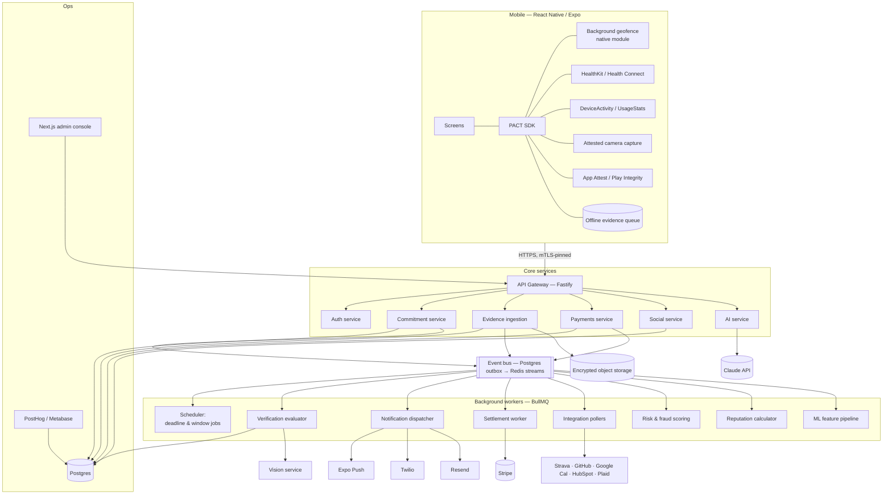

## 25.3 Service responsibilities

| Service | Owns |
|---|---|
| **Auth** | Phone OTP, sessions, device registration + attestation, JWT issuance |
| **Commitment** | Spec validation, lifecycle/state machine, rule compilation, scheduling of deadline jobs |
| **Evidence** | Ingestion, nonce issuance, dedup, integrity checks, normalization, storage |
| **Verification** (worker) | Rule evaluation, confidence scoring, decisioning, ambiguity ladder |
| **Payments** | Auth holds, captures, refunds, ledger, reconciliation, Stripe webhooks |
| **Social** | Friends, groups, feed generation, reactions, privacy enforcement |
| **AI** | NL parsing, coach insight phrasing, dispute review, CV orchestration |
| **Notification** | Template rendering, channel routing, quiet hours, frequency capping, delivery tracking |
| **Risk** | Device integrity, fraud, collusion graph, velocity limits |
| **Reputation** | Score computation, category sub-scores, streaks |

## 25.4 Critical path: deadline evaluation

The single most important code path in the system. It must be **durable, idempotent, exactly-once in effect, and observable.**

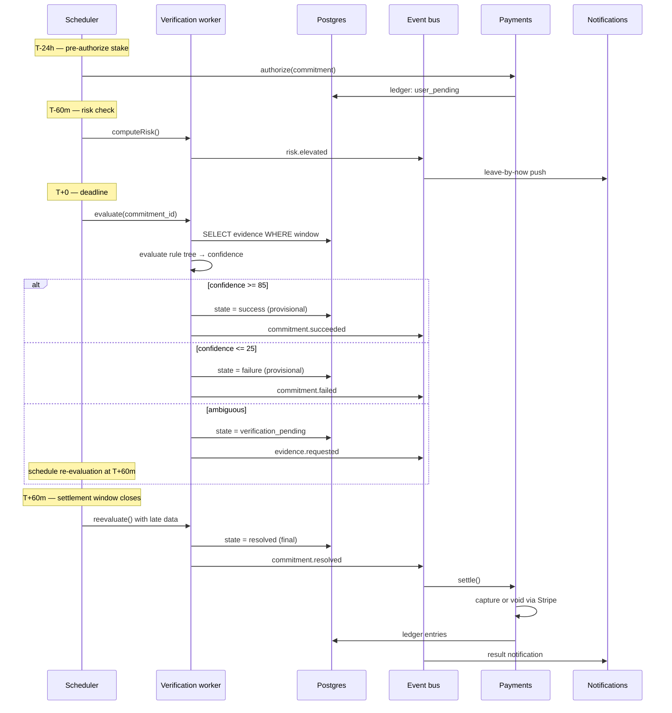

**Guarantees:**
- Every job carries an idempotency key `(commitment_instance_id, job_type, scheduled_for)`. Re-running is a no-op.
- A `resolution_lock` advisory lock per commitment prevents concurrent evaluation.
- State transitions are enforced in the database with a `CHECK` constraint + a transition table; illegal transitions raise.
- **A settled commitment is immutable.** Corrections happen via new compensating ledger entries and an `override` record, never by mutating history.
- The scheduler is monitored on *lateness*: any deadline job executing >120s after `scheduled_for` pages on-call. Late evaluation with money attached is an incident.

## 25.5 Frontend architecture

```
apps/mobile/src/
  app/                    # expo-router file-based routes
    (auth)/               # phone, otp, profile
    (tabs)/               # home, feed, create, groups, profile
    commitment/[id]/      # detail, verify, dispute
  features/               # vertical slices — the primary organizing unit
    commitment/{api,components,hooks,state,types}
    verification/
    social/
    wallet/
    coach/
  components/ui/          # design system primitives
  lib/{api,auth,storage,analytics,notifications}
  native/                 # geofence, healthkit, screentime, attest bridges
  state/                  # Zustand stores (UI) + TanStack Query (server state)
```

- **TanStack Query** for all server state; **Zustand** for ephemeral UI state. No Redux.
- **Optimistic UI everywhere** — commitment creation renders instantly.
- **Offline-first for evidence.** MMKV-backed queue; capture always succeeds locally, sync happens later.
- **Background tasks:** geofence events wake the app via `expo-task-manager`; evidence is posted from the background handler with a short-lived token.
- **Types generated from the Postgres schema** (`supabase gen types`) and shared via `packages/shared`. No hand-written API types.

## 25.6 Observability

| Signal | Tool | Alert |
|---|---|---|
| Deadline job lateness | Custom metric | >120s → page |
| Verification confidence distribution | Metabase | Sudden shift → investigate |
| Auto-verify rate by type | PostHog | <60% for a type → page product |
| Dispute rate | Metabase | >5% weekly → page |
| Wrongful-failure reports | Manual + support tags | Any → same-day review |
| Ledger imbalance | Reconciliation job | Any → **page immediately** |
| Stripe webhook lag | Metric | >5 min → page |
| LLM parse success rate | PostHog | <90% → page |
| Push delivery rate | Expo | <95% → investigate |
| p95 API latency | Sentry/APM | >800ms → investigate |

---

# 26. DATABASE SCHEMA

Postgres. All tables have `id uuid primary key default gen_random_uuid()`, `created_at timestamptz not null default now()`, `updated_at timestamptz`. Soft deletes via `deleted_at` where relevant. RLS enabled on every user-facing table.

## 26.1 Enums

```sql
create type commitment_state as enum (
  'draft','pending_acceptance','funding','scheduled','active',
  'verification_pending','success','failure','disputed','resolved',
  'cancelled','voided','expired');
create type participant_role   as enum ('committer','witness','beneficiary','verifier','co_committer');
create type stake_kind         as enum ('none','points','fiat','stablecoin');
create type forfeit_destination as enum ('partner','charity','group_pool','platform','savings');
create type evidence_source    as enum (
  'gps','geofence','motion','healthkit','health_connect','wearable','screentime',
  'calendar','third_party_api','photo','video','qr','nfc','ble','wifi',
  'partner_attest','group_vote','plaid','manual');
create type verification_status as enum ('pending','satisfied','violated','indeterminate','voided');
create type dispute_state      as enum ('open','evidence','partner_review','ai_review','human_review','resolved','withdrawn');
create type ledger_direction   as enum ('debit','credit');
create type payment_status     as enum ('requires_action','authorized','captured','voided','refunded','failed');
create type notification_channel as enum ('push','sms','email','in_app');
```

## 26.2 Core tables

```sql
-- IDENTITY -------------------------------------------------------------
create table users (
  id                uuid primary key default gen_random_uuid(),
  phone_e164        text unique not null,
  email             text unique,
  phone_verified_at timestamptz,
  date_of_birth     date,                       -- age gate ⚖️
  is_adult          boolean generated always as (date_of_birth <= (current_date - interval '18 years')) stored,
  country_code      text not null default 'US',
  region_code       text,                       -- state, for jurisdiction gating ⚖️
  status            text not null default 'active',  -- active|suspended|self_excluded|deleted
  self_excluded_until timestamptz,
  created_at        timestamptz not null default now(),
  deleted_at        timestamptz
);
create index on users (phone_e164);
create index on users (status) where status <> 'active';

create table profiles (
  user_id           uuid primary key references users(id) on delete cascade,
  display_name      text not null,
  username          text unique,
  avatar_url        text,
  bio               text,
  timezone          text not null default 'America/New_York',   -- IANA
  default_visibility text not null default 'partners_only',
  score             integer not null default 500,
  score_updated_at  timestamptz,
  current_streak    integer not null default 0,
  longest_streak    integer not null default 0,
  total_commitments integer not null default 0,
  total_completed   integer not null default 0,
  total_staked_minor bigint not null default 0,
  points_balance    integer not null default 0,
  stake_tier        text not null default 'new',
  max_stake_minor   integer not null default 2500,
  daily_cap_minor   integer not null default 5000
);

create table friendships (
  id          uuid primary key default gen_random_uuid(),
  user_a      uuid not null references users(id) on delete cascade,
  user_b      uuid not null references users(id) on delete cascade,
  status      text not null default 'pending',   -- pending|accepted|blocked
  requested_by uuid not null references users(id),
  is_close_circle boolean not null default false,
  created_at  timestamptz not null default now(),
  accepted_at timestamptz,
  constraint ordered_pair check (user_a < user_b),   -- canonical ordering; one row per pair
  unique (user_a, user_b)
);
create index on friendships (user_a, status);
create index on friendships (user_b, status);

-- GROUPS ---------------------------------------------------------------
create table groups (
  id            uuid primary key default gen_random_uuid(),
  name          text not null,
  slug          text unique,
  avatar_url    text,
  type          text not null default 'squad',    -- squad|team|cohort|org|class
  owner_id      uuid not null references users(id),
  visibility    text not null default 'private',
  member_limit  integer not null default 8,
  created_at    timestamptz not null default now()
);

create table group_members (
  group_id   uuid not null references groups(id) on delete cascade,
  user_id    uuid not null references users(id) on delete cascade,
  role       text not null default 'member',      -- owner|admin|member
  joined_at  timestamptz not null default now(),
  left_at    timestamptz,
  primary key (group_id, user_id)
);

-- COMMITMENTS ----------------------------------------------------------
create table commitments (
  id                   uuid primary key default gen_random_uuid(),
  committer_id         uuid not null references users(id),
  group_id             uuid references groups(id),
  protocol_id          uuid references protocols(id),
  title                text not null,
  natural_language     text,
  spec                 jsonb not null,              -- frozen CommitmentSpec at lock time
  spec_version         text not null default '1.0',
  evaluator_version    text not null,               -- pinned; contract integrity §5.4
  state                commitment_state not null default 'draft',
  visibility           text not null default 'partners_only',
  timezone             text not null,
  start_at             timestamptz,
  deadline_at          timestamptz not null,
  recurrence_rule      text,                        -- RFC 5545
  parent_commitment_id uuid references commitments(id),  -- for recurring instances
  occurrence_index     integer,
  locked_at            timestamptz,
  resolved_at          timestamptz,
  settled_at           timestamptz,
  outcome              text,                        -- success|failure|void
  final_confidence     numeric(5,2),
  created_at           timestamptz not null default now()
);
create index on commitments (committer_id, state);
create index on commitments (deadline_at) where state in ('scheduled','active','verification_pending');
create index on commitments (parent_commitment_id);
create index on commitments (group_id) where group_id is not null;

create table commitment_participants (
  id             uuid primary key default gen_random_uuid(),
  commitment_id  uuid not null references commitments(id) on delete cascade,
  user_id        uuid references users(id),
  invited_phone  text,                            -- non-user invitee
  role           participant_role not null,
  accepted_at    timestamptz,
  declined_at    timestamptz,
  can_escalate   boolean not null default false,
  created_at     timestamptz not null default now(),
  unique (commitment_id, user_id, role)
);
create index on commitment_participants (user_id, accepted_at);

create table commitment_rules (
  id            uuid primary key default gen_random_uuid(),
  commitment_id uuid not null references commitments(id) on delete cascade,
  tree          jsonb not null,                    -- RuleNode
  rendered_text text not null,                     -- plain-English; must exist §5.3
  required_confidence smallint not null default 85,
  fallback      text not null default 'evidence_request'
);

create table commitment_conditions (      -- flattened leaves, for indexed querying
  id            uuid primary key default gen_random_uuid(),
  commitment_id uuid not null references commitments(id) on delete cascade,
  leaf_key      text not null,                     -- path in the tree, e.g. "0.1"
  type          text not null,                     -- 'location.dwell' etc.
  params        jsonb not null,
  status        verification_status not null default 'pending',
  confidence    numeric(5,2) not null default 0,
  satisfied_at  timestamptz,
  place_id      uuid references places(id)
);
create index on commitment_conditions (commitment_id, status);

create table places (
  id           uuid primary key default gen_random_uuid(),
  owner_id     uuid references users(id),          -- null = global/shared
  name         text not null,
  provider_ref text,                               -- Google place_id
  lat          double precision not null,
  lng          double precision not null,
  radius_m     integer not null default 100,
  category     text,
  wifi_bssids  text[],                             -- learned over time
  created_at   timestamptz not null default now()
);
create index on places using gist (ll_to_earth(lat, lng));

-- VERIFICATION ---------------------------------------------------------
create table verification_events (
  id            uuid primary key default gen_random_uuid(),
  commitment_id uuid not null references commitments(id) on delete cascade,
  evaluated_at  timestamptz not null default now(),
  confidence    numeric(5,2) not null,
  breakdown     jsonb not null,   -- itemized per source; shown to users in disputes §8.3
  decision      text not null,    -- pass|fail|ambiguous|void
  evaluator_version text not null,
  is_final      boolean not null default false
);
create index on verification_events (commitment_id, evaluated_at desc);

create table evidence (
  id                  uuid primary key default gen_random_uuid(),
  commitment_id       uuid not null references commitments(id) on delete cascade,
  submitted_by        uuid references users(id),
  source              evidence_source not null,
  captured_at         timestamptz not null,
  received_at         timestamptz not null default now(),
  clock_skew_ms       integer,
  payload             jsonb not null,
  storage_ref         text,
  content_hash        text,
  perceptual_hash     text,       -- pHash, for duplicate detection §6.5
  device_id           uuid references devices(id),
  integrity_score     smallint not null default 100,
  integrity_flags     text[] not null default '{}',
  nonce               text,
  weight_applied      numeric(5,2),
  created_at          timestamptz not null default now()
);
create index on evidence (commitment_id, source);
create index on evidence (perceptual_hash) where perceptual_hash is not null;
create unique index on evidence (nonce) where nonce is not null;   -- replay prevention

create table devices (
  id              uuid primary key default gen_random_uuid(),
  user_id         uuid not null references users(id) on delete cascade,
  platform        text not null,
  model           text,
  os_version      text,
  push_token      text,
  public_key      text,               -- for evidence signing
  attested        boolean not null default false,
  attestation_at  timestamptz,
  integrity_score smallint not null default 100,
  last_seen_at    timestamptz,
  revoked_at      timestamptz
);
create index on devices (user_id) where revoked_at is null;

create table integrations (
  id            uuid primary key default gen_random_uuid(),
  user_id       uuid not null references users(id) on delete cascade,
  provider      text not null,       -- strava|github|google_calendar|hubspot|plaid|kindle
  external_id   text,
  access_token  text,                -- encrypted at rest (pgsodium / KMS)
  refresh_token text,
  scopes        text[],
  status        text not null default 'active',   -- active|expired|revoked
  last_sync_at  timestamptz,
  created_at    timestamptz not null default now(),
  unique (user_id, provider)
);

-- MONEY ----------------------------------------------------------------
create table wallets (        -- accounting shell; NOT stored value ⚖️
  id             uuid primary key default gen_random_uuid(),
  user_id        uuid not null references users(id) on delete cascade unique,
  credit_minor   bigint not null default 0,     -- platform credit only
  points_balance integer not null default 0,
  currency       text not null default 'USD',
  updated_at     timestamptz not null default now()
);

create table ledger_entries (     -- append-only, immutable
  id             bigserial primary key,
  txn_id         uuid not null,
  account_type   text not null,   -- user_pending|user_credit|platform_revenue|charity_payable|partner_payable|psp_settlement|chargeback_reserve
  account_ref    uuid,
  direction      ledger_direction not null,
  amount_minor   bigint not null check (amount_minor > 0),
  currency       text not null default 'USD',
  commitment_id  uuid references commitments(id),
  external_ref   text,            -- Stripe object id
  memo           text,
  created_at     timestamptz not null default now()
);
create index on ledger_entries (txn_id);
create index on ledger_entries (commitment_id);
create index on ledger_entries (account_type, created_at);
-- enforce balance per txn with a deferred constraint trigger

create table payments (
  id                  uuid primary key default gen_random_uuid(),
  user_id             uuid not null references users(id),
  commitment_id       uuid references commitments(id),
  provider            text not null default 'stripe',
  provider_intent_id  text unique,
  amount_minor        bigint not null,
  currency            text not null default 'USD',
  status              payment_status not null,
  captured_amount_minor bigint,
  authorized_at       timestamptz,
  captured_at         timestamptz,
  voided_at           timestamptz,
  expires_at          timestamptz,     -- auth expiry; re-auth before this
  failure_code        text,
  idempotency_key     text unique not null,
  created_at          timestamptz not null default now()
);
create index on payments (commitment_id);
create index on payments (status, expires_at) where status = 'authorized';

create table payouts (
  id             uuid primary key default gen_random_uuid(),
  recipient_type text not null,   -- user|charity|group
  recipient_id   uuid,
  charity_ein    text,
  amount_minor   bigint not null,
  commitment_id  uuid references commitments(id),
  provider_ref   text,
  status         text not null default 'pending',
  disbursed_at   timestamptz,
  created_at     timestamptz not null default now()
);

-- DISPUTES -------------------------------------------------------------
create table disputes (
  id             uuid primary key default gen_random_uuid(),
  commitment_id  uuid not null references commitments(id),
  opened_by      uuid not null references users(id),
  state          dispute_state not null default 'open',
  reason         text not null,
  statement      text,
  current_level  smallint not null default 0,
  evidence_ids   uuid[],
  resolution     text,             -- upheld|overturned|void
  resolved_by    text,             -- auto|partner|ai|human|panel
  resolver_id    uuid,
  resolved_at    timestamptz,
  deadline_at    timestamptz not null,
  created_at     timestamptz not null default now()
);
create index on disputes (state, deadline_at);

create table dispute_panels (      -- Commitment Court, V3
  id          uuid primary key default gen_random_uuid(),
  dispute_id  uuid not null references disputes(id) on delete cascade,
  juror_id    uuid not null references users(id),
  vote        text,               -- pass|fail|abstain
  rationale   text,
  voted_at    timestamptz,
  unique (dispute_id, juror_id)
);

-- SOCIAL / ENGAGEMENT --------------------------------------------------
create table notifications (
  id          uuid primary key default gen_random_uuid(),
  user_id     uuid not null references users(id) on delete cascade,
  type        text not null,
  channel     notification_channel not null,
  title       text not null,
  body        text not null,
  payload     jsonb,
  commitment_id uuid references commitments(id),
  sent_at     timestamptz,
  delivered_at timestamptz,
  read_at     timestamptz,
  action_taken text,
  created_at  timestamptz not null default now()
);
create index on notifications (user_id, created_at desc);
create index on notifications (user_id) where read_at is null;

create table streaks (
  id          uuid primary key default gen_random_uuid(),
  user_id     uuid not null references users(id) on delete cascade,
  category    text not null default 'overall',
  current     integer not null default 0,
  longest     integer not null default 0,
  last_day    date,
  freezes_remaining smallint not null default 2,
  freezes_reset_at date,
  unique (user_id, category)
);

create table reputation_events (
  id            uuid primary key default gen_random_uuid(),
  user_id       uuid not null references users(id) on delete cascade,
  commitment_id uuid references commitments(id),
  component     text not null,   -- completion|verification_quality|consistency|difficulty|volume|integrity
  delta         numeric(6,2) not null,
  score_after   integer not null,
  reason        text not null,   -- human-readable; §9.5 transparency
  created_at    timestamptz not null default now()
);
create index on reputation_events (user_id, created_at desc);

create table feed_items (
  id            uuid primary key default gen_random_uuid(),
  actor_id      uuid not null references users(id),
  type          text not null,
  commitment_id uuid references commitments(id),
  group_id      uuid references groups(id),
  payload       jsonb not null,
  visibility    text not null,
  hidden_by_actor boolean not null default false,
  created_at    timestamptz not null default now()
);
create index on feed_items (actor_id, created_at desc);

create table reactions (
  id           uuid primary key default gen_random_uuid(),
  feed_item_id uuid not null references feed_items(id) on delete cascade,
  user_id      uuid not null references users(id) on delete cascade,
  kind         text not null,
  created_at   timestamptz not null default now(),
  unique (feed_item_id, user_id, kind)
);

create table protocols (
  id            uuid primary key default gen_random_uuid(),
  author_id     uuid references users(id),
  title         text not null,
  slug          text unique not null,
  description   text,
  template      jsonb not null,
  duration_days integer,
  stake_model   jsonb,
  is_published  boolean not null default false,
  safety_review_status text not null default 'pending',   -- §22.7
  install_count integer not null default 0,
  completion_rate numeric(5,2),
  created_at    timestamptz not null default now()
);

-- RISK / AUDIT ---------------------------------------------------------
create table risk_scores (
  id          uuid primary key default gen_random_uuid(),
  subject_type text not null,      -- user|device|pair
  subject_id  uuid not null,
  score       smallint not null,
  signals     jsonb not null,
  computed_at timestamptz not null default now()
);
create index on risk_scores (subject_type, subject_id, computed_at desc);

create table audit_logs (
  id          bigserial primary key,
  actor_type  text not null,       -- user|system|admin
  actor_id    uuid,
  action      text not null,
  entity_type text not null,
  entity_id   uuid,
  before      jsonb,
  after       jsonb,
  ip          inet,
  user_agent  text,
  created_at  timestamptz not null default now()
);
create index on audit_logs (entity_type, entity_id, created_at desc);
create index on audit_logs (actor_id, created_at desc);
```

## 26.3 Relationship map

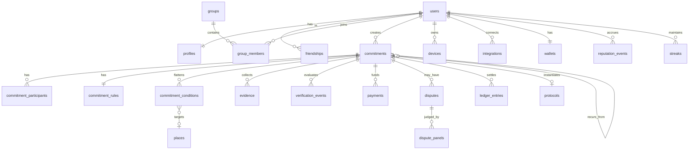

## 26.4 Key index strategy

| Query | Index |
|---|---|
| Due commitments for the scheduler | `commitments (deadline_at) WHERE state IN (...)` — partial, hot, small |
| A user's active commitments | `commitments (committer_id, state)` |
| Evidence for evaluation | `evidence (commitment_id, source)` |
| Duplicate media detection | `evidence (perceptual_hash)` |
| Replay prevention | unique `evidence (nonce)` |
| Friend feed | `feed_items (actor_id, created_at desc)` + fan-out-on-read for <500 friends |
| Auth expiry sweep | `payments (status, expires_at) WHERE status='authorized'` |
| Ledger reconciliation | `ledger_entries (txn_id)`, `(account_type, created_at)` |

---

# 27. COMMITMENT STATE MACHINE

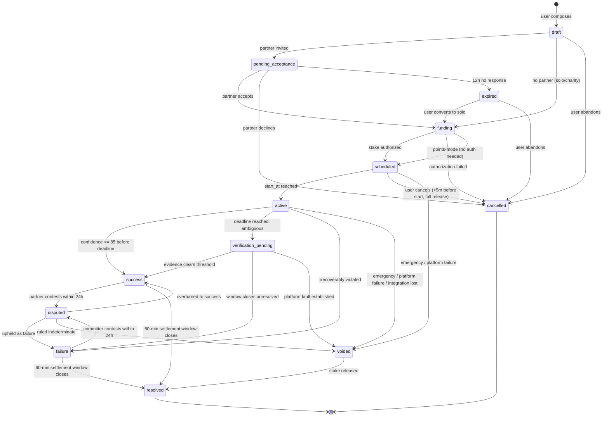

## 27.1 Transition table

| From | To | Trigger | Guards | Side effects |
|---|---|---|---|---|
| `draft` | `pending_acceptance` | User confirms with a partner | Spec valid, safety passed, partner is an adult & consented-able | Invite sent (push+SMS); 12h expiry job scheduled |
| `draft` | `funding` | User confirms, no partner | Spec valid, charity selected | — |
| `pending_acceptance` | `funding` | Partner accepts | Not expired | `commitment.accepted` event |
| `pending_acceptance` | `expired` | 12h elapsed | — | Notify committer; offer solo conversion |
| `funding` | `scheduled` | Stripe auth succeeds **or** points mode | Auth ≥ stake; user within caps | `payments` row; ledger `user_pending`; deadline jobs scheduled |
| `funding` | `cancelled` | Auth fails after retries | — | Notify both; offer points mode |
| `scheduled` | `active` | `start_at` reached | — | Begin monitoring; register geofences on device |
| `scheduled` | `cancelled` | User cancels | >5 min before `start_at` | Void authorization; full release |
| `active` | `success` | Confidence ≥ threshold | Within window | Provisional success; 60-min settlement timer |
| `active` | `failure` | Condition irrecoverably violated | Deadline passed / short-circuit | Provisional failure; 60-min settlement timer; notify |
| `active` | `verification_pending` | Deadline reached, 26–84 confidence | — | Evidence request; ladder begins |
| `active` | `voided` | Emergency, platform failure, void allowance | Void budget available or admin action | Release stake; preserve streak; no reputation delta |
| `verification_pending` | `success`/`failure` | Ladder resolves | — | As above |
| `success`/`failure` | `disputed` | Party contests | Within 24h; dispute budget available | Extend hold to 7 days; halt settlement |
| `success`/`failure` | `resolved` | 60-min settlement window closes | No open dispute | **Capture or void via Stripe**; ledger entries; reputation; streak; feed item |
| `disputed` | `success`/`failure`/`voided` | Dispute resolution | — | Final; settle accordingly |

**Invariants (enforced in DB + code):**
1. Money moves **only** on the transition into `resolved`. No other transition touches Stripe capture.
2. A commitment in `resolved` is immutable. Corrections are compensating entries + an override record.
3. `voided` never produces a reputation event or a streak break.
4. A commitment cannot enter `scheduled` without a valid authorization (or points mode).
5. Every transition writes an `audit_logs` row.

---
---

# 28. API DESIGN

REST over HTTPS. JSON. Versioned at `/v1`. Bearer JWT auth. Every mutating endpoint accepts an `Idempotency-Key` header.

## 28.1 Endpoint catalogue

| Method | Path | Purpose |
|---|---|---|
| POST | `/v1/auth/phone` | Request OTP |
| POST | `/v1/auth/verify` | Verify OTP → session |
| POST | `/v1/devices` | Register device + attestation |
| GET | `/v1/me` | Profile, limits, score |
| PATCH | `/v1/me` | Update profile/settings |
| POST | `/v1/commitments/parse` | NL → CommitmentSpec (no persistence) |
| POST | `/v1/commitments` | Create (draft) |
| PATCH | `/v1/commitments/:id` | Edit a draft |
| POST | `/v1/commitments/:id/invite` | Invite partner(s) |
| POST | `/v1/commitments/:id/accept` | Partner accepts |
| POST | `/v1/commitments/:id/decline` | Partner declines |
| POST | `/v1/commitments/:id/fund` | Authorize stake → `scheduled` |
| POST | `/v1/commitments/:id/cancel` | Cancel (guarded) |
| POST | `/v1/commitments/:id/void` | Request void ("life happens") |
| GET | `/v1/commitments/:id` | Detail + live verification state |
| GET | `/v1/commitments/active` | Active list |
| GET | `/v1/commitments/history` | Paginated history |
| POST | `/v1/commitments/:id/evidence` | Submit evidence |
| POST | `/v1/evidence/nonce` | Get a capture nonce |
| POST | `/v1/commitments/:id/attest` | Partner confirms/denies |
| POST | `/v1/commitments/:id/dispute` | Open a dispute |
| POST | `/v1/disputes/:id/evidence` | Add dispute evidence |
| POST | `/v1/disputes/:id/escalate` | Escalate a level |
| GET | `/v1/users/:id/reputation` | Score + breakdown |
| GET | `/v1/feed` | Friends feed |
| POST | `/v1/feed/:id/react` | React |
| GET/POST | `/v1/friends` | List / invite |
| GET/POST | `/v1/groups` | List / create |
| POST | `/v1/groups/:id/join` | Join |
| GET | `/v1/protocols` | Browse |
| POST | `/v1/protocols/:id/install` | Install a protocol |
| GET | `/v1/wallet` | Money state |
| POST | `/v1/wallet/payment-method` | Setup intent |
| POST | `/v1/limits` | Set self-imposed limits |
| POST | `/v1/self-exclude` | Self-exclusion |
| POST | `/v1/webhooks/stripe` | Stripe webhooks |
| POST | `/v1/webhooks/:provider` | Integration webhooks |

## 28.2 Request/response examples

### `POST /v1/commitments/parse`
```json
// Request
{
  "utterance": "If I don't get to the gym before 6:30 tomorrow and stay at least 45 minutes, I owe Sam $30",
  "context": {
    "now": "2026-09-02T21:14:00-04:00",
    "timezone": "America/New_York",
    "recent_places": [{"id":"plc_equinox_wellesley","name":"Equinox Wellesley","visits":12}],
    "recent_partners": [{"id":"usr_sam","name":"Sam Rivera"}],
    "connected_integrations": ["healthkit","location"]
  }
}
```
```json
// 200 Response
{
  "spec": { /* full CommitmentSpec — see §4.10 */ },
  "rendered": "Get to Equinox Wellesley before 6:30 AM tomorrow and stay at least 45 minutes. If you don't, you owe Sam $30.",
  "verification_plan": {
    "summary": "I'll check your location at the gym, that you stay 45 minutes, and your Apple Watch workout.",
    "expected_auto_verify_rate": 0.85,
    "fallback": "If those don't line up, I'll ask for a quick photo."
  },
  "assumptions": [
    "Equinox Wellesley — you've been there 12 times",
    "Tomorrow = Thursday, September 3",
    "45 minutes measured from arrival"
  ],
  "confidence": 0.91,
  "needs_disambiguation": [],
  "warnings": [{"code":"tight_schedule","message":"You'd need to leave home by about 6:12 AM."}],
  "parse_id": "prs_01J8X..."
}
```

### `POST /v1/commitments`
```json
// Request
{ "parse_id": "prs_01J8X...", "spec_overrides": { "stake": { "amount_minor": 2500 } },
  "visibility": "partners_only" }
```
```json
// 201 Response
{ "id": "cmt_01J8Y...", "state": "draft",
  "deadline_at": "2026-09-03T06:30:00-04:00",
  "invite_required": true,
  "next_actions": ["invite","fund"] }
```

### `POST /v1/commitments/:id/invite`
```json
// Request
{ "participants": [{ "user_id": "usr_sam", "role": "beneficiary", "can_escalate": true }] }

// 200 Response
{ "state": "pending_acceptance",
  "invites": [{ "participant_id":"prt_...", "channel":"push", "fallback":"sms",
                "invite_url":"https://pact.app/i/aB3xK9", "expires_at":"2026-09-03T09:14:00-04:00" }] }
```

### `POST /v1/commitments/:id/fund`
```json
// Request
{ "payment_method_id": "pm_1Abc", "amount_minor": 2500 }

// 200 Response
{ "state": "scheduled",
  "payment": { "id":"pay_...", "status":"authorized", "amount_minor":2500,
               "expires_at":"2026-09-09T21:20:00-04:00" },
  "note": "Your card is only charged if you don't make it." }

// 402 Response
{ "error": { "code":"authorization_failed", "message":"Your card was declined.",
             "recoverable": true,
             "options":["update_payment_method","use_points","lower_stake"] } }
```

### `POST /v1/commitments/:id/evidence`
```json
// Request (multipart or JSON)
{ "source": "photo", "nonce": "nce_7Kd...",
  "captured_at": "2026-09-03T06:41:12-04:00",
  "storage_ref": "ev/2026/09/cmt_01J8Y/ab12.jpg",
  "content_hash": "sha256:9f2c...",
  "device_attestation": { "platform":"ios","attested":true,"jailbroken_signal":false },
  "signature": "base64..." }
```
```json
// 202 Response
{ "evidence_id": "evd_...", "accepted": true,
  "integrity": { "score": 98, "flags": [] },
  "verification": { "confidence_before": 62.5, "confidence_after": 87.5,
                    "decision": "pass", "is_final": false },
  "message": "Verified. Your $25 is released once the settlement window closes." }
```

### `GET /v1/commitments/:id`
```json
{
  "id": "cmt_01J8Y...", "state": "active",
  "title": "Gym by 6:30 AM",
  "rendered": "Get to Equinox Wellesley before 6:30 AM and stay at least 45 minutes.",
  "deadline_at": "2026-09-03T06:30:00-04:00",
  "seconds_remaining": 4320,
  "risk": { "p_fail": 0.28, "reason": "You're at home, 18 min away", "action": "leave_by",
            "leave_by": "2026-09-03T06:07:00-04:00" },
  "conditions": [
    { "key":"0.0","text":"Arrive at Equinox before 6:30 AM","status":"pending","confidence":0 },
    { "key":"0.1","text":"Stay at least 45 minutes","status":"pending","confidence":0 }
  ],
  "verification": { "current_confidence": 0, "required": 85,
                    "sources": [{"source":"gps.dwell","weight":45,"status":"waiting"},
                                {"source":"healthkit.workout","weight":30,"status":"waiting"}] },
  "stake": { "kind":"fiat","amount_minor":2500,"on_failure":{"destination":"partner","name":"Sam"},
             "status":"authorized" },
  "participants": [{"user_id":"usr_sam","name":"Sam Rivera","role":"beneficiary","accepted_at":"..."}],
  "actions": ["get_directions","void_request","share"]
}
```

### `GET /v1/users/:id/reputation`
```json
{
  "user_id": "usr_alec", "score": 843, "percentile": 92, "trend_30d": +18,
  "components": {
    "completion_rate": {"value":0.92,"weight":0.35,"contribution":294},
    "verification_quality": {"value":0.81,"weight":0.20,"contribution":162},
    "consistency": {"value":0.88,"weight":0.15,"contribution":132},
    "difficulty": {"value":0.71,"weight":0.10,"contribution":71},
    "volume": {"value":0.94,"weight":0.10,"contribution":94},
    "integrity": {"value":0.90,"weight":0.10,"contribution":90}
  },
  "categories": [
    {"category":"fitness","score":912,"n":98},
    {"category":"study","score":640,"n":31}
  ],
  "stats": {"total_commitments":187,"completed":172,"current_streak":41,
            "longest_streak":63,"total_staked_minor":420000,"disputes":3,"disputes_won":2}
}
```

### `POST /v1/commitments/:id/dispute`
```json
// Request
{ "reason": "gps_inaccurate",
  "statement": "I was inside the gym at 6:28 but the building blocks GPS. My watch shows the workout started at 6:31." }

// 201 Response
{ "dispute_id": "dsp_...", "state": "evidence", "current_level": 1,
  "deadline_at": "2026-09-04T08:00:00-04:00",
  "what_we_saw": {
    "summary": "GPS placed you at Equinox from 6:34 to 7:02 (28 minutes). You committed to arriving before 6:30 and staying 45 minutes.",
    "breakdown": [
      {"source":"gps.dwell","observed":"6:34–7:02","weight":45,"contribution":0,
       "note":"Arrival after the deadline"},
      {"source":"healthkit.workout","observed":"none","weight":30,"contribution":0}
    ]
  },
  "next_step": "Add any evidence you have, then Sam will review.",
  "settlement": "on_hold_until_resolved"
}
```

## 28.3 Conventions

| Concern | Convention |
|---|---|
| Errors | `{ "error": { "code", "message", "recoverable", "options"[], "details"{} } }` — machine code + human message + recovery paths |
| Idempotency | `Idempotency-Key` header required on all POSTs that move money or create commitments; keys stored 24h |
| Pagination | Cursor-based: `?cursor=&limit=` → `{ data, next_cursor }` |
| Rate limits | Per-user + per-IP; `429` with `Retry-After`. Parse: 30/min. Evidence: 60/min. Invites: 20/hour. |
| Versioning | URL path. Breaking changes require a new version; commitments always resolve under the version they were created with. |
| Realtime | Supabase Realtime channel per commitment for live verification state |
| Webhooks | Signed (HMAC), replay-protected, idempotent, retried with backoff |
| Time | All timestamps ISO-8601 with offset. **Server time is authoritative.** |

---

# 29. EVENT SYSTEM

## 29.1 Pattern

**Transactional outbox → Redis Streams → consumer groups.** Domain events are written in the same transaction as the state change (guaranteeing no lost events), then relayed. Consumers are idempotent and process at-least-once.

```
Postgres txn: { UPDATE commitments SET state=...; INSERT INTO outbox_events (...) }
                            ↓ relay worker
                  Redis Stream: pact.events
                            ↓ consumer groups
      [notifications] [reputation] [feed] [analytics] [payments] [ml] [risk]
```

## 29.2 Event catalogue

| Event | Payload | Consumers → side effects |
|---|---|---|
| `commitment.created` | id, committer, spec, deadline | analytics; ml(features); risk(velocity check) |
| `commitment.invited` | id, participants, channels | notifications(push+SMS); analytics; schedule 12h expiry |
| `commitment.accepted` | id, participant | notifications(→committer); feed; analytics |
| `commitment.declined` | id, participant | notifications; offer solo conversion |
| `commitment.invite_expired` | id | notifications; auto-convert or cancel |
| `commitment.funded` | id, payment_id, amount | ledger(user_pending); scheduler(deadline jobs); analytics |
| `commitment.funding_failed` | id, failure_code | notifications(critical); offer points mode |
| `commitment.started` | id | device(register geofences); notifications(opt-in); ml(risk baseline) |
| `evidence.received` | commitment_id, evidence_id, source | verification(re-evaluate); risk(integrity); analytics |
| `evidence.requested` | commitment_id, prompt | notifications(critical); schedule escalation timer |
| `evidence.rejected` | evidence_id, reason | notifications; risk |
| `risk.elevated` | commitment_id, p_fail, action | notifications(leave-by-now); coach; optional partner escalation |
| `verification.completed` | commitment_id, confidence, decision, breakdown | commitment(state); analytics; ml(label) |
| `commitment.succeeded` | id, confidence | schedule settlement(+60m); feed; notifications; streaks |
| `commitment.failed` | id, confidence, reason | schedule settlement(+60m); notifications; coach(supportive mode) |
| `commitment.voided` | id, reason | payments(release); notifications; **no reputation event** |
| `commitment.resolved` | id, outcome, final | payments(settle); reputation; streaks; feed; ml(label); analytics |
| `stake.authorized` | payment_id, amount | ledger |
| `stake.released` | payment_id | ledger; notifications |
| `stake.forfeited` | payment_id, destination, amount | ledger; payouts; notifications; receipt email |
| `stake.settlement_failed` | payment_id, code | retry schedule; notifications; disable monetary stakes |
| `dispute.created` | dispute_id, commitment_id | payments(hold); notifications(both parties); ops queue |
| `dispute.escalated` | dispute_id, level | notifications; ops queue; AI review job |
| `dispute.resolved` | dispute_id, resolution | commitment(final state); payments(settle); reputation |
| `reputation.updated` | user_id, delta, score | profile cache; feed(milestones) |
| `streak.extended` / `streak.broken` / `streak.frozen` | user_id, value | notifications(milestones only); feed |
| `friendship.created` | pair | feed; notifications; growth analytics |
| `group.program_started` / `.completed` | group_id | notifications; payouts |
| `integrity.flagged` | subject, signals | risk; ops queue; possible stake suspension |
| `safety.blocked` | user_id, category | ops(trust & safety); resources surfaced; **not logged for training** |
| `user.self_excluded` | user_id, until | payments(block); notifications(disable); ops |

## 29.3 Consumer guarantees

- **Idempotent by `event_id`**; consumers keep a processed-set with a 7-day TTL.
- **Ordering per commitment** via a stream partition key of `commitment_id`.
- **Dead-letter queue** after 5 failed attempts; DLQ depth > 0 pages on-call.
- **Money consumers are single-threaded per commitment** and take an advisory lock. Double-capture is the worst possible bug in this system; the architecture must make it structurally impossible, not merely unlikely.

---

# 30. SECURITY

## 30.1 Threat model

| Actor | Goal | Primary defenses |
|---|---|---|
| Fraudulent user | Fake completion to avoid a stake | Device attestation, spoof detection, multi-source correlation, pHash (§6.5) |
| Colluding pair | Rubber-stamp each other | Graph analysis, attestation weighting, money-flow blocks |
| Malicious partner | Falsely deny a completion | Attestation reliability scores, AI + human escalation |
| Account thief | Drain credits, create commitments | Phone auth + device binding, anomaly detection, money freeze on new device |
| Scraper | Harvest the social/behavioral graph | Rate limits, RLS, no public enumeration endpoints |
| Insider | Access location/health data | Least privilege, break-glass with audit, field-level encryption |
| Chargeback abuser | Stake, fail, charge back | Evidence packets, account restriction, network-level risk signals |
| Launderer | Move money between accounts | Velocity limits, graph monitoring, KYC at payout, SAR ⚖️ |

## 30.2 Controls

| Domain | Control |
|---|---|
| **Transport** | TLS 1.3, certificate pinning in the mobile app, HSTS |
| **Auth** | Phone OTP (rate-limited, 6-digit, 5-min expiry, 3 attempts); JWT access (15 min) + refresh (30 days, rotating); device binding; re-auth for money-affecting actions |
| **Device** | App Attest (iOS) / Play Integrity (Android) at registration and periodically; unattested devices cannot stake money |
| **Authorization** | Postgres RLS on every user table; policies asserted by tests, not by trust |
| **Payments** | No card data touches PACT servers (Stripe Elements / PaymentSheet); PCI SAQ-A scope; webhook signature verification; idempotency keys |
| **Encryption at rest** | Postgres TDE; field-level encryption (pgsodium/KMS) for integration tokens, DOB, phone; per-object keys for evidence media |
| **Location privacy** | On-device geofence evaluation; only boolean outcomes uploaded in the normal path; raw traces never leave the device except on dispute, with explicit consent |
| **Health privacy** | Only the specific metric a commitment requires; never the full record; never displayed socially |
| **Evidence media** | Encrypted at rest, presigned URLs (5-min TTL), access limited to committer + accepted participants + audited admins; auto-delete originals after 30 days (retain hashes + decision) |
| **Face handling** | On-device blurring of non-committer faces by default. ⚠️ **No face recognition or face matching anywhere in the product** — BIPA and equivalent statutes make biometric identifiers a severe liability, and the product doesn't need it. ⚖️ |
| **API security** | Per-user + per-IP rate limits, request signing on evidence, strict input validation (Zod), no raw SQL from user input, output field allow-lists |
| **Secrets** | Managed secret store, no secrets in env files in the repo, rotation every 90 days |
| **Audit** | Every admin action, outcome override, refund, data access, and state transition logged immutably with actor, before/after, IP |
| **Admin access** | SSO + hardware MFA, least privilege, break-glass elevation with an automatic incident ticket, no production data in local environments |
| **Fraud** | Real-time integrity scoring, velocity limits, graph anomaly detection, manual review queue |
| **Content** | Automated scanning of all uploaded media for illegal content; mandatory reporting pipeline ⚖️ |
| **Dependency** | Automated dependency scanning, SBOM, pinned versions, monthly patch cadence |
| **Testing** | Annual third-party pentest; pre-launch pentest of the payments and verification paths specifically |
| **Incident response** | Written IR plan, on-call rotation, 72h breach notification readiness (GDPR/state laws) ⚖️ |
| **Data rights** | Export (JSON), deletion (with the money-at-stake guard, §21.88), consent ledger for each integration |

## 30.3 Wallet & money-specific security

- **No stored value.** Nothing to steal.
- **Every capture is a state-machine-guarded, advisory-locked, idempotent operation.**
- **Nightly reconciliation** between the internal ledger and Stripe's balance transactions; any discrepancy pages immediately and freezes automated settlement until cleared.
- **Reserve** ≥5% of trailing monthly disbursements for refund/chargeback coverage.
- **Kill switch:** a single flag halts all settlement globally while allowing commitments to continue resolving. Test it quarterly.
- **Amount limits enforced server-side**, never client-side.

---
---

# 31. ANALYTICS

## 31.1 North-star metric

> **Verified Commitments Completed per Weekly Active User (VCC/WAU)**

**Why this and not the alternatives:**

| Candidate | Why rejected |
|---|---|
| Commitments created | Rewards creation without follow-through; an app full of abandoned intentions would look healthy |
| Weekly committed dollars | Rewards higher stakes, which is the exact incentive §22 exists to suppress. **Dangerous as a north star.** |
| Successful commitment rate | Rewards easy commitments; a user who commits to "drink water once" every day scores perfectly |
| DAU / session time | Engagement without behavior change; the product's value is in *not* needing to be opened |

VCC/WAU is right because it requires all four things that matter simultaneously: a user active enough to create, a commitment real enough to be verified, verification working, and the user actually doing the thing. It cannot be gamed by raising stakes, and it is denominated per-user so it doesn't just track growth.

**Targets:** Month 3 → 2.5 · Month 6 → 3.5 · Month 12 → 4.5 · Month 24 → 6.0

**Guardrail metrics** (VCC/WAU is invalid if any of these degrade):
- Wrongful-failure rate < 1%
- Dispute rate < 5%
- Median stake size flat or declining (rising median stake = the product is drifting toward the wrong thing)
- Safety intervention rate stable
- Void rate < 5%

## 31.2 Funnel

| Step | Definition | Target |
|---|---|---|
| Install → signup | Completed phone verification | 65% |
| Signup → first commitment created | Reached the confirmation card and locked | 55% |
| Created → partner invited | Invite sent | 75% |
| Invited → accepted | Partner accepted in 24h | 60% |
| Accepted → funded | Auth succeeded (or points) | 90% |
| Funded → started | Reached `active` | 98% |
| Started → resolved | Reached `resolved` | 99% |
| Resolved → completed successfully | Outcome = success | 68% |
| **First → second commitment (7d)** | **The activation metric** | **55%** |
| Second → fourth (30d) | Habit formed | 65% |

**"Activated" is defined as: created a second commitment within 7 days of the first resolving.** Everything before that is tourism.

## 31.3 Retention cohorts

Segmented by: acquisition source · beachhead campus · persona · first commitment type · staked vs. points · partner vs. solo · auto-verified vs. manual.

| Cohort | D1 | D7 | D30 | D90 |
|---|---|---|---|---|
| All users | 55% | 32% | 20% | 12% |
| **With an accepted partner** | 72% | 52% | 38% | 26% |
| Solo/charity | 44% | 22% | 11% | 5% |
| Staked (money) | 68% | 45% | 31% | 20% |
| Points only | 48% | 26% | 14% | 7% |
| **First commitment auto-verified** | 74% | 56% | 41% | 29% |
| First commitment required manual proof | 51% | 28% | 15% | 8% |
| In a group | 78% | 61% | 47% | 35% |

These hypothesized deltas are the product strategy in numeric form. If "with a partner" doesn't massively outperform solo, the social thesis is wrong and the product should be rebuilt around solo commitment contracts. **Measure this first and honestly.**

## 31.4 Event taxonomy (PostHog)

```
app_opened · composer_focused · utterance_submitted · parse_completed{confidence,latency,method}
spec_edited{field} · commitment_locked{type,stake,has_partner} · invite_sent{channel}
invite_page_viewed · invite_accepted{time_to_accept} · funding_attempted/succeeded/failed{code}
commitment_started · geofence_entered/exited · evidence_requested{reason}
evidence_submitted{source,latency} · verification_completed{confidence,decision,auto}
commitment_resolved{outcome,disputed} · settlement_completed{destination}
dispute_opened{reason} · dispute_resolved{level,outcome}
notification_sent/opened/actioned{type} · coach_message_shown/actioned
share_initiated/completed{surface} · repeat_tapped · limit_hit{type} · safety_blocked{category}
```

## 31.5 Dashboards

1. **Loop health** — funnel, VCC/WAU, second-commitment rate, time-to-first-commitment
2. **Verification quality** — auto-verify rate by type, confidence distribution, dispute rate, wrongful-failure reports, void rate
3. **Money** — at-stake total, forfeit rate, settlement success, chargebacks, ledger balance, reserve coverage
4. **Growth** — K-factor by mechanism, invite conversion, campus density
5. **Safety** — blocks by category, limit hits, escalation-velocity flags, self-exclusions, support tickets by type
6. **Retention** — cohort curves by segment

---

# 32. EXPERIMENTATION

The first 25 experiments, ordered by expected information value. Each has a hypothesis, a primary metric, and a decision rule.

| # | Experiment | Hypothesis | Primary metric | Why it matters |
|---|---|---|---|---|
| 1 | **Stake vs. no stake** | Monetary stakes increase completion rate by >15pp | Completion rate | Validates the core premise |
| 2 | **Partner vs. solo** | Accepted partner increases completion by >20pp and D30 by >2× | Completion, D30 | Validates the social thesis |
| 3 | **Stake size ($5/$25/$50)** | Effect saturates around $25 | Completion vs. stake | Justifies low caps; if it saturates, §22 caps cost nothing |
| 4 | **Charity forfeit vs. peer payout** | Peer payout ≤5pp better than charity | Completion, satisfaction | **The highest-value experiment in the product.** If true, PACT never needs to be a money transmitter. |
| 5 | **Voice vs. text composer** | Voice increases creation rate by >20% | Creation rate | Friction hypothesis |
| 6 | **Show verification plan before lock** | Reduces disputes by >30% | Dispute rate | Trust hypothesis |
| 7 | **Risk-triggered vs. scheduled reminders** | Risk-triggered increases completion by >8pp at lower volume | Completion, notif opt-out | Notification philosophy |
| 8 | **Leave-by-now notification** | Increases completion by >12pp on location commitments | Completion | Likely the single best feature |
| 9 | **Show completion probability** | Net negative when below 40% | Completion, sentiment | Informs §15.3 |
| 10 | **Repeat prompt in the result notification** | Increases 7-day second commitment by >15pp | Second-commitment rate | Loop closure |
| 11 | **Public vs. private commitments** | Public increases completion but reduces creation | Completion, creation | Privacy defaults |
| 12 | **Rich SMS invite page vs. plain link** | Rich page doubles accept rate | Invite conversion | Growth |
| 13 | **Streak freezes on vs. off** | Freezes increase D30 (no demotivation cost) | D30, completion | Healthy gamification |
| 14 | **Commitment duration (1 day vs. 7 vs. 30)** | Short commitments retain better early | Second-commitment rate | Onboarding design |
| 15 | **Onboarding: create first vs. invite first** | Create-first converts better | Activation | Onboarding order |
| 16 | **Three vs. seven commitment types at launch** | Three converts better (clarity) | Activation | Validates MVP scoping |
| 17 | **AI coach on vs. off** | Coach increases completion by >6pp | Completion | Coach ROI |
| 18 | **Coach frequency (1 vs. 2 vs. 4 msg/day)** | Diminishing returns past 2; opt-outs rise | Completion, opt-out | Frequency budget |
| 19 | **Suggested stake vs. user-chosen** | Suggested increases staked share without raising median | Staked %, median stake | Must not raise the median |
| 20 | **Grace period (0 vs. 2 vs. 5 min)** | 2 min reduces disputes without reducing completion | Disputes, completion | Fairness tuning |
| 21 | **Group size (3 vs. 5 vs. 8)** | 5 is optimal for retention | Group D30 | Group design |
| 22 | **Per-member vs. shared group targets** | Per-member reduces conflict and increases completion | Completion, group survival | Validates §16.3 |
| 23 | **Feed: failures visible vs. hidden** | Visible increases completion, reduces creation among low performers | Completion, creation by segment | Ethics-sensitive; watch the low-performer segment carefully |
| 24 | **Score visible vs. hidden** | Visible increases D90 | D90 | Reputation value |
| 25 | **Protocol-installed vs. self-created** | Protocols convert new users better, retain worse | Activation, D30 | Marketplace strategy |

**Statistical discipline:** minimum detectable effect fixed *before* launch; two-week minimum runtime to capture weekly cycles; one primary metric per experiment; guardrails (dispute rate, median stake, safety flags) monitored on every test with automatic rollback triggers.

---

# 33. COMPETITIVE LANDSCAPE

| Category | Players | Strength | Fatal weakness | PACT's angle |
|---|---|---|---|---|
| **Habit trackers** | Streaks, Habitica, Way of Life, Finch | Beautiful, cheap, low friction | Self-report; no consequence; solo | Verification + stakes + partner |
| **Commitment contracts** | StickK, Beeminder | Correct mechanics; Beeminder's auto-data is genuinely good | StickK: honor system, 2008 UX, referee friction. Beeminder: engineer-only, solo, no social layer | Consumer UX + automatic verification + social |
| **Forfeit-style apps** | Forfeit, Bet On Yourself | Right idea, real stakes | Photo-only verification (fakeable), thin social graph, narrow | Multi-source verification + network |
| **Fitness wagering** | HealthyWage, DietBet, StepBet, Sweatcoin | Real money at scale; proven willingness to pay | Structured as wagers (heavy legal load); single vertical (weight/steps); no friend graph; ⚠️ weight-loss framing is ethically fraught | Multi-domain, friend-native, deposit-not-wager structure |
| **Social fitness** | Strava, Nike Run Club, Whoop, Peloton | Excellent verification, huge networks | Reports the past; never binds the future; no consequence | Prospective commitment layer — potentially a *partner*, not a competitor |
| **Focus/screen time** | Forest, Opal, one sec, Freedom | Effective blocking, good design | No stakes, no social, single-domain | Screen-time as one condition type among many |
| **Productivity** | Todoist, Notion, Sunsama, Motion | Deep planning tools | Intention capture with zero enforcement | Integration target, not competitor |
| **Accountability coaching** | Focusmate, Caveday, coaching marketplaces | Human presence works extremely well | Doesn't scale, expensive, scheduled not continuous | Automate the presence, keep the human where it matters |
| **Corporate wellness** | Virgin Pulse, Wellable | Distribution, budgets | ~5% real engagement, compliance theater | Better mechanics; B2B2C entry |
| **Betting/challenge** | Various prediction markets and P2P challenge apps | Real money mechanics | Gambling posture; adversarial to app stores and regulators | Explicit non-wager architecture |
| **AI companions/coaches** | Various | Conversational, engaging | Advice without consequence | Coach is a feature, not the product |

## 33.1 Whitespace

1. **Nobody has solved verification.** Every competitor either self-reports (fakeable) or uses one signal (gameable). Multi-source fused verification with calibrated confidence is genuinely unbuilt.
2. **Nobody has a social graph around commitments.** StickK has referees, not friends. Forfeit has stakes, not a network.
3. **Nobody is multi-domain.** Fitness apps do fitness. Focus apps do focus. A general commitment primitive covers all of them and produces cross-domain retention (a user whose gym habit lapses still has study commitments).
4. **Nobody has natural-language creation.** Every competitor makes you fill in a form. The one-sentence composer is a genuine 10× UX difference and is only newly possible.
5. **Nobody has a reputation layer.** Completion history is trapped inside each app and worthless outside it.
6. **Nobody is building infrastructure.** The API business has no incumbent.

## 33.2 The most dangerous competitor

**Strava.** They have the verification, the social graph, the fitness audience, and the trust. If Strava shipped "Challenges with stakes," they would be immediately credible. Mitigations: move fast on the non-fitness domains where Strava won't go (study, screen time, work, chores); make the money and verification infrastructure genuinely hard to replicate; and consider Strava as an integration partner and eventual acquirer rather than purely an adversary.

**Second most dangerous: Apple.** Screen Time, Fitness, and Wallet in one company. But Apple will not build financial stakes between users, which is the exact gap.

---

# 34. MOAT

Ranked by durability.

| # | Moat | How it forms | Time to durability | Strength |
|---|---|---|---|---|
| 1 | **Verification infrastructure + calibration data** | Millions of labeled outcomes (especially disputed ones) tune the confidence model. A competitor starting today has no labels and cannot buy them. | 18–36 mo | ★★★★★ |
| 2 | **Reputation graph** | Portable accountability scores that only mean something where they're recognized. Switching costs grow with tenure. | 24–48 mo | ★★★★★ |
| 3 | **Social graph** | Commitments require partners; partners must be on PACT. Classic direct network effect. | 6–18 mo | ★★★★ |
| 4 | **Behavioral dataset** | Longitudinal, verified, context-conditional follow-through data. Nothing comparable exists. | 24 mo | ★★★★ |
| 5 | **Commitment graph** | Who commits with whom, about what, how reliably — powers matching, prediction, and trust | 18 mo | ★★★★ |
| 6 | **Payment + trust rails** | Compliance work, processor relationships, fraud models, chargeback history — expensive and slow to replicate | 12–24 mo | ★★★ |
| 7 | **Integration breadth** | Each new verification source expands commitment coverage; each has its own approval and engineering cost | 12–36 mo | ★★★ |
| 8 | **Prediction models** | Failure-probability models trained on proprietary outcomes | 18 mo | ★★★ |
| 9 | **Creator/coach marketplace** | Two-sided; creators follow audiences and vice versa | 18–30 mo | ★★★ |
| 10 | **Brand as the accountability standard** | "Cinch it" entering the vocabulary | 24–48 mo | ★★ |

**The compounding core:** verification quality → trust → willingness to stake → more commitments → more labels → better verification. That loop is the company. Everything else is distribution for it.

**Honest weaknesses:**
- The social graph is shallow and portable early. A group can migrate to a competitor in a day if the competitor is better.
- Verification advantage is invisible to users until it fails, so it doesn't market itself.
- Compliance work is a moat that a well-funded incumbent can simply buy.

**Therefore:** the priority order for the first 18 months is (1) verification quality, (2) graph density in a small geography, (3) everything else. Density beats breadth; a defensible position on one campus is worth more than a shallow presence in fifty.

---

# 35. ROADMAP

## 0–3 months — Prove the loop

| Track | Deliverables |
|---|---|
| **Product** | MVP P0 (§24.2): NL composer, 3 location commitment types, GPS+HealthKit verification, charity/platform forfeit, partner invite/accept/confirm, basic disputes, home, history, streaks |
| **Engineering** | iOS only. Expo dev client with native geofence/HealthKit modules. Supabase. Stripe manual capture. Durable scheduler. Ops console. |
| **Growth** | One campus. 20 hand-recruited gym pairs. Founder-led onboarding in person. Target 1,000 users by week 12. |
| **Monetization** | None |
| **Compliance** | ⚖️ Payments/gaming memo (weeks 1–3). ToS, privacy policy, age gate, DAF partner agreement, App Store review strategy. |
| **Data** | Event taxonomy live day one. Golden eval set of 500 utterances. Verification calibration dashboard. |
| **Exit criteria** | VCC/WAU > 2.5 · second-commitment rate > 55% · auto-verify > 70% · disputes < 5% |

## 3–6 months — Density and depth

| Track | Deliverables |
|---|---|
| **Product** | Recurring commitments · screen-time type · groups (3–8, per-member targets) · Accountability Score v1 · shareable cards · AI coach v1 (leave-by-now, weekly digest) · Android |
| **Engineering** | Health Connect · Strava · confidence-model v2 with real calibration data · fraud detection v1 · feed infrastructure |
| **Growth** | 5 campuses in one region. Campus leaderboards and rivalries. Greek/club org partnerships. Target 25,000 users. |
| **Monetization** | Pro subscription launches (month 6) |
| **Compliance** | ⚖️ Peer-payout structure memo · jurisdiction allow-list · KYC/AML program design |
| **Data** | Prediction model v1 · retention cohorts by segment · experiments 1–10 |

## 6–12 months — Expand the primitive

| Track | Deliverables |
|---|---|
| **Product** | Peer payouts (if experiment 4 justifies it) · third-party API commitments (GitHub, Calendar, HubSpot, Canvas) · PACT-authored challenge marketplace · coach seats · richer disputes · reputation categories |
| **Engineering** | Stripe Connect Express · integration framework (pluggable providers) · CV evidence pipeline · scaled feed · SOC 2 Type I prep |
| **Growth** | 25 campuses · coach and creator recruiting · first paid acquisition tests · Target 250,000 users |
| **Monetization** | Processing fee · coach seats · Pro at scale. Target $400k ARR |
| **Compliance** | ⚖️ MTL analysis for peer payouts · 1099 process · charitable solicitation registrations · SOC 2 |
| **Data** | Coach intervention lift measurement · fraud model v2 · verification quality by type published internally |

## 12–24 months — Platform

| Track | Deliverables |
|---|---|
| **Product** | Creator publishing (gated by safety review) · gym/studio B2B with NFC hardware · enterprise teams · Commitment Court · reputation sharing · international (UK, Canada, Australia) |
| **Engineering** | Public API (private beta) · multi-region · webhook platform for partners · advanced anomaly detection |
| **Growth** | Creator-led campaigns · gym partnerships · enterprise pilots · Target 2M users |
| **Monetization** | Marketplace take · enterprise · sponsored protocols. Target $5–9M ARR |
| **Compliance** | ⚖️ International (UK gambling/FCA, EU GDPR/PSD2, Australia) · SOC 2 Type II · state-by-state clearances |
| **Data** | Behavioral graph productization (consented) · reputation portability standard · verification-as-a-service benchmarks |

---
---

# 36. CODING AGENT IMPLEMENTATION PLAN

Written to be executed sequentially by Claude Code, Cursor, or a similar agent. Each phase is independently verifiable. **Do not start phase N+1 until phase N's acceptance criteria pass.**

## Agent operating rules

1. **TypeScript strict everywhere.** No `any`. No `@ts-ignore` without a comment explaining why.
2. **Schema first.** Every feature starts with a migration and generated types.
3. **Zod at every boundary.** Validate all external input; derive types from schemas, never duplicate them.
4. **Tests before merge.** Every domain rule gets a unit test; every endpoint gets an integration test; the state machine and confidence engine get exhaustive tests.
5. **No business logic in components.** UI calls hooks; hooks call the API client; the API client is generated types over fetch.
6. **Money code is different.** Every payment path requires an idempotency key, an advisory lock, and a test proving double-execution is a no-op.
7. **Never mutate a resolved commitment.** Compensating entries only.
8. **Server time is authoritative.** Never trust a client timestamp for a deadline.
9. **Feature flags on everything user-facing.** Default off.
10. **Native modules are human work.** Phases 5 and 6 involve background location, HealthKit, and DeviceActivity — these must be built and tested on physical devices by a person. An agent may scaffold the JS bridge, not the native implementation or its verification.

---

## Phase 0 — Foundation (week 1)
**Objective:** monorepo, CI, typed client-server round trip, deployed.

- **Create:** `turbo.json`, `pnpm-workspace.yaml`, `apps/mobile` (Expo dev client), `apps/web` (Next.js), `packages/{shared,database,api-client,ui,config}`, `.github/workflows/ci.yml`
- **Migrations:** `0001_init` — `users`, `profiles`, `devices`
- **Backend:** Fastify server, `GET /v1/health`, `GET /v1/me`, error middleware, request logging, Zod validation plugin
- **Frontend:** Expo app boots, expo-router, design tokens, one screen calling `/v1/me`
- **Tests:** health check integration test; `pnpm typecheck` clean across all packages
- **Acceptance:** `pnpm dev` runs mobile + API + web; CI green; a typed call from mobile reaches the API and renders; migrations run on a fresh DB.

## Phase 1 — Auth & identity (week 2)
**Objective:** phone auth, device registration, profile.

- **Create:** `packages/api/src/modules/auth/*`, `apps/mobile/src/features/auth/*`
- **Migrations:** `0002_auth` — sessions, OTP attempts, device attestation columns
- **Endpoints:** `POST /v1/auth/phone`, `POST /v1/auth/verify`, `POST /v1/auth/refresh`, `POST /v1/devices`, `PATCH /v1/me`
- **Screens:** Phone entry, OTP entry, profile setup
- **Tests:** OTP rate limiting (3 attempts, 5-min expiry); JWT refresh rotation; device binding; RLS policy tests (user A cannot read user B's profile)
- **Acceptance:** a new user completes signup in <60s; tokens refresh; RLS blocks cross-user reads in an automated test.

## Phase 2 — Commitment domain (weeks 3–4)
**Objective:** the core object, state machine, and rules engine — with no verification or money yet.

- **Create:** `packages/commitments/src/{spec,rules,state-machine,renderer,validators}`
- **Migrations:** `0003_commitments` — `commitments`, `commitment_participants`, `commitment_rules`, `commitment_conditions`, `places`
- **Key modules:**
  - `spec.ts` — Zod schema for `CommitmentSpec` (§4.3)
  - `rules.ts` — `RuleNode` types, tree evaluation, AND/OR/NOT/AT_LEAST
  - `renderer.ts` — rule tree → plain English (**required**: no tree ships without a rendering)
  - `state-machine.ts` — transition table (§27), guards, `assertTransition()`
  - `validators.ts` — all 15 validators from §4.8
- **Endpoints:** `POST /v1/commitments`, `PATCH /v1/commitments/:id`, `GET /v1/commitments/:id`, `GET /v1/commitments/active`, `POST /v1/commitments/:id/cancel`
- **Tests:** exhaustive state-machine transition tests (every legal transition passes, every illegal one throws); rule evaluation truth tables; renderer snapshot tests; all validators
- **Acceptance:** a commitment can be created via API with a hand-written spec, transitions legally, and renders to correct English. Illegal transitions are impossible.

## Phase 3 — AI commitment builder (week 5)
**Objective:** natural language → validated spec.

- **Create:** `packages/ai/src/{parser,templates,resolvers,confidence,prompts}`
- **Modules:** template matcher (30 canonical patterns), Claude tool-call extractor with the `CommitmentSpec` schema, person/place/time resolvers, confidence scorer (§4.7), safety classifier (§22.2)
- **Endpoints:** `POST /v1/commitments/parse`
- **Screens:** Composer (S3), Confirmation card (S4) with editable chips
- **Tests:** golden eval set of 500 utterances — field-level exact match ≥94% on outcome-determining fields; safety classifier catches all §22.2 categories in a red-team fixture set; template matcher latency <50ms
- **Acceptance:** "gym by 6:30 tomorrow or I owe Ryan $25" produces a correct spec in <2.5s with visible assumptions; a blocked category produces a warm refusal with resources, not an error.

## Phase 4 — Social layer (week 6)
**Objective:** friends, invites, acceptance.

- **Migrations:** `0004_social` — `friendships`, `feed_items`, `reactions`
- **Endpoints:** `/v1/friends` (CRUD), `/v1/commitments/:id/invite|accept|decline`, `/v1/feed`
- **Web:** the invite page at `/i/:code` (§11.4) — **server-rendered, rich preview, no signup gate before the commitment is visible**
- **Screens:** Invite partner (S5), Feed
- **Tests:** invite expiry (12h → converts); privacy enforcement (visibility levels respected in feed queries); invite page renders correct OG tags
- **Acceptance:** a non-user receives an SMS, views the full commitment on the web, taps "Hold him to it," signs up, and accepts — in under 60 seconds.

## Phase 5 — Verification engine (weeks 7–9) ⚠️ *native work; human-led*
**Objective:** passive verification with confidence scoring.

- **Create:** `packages/verification/src/{ingestion,integrity,confidence,evaluator,sources/*}`, `apps/mobile/src/native/{geofence,healthkit}`
- **Migrations:** `0005_verification` — `evidence`, `verification_events`, `integrations`
- **Native:** background geofence registration and event handling (iOS region monitoring); HealthKit workout/steps/sleep read; App Attest; offline evidence queue (MMKV)
- **Backend:** evidence ingestion with nonce issuance and replay prevention; integrity checks (mock-location, clock skew, attestation, EXIF, pHash); confidence aggregator with correlation discounting (§6.3); the evaluator worker
- **Endpoints:** `POST /v1/evidence/nonce`, `POST /v1/commitments/:id/evidence`, `POST /v1/commitments/:id/attest`
- **Screens:** Commitment detail with live verification state (S6); proof capture (S8)
- **Tests:** confidence scoring fixture table (the §6.3 worked examples must produce exactly 85, 47.5, and −20); replay rejection; duplicate pHash rejection; correlation discount correctness; **negative conditions auto-pass on missing data**
- **Acceptance:** walking into a real geofenced location with a watch produces auto-verification at ≥85 confidence with zero user interaction. Leaving the phone behind produces the correct ambiguous path.

## Phase 6 — Scheduler & resolution (week 10)
**Objective:** durable, idempotent deadline processing.

- **Create:** `packages/workers/src/{scheduler,evaluator,resolver,dispatcher}`
- **Migrations:** `0006_jobs` — `scheduled_jobs` (with idempotency key + unique constraint), `outbox_events`
- **Modules:** durable Postgres-backed scheduler; BullMQ workers; advisory-lock-per-commitment; 60-minute settlement window; late-data re-evaluation
- **Tests:** jobs execute exactly once under duplicate enqueue; lateness metric; late HealthKit data reverses a provisional failure before settlement; outage → deadlines auto-extended, never mass-failed
- **Acceptance:** 1,000 simulated commitments with deadlines in the same minute all resolve correctly within 120s, with no duplicate side effects.

## Phase 7 — Money (weeks 11–12) ⚠️ *compliance gate*
**Objective:** stakes, holds, settlement, ledger. **Do not start until the §7 legal memo is delivered.**

- **Create:** `packages/payments/src/{stripe,ledger,settlement,limits,reconciliation}`
- **Migrations:** `0007_money` — `wallets`, `payments`, `ledger_entries`, `payouts`
- **Modules:** Stripe PaymentIntent manual capture; auth expiry sweeper + re-auth; capture/void on resolution; double-entry ledger with a balance-enforcing trigger; stake limits by tier; nightly reconciliation; charity disbursement batches
- **Endpoints:** `POST /v1/wallet/payment-method`, `POST /v1/commitments/:id/fund`, `POST /v1/webhooks/stripe`, `GET /v1/wallet`, `POST /v1/limits`, `POST /v1/self-exclude`
- **Screens:** funding sheet (Apple Pay), Wallet (S9), Limits settings
- **Tests:** **double-capture is impossible** (concurrent settlement attempts, one succeeds); ledger always balances; auth expiry re-auth; declined card path; refund path; limit enforcement server-side; idempotency under retry
- **Acceptance:** a commitment authorizes at lock, voids on success (user never charged), captures on failure, and the ledger reconciles to Stripe to the cent. A concurrency test proves no double-charge.

## Phase 8 — Notifications & coach (week 13)
- **Create:** `packages/notifications/src/{templates,router,quiet-hours,frequency-cap}`, `packages/ai/src/coach`
- **Migrations:** `0008_notifications` — `notifications`, preference columns
- **Modules:** the §20.2 matrix; Expo Push + Twilio + Resend; quiet hours; 6/day cap; risk-triggered dispatch; deterministic insight generation + LLM phrasing
- **Tests:** frequency cap; quiet hours; critical notifications bypass batching but not quiet hours; coach never suggests a stake increase within 24h of a failure (**explicit test**)
- **Acceptance:** the leave-by-now notification fires at the correct moment based on real routing ETA.

## Phase 9 — Disputes & reputation (week 14)
- **Migrations:** `0009_disputes` — `disputes`, `reputation_events`, `streaks`
- **Modules:** dispute ladder state machine; evidence packet assembly with the itemized confidence breakdown; AI review; ops queue; reputation calculator with Bayesian smoothing; streak logic with freezes
- **Endpoints:** dispute endpoints, `GET /v1/users/:id/reputation`
- **Screens:** Disputes (S16), Profile/Score (S11)
- **Tests:** ladder escalation and SLAs; settlement halts on dispute; score components sum correctly; a single failure never costs >15 points; voids produce no reputation event
- **Acceptance:** a disputed commitment shows the user exactly what the system saw, escalates on schedule, and holds settlement throughout.

## Phase 10 — Safety, ops, launch readiness (week 15)
- **Modules:** safety classifier integration at every creation path; cooling-off; velocity limits; self-exclusion enforcement; admin console (view/override/refund/void/ban) with full audit logging; kill switch
- **Screens:** Settings (S17) with prominent Limits
- **Tests:** every §22.2 category blocked with the correct warm response; loss-chasing block; self-exclusion blocks all monetary paths; every admin action audited
- **Acceptance:** a red-team fixture set of 100 harmful commitment attempts produces 100 blocks with appropriate responses and zero training-data logging.

## Phase 11 — Polish & beta (week 16)
Empty states, error states, offline handling, animations (the stamp), haptics, accessibility audit (VoiceOver, dynamic type, contrast), performance (<2s cold start), crash-free rate >99.5%, App Store submission materials.

---

# 37. REPOSITORY STRUCTURE

```
pact/
├── apps/
│   ├── mobile/                    # React Native + Expo (dev client)
│   │   ├── app/                   # expo-router routes
│   │   ├── src/{features,components,lib,native,state}
│   │   └── app.config.ts
│   ├── web/                       # Next.js — invite pages, share cards, marketing
│   │   └── app/{i/[code],c/[id],(marketing)}
│   ├── admin/                     # Next.js — internal ops console
│   └── api/                       # Fastify server
│       └── src/{modules,plugins,middleware,server.ts}
├── packages/
│   ├── shared/                    # types, constants, date/tz utils, errors
│   ├── database/                  # migrations, generated types, seed, RLS policies
│   ├── commitments/               # spec, rules engine, state machine, renderer, validators
│   ├── verification/              # ingestion, integrity, confidence, evaluator, sources/*
│   ├── payments/                  # Stripe, ledger, settlement, limits, reconciliation
│   ├── ai/                        # parser, templates, resolvers, coach, dispute review, prompts
│   ├── notifications/             # templates, routing, quiet hours, frequency cap
│   ├── reputation/                # score, streaks, categories
│   ├── risk/                      # fraud, collusion graph, device integrity, velocity
│   ├── safety/                    # forbidden-category classifier, limits, cooling-off
│   ├── workers/                   # scheduler, evaluator, resolver, dispatcher, pollers
│   ├── api-client/                # generated typed client (mobile + web + admin)
│   ├── ui/                        # design system: tokens, primitives, commitment card
│   └── config/                    # eslint, tsconfig, tailwind, jest presets
├── infra/                         # IaC, migrations runner, monitoring config
├── docs/                          # this PRD, ADRs, runbooks, compliance memos
└── turbo.json · pnpm-workspace.yaml
```

## Package responsibilities

| Package | Owns | Must not |
|---|---|---|
| `shared` | Types, constants, date/timezone helpers, error classes | Import any other package |
| `database` | Migrations, generated types, RLS policies, seeds | Contain business logic |
| `commitments` | The commitment domain: spec, rules, state machine, rendering, validation | Know about HTTP, Stripe, or React |
| `verification` | Evidence → confidence → decision | Know about payments or notifications |
| `payments` | All money movement and the ledger | Decide commitment outcomes |
| `ai` | LLM interaction, parsing, coach phrasing | Make outcome decisions unilaterally |
| `notifications` | Delivery across channels, throttling | Decide *whether* something happened |
| `reputation` | Score and streak computation | Write to commitments |
| `risk` | Fraud and integrity scoring | Block money directly (it advises; `payments` enforces) |
| `safety` | Harm classification and limits | Be bypassable by any caller |
| `workers` | Scheduling and orchestration | Contain domain rules (it calls them) |
| `ui` | Presentation primitives | Fetch data |
| `api-client` | Typed transport | Contain logic |

**Dependency rule:** `apps → packages`; within packages, `domain (commitments, verification, payments, reputation) → shared` only. Domain packages must never import each other; orchestration happens in `workers` and `apps/api`. This is what keeps the verification engine independently testable and eventually independently sellable.

---

# 38. USER STORIES & ACCEPTANCE CRITERIA

## Onboarding & identity

**US-01** — As a new user, I want to sign up with my phone number, so that I can start without creating a password.
*Given* the app is fresh · *When* I enter a valid number and the correct OTP · *Then* an account is created and I reach profile setup in <60s.

**US-02** — As a new user, I want to make a commitment during onboarding, so that I experience the value immediately.
*Given* I finished profile setup · *When* onboarding continues · *Then* the composer is presented with a worked example, not a feature tour.

**US-03** — As a user, I want permissions requested only when needed, so that I understand why.
*Given* I have granted nothing · *When* I create my first location commitment · *Then* location permission is requested with a one-sentence, specific explanation.

**US-04** — As a user, I want to find friends already using PACT, so that I can invite them easily.
*Given* I grant contact access · *When* the friends screen loads · *Then* existing users are shown first, and declining contacts still leaves manual phone entry available.

**US-05** — As a minor, I want to be prevented from staking money, so that I'm not exposed to financial risk.
*Given* my DOB indicates under 18 · *When* I create a commitment · *Then* only points are available and the money option is absent, not merely disabled.

## Creating commitments

**US-06** — As a user, I want to describe my commitment in one sentence, so that I don't fill out a form.
*Given* I'm on Home · *When* I type or speak a commitment · *Then* a structured confirmation card appears in <2.5s.

**US-07** — As a user, I want to see what the AI assumed, so that I'm not surprised later.
*Given* a parse completes · *When* the card renders · *Then* every inferred value is listed in plain language above the CTA.

**US-08** — As a user, I want to correct a misparse by tapping, so that I don't start over.
*Given* the time is wrong · *When* I tap the time chip · *Then* an inline editor opens and the spec updates without leaving the screen.

**US-09** — As a user, I want to know how I'll be verified before I commit, so that I agree to the terms knowingly.
*Given* the confirmation card · *When* I view it · *Then* the verification plan and its fallback are shown before the Lock CTA.

**US-10** — As a user, I want to be warned when my commitment is unrealistic, so that I don't set myself up to fail.
*Given* travel time exceeds available time · *When* the card renders · *Then* a warning shows the required departure time, and I can still proceed.

**US-11** — As a user, I want ambiguous quantities clarified, so that money isn't decided by a guess.
*Given* I say "a long run" · *When* parsing completes · *Then* I'm asked to choose a distance from my history rather than having one inferred.

**US-12** — As a user, I want unsafe commitments refused kindly, so that I'm not harmed or shamed.
*Given* I describe a commitment in a forbidden category · *When* I submit · *Then* it's blocked with a warm message, a safer alternative, and relevant support resources.

**US-13** — As a user, I want to cancel a commitment I just made by mistake, so that I'm not trapped.
*Given* I locked a commitment <5 minutes ago · *When* I tap cancel · *Then* it cancels with a full release and no questions.

**US-14** — As a user, I want to repeat a past commitment in one tap, so that recurring intentions are effortless.
*Given* a resolved commitment in history · *When* I tap Repeat · *Then* an identical commitment is created for the next occurrence, pre-filled.

**US-15** — As a user, I want a commitment without money, so that I can use the product on my own terms.
*Given* the confirmation card · *When* I tap "points instead" · *Then* the stake converts to points and the commitment functions identically.

## Partners & social

**US-16** — As a user, I want to invite a friend as my witness, so that someone is holding me to it.
*Given* a draft commitment · *When* I select a contact · *Then* they receive push (if a user) or SMS (if not) with a link to the full commitment.

**US-17** — As an invited non-user, I want to see the commitment before signing up, so that I understand what I'm agreeing to.
*Given* I open an invite link · *When* the page loads · *Then* the full commitment, stake, deadline, and inviter are visible with no signup gate.

**US-18** — As a partner, I want to accept in one tap, so that it takes no effort.
*Given* I receive an invite · *When* I tap Accept · *Then* the commitment moves to funding and the committer is notified immediately.

**US-19** — As a committer, I want a clear path when my partner doesn't respond, so that my commitment isn't stuck.
*Given* 12 hours pass without a response · *When* the invite expires · *Then* I'm notified and offered solo/charity conversion in one tap.

**US-20** — As a partner, I want to confirm or deny a friend's claim, so that verification is honest.
*Given* verification is ambiguous · *When* I receive the request · *Then* I can answer Yes / No / I don't know, with the third option escalating rather than deciding.

**US-21** — As a user, I want to control who sees my commitments, so that private goals stay private.
*Given* I'm creating a commitment · *When* I set visibility to private · *Then* it never appears in any feed, including my own public profile.

**US-22** — As a user, I want to hide a failure from my feed, so that I keep dignity over my own record.
*Given* a failure appeared in the feed · *When* I tap hide (once per week) · *Then* it's removed from others' feeds while remaining in my private history.

**US-23** — As a user, I want to see friends' results, so that I'm motivated and can encourage them.
*Given* a friend resolves a commitment · *When* I open the feed · *Then* I see the outcome with an action ("Match this" / "Send encouragement"), not just a reaction.

**US-24** — As a user, I want to challenge a friend from their profile, so that I can start something in one tap.
*Given* I'm on a friend's profile · *When* I tap Challenge · *Then* the composer opens pre-filled with them as the partner.

**US-25** — As a user, I want to block someone who's harassing me, so that I'm safe.
*Given* I block a user · *When* the block takes effect · *Then* all shared commitments void with full release and they cannot contact or invite me again.

## Verification

**US-26** — As a user, I want my gym commitment verified automatically, so that I don't have to do anything.
*Given* I arrive and stay for the required time with my watch on · *When* the deadline passes · *Then* it verifies at ≥85 confidence with zero interaction from me.

**US-27** — As a user, I want to see verification progress live, so that I know where I stand.
*Given* I'm at the location · *When* I open the commitment · *Then* I see elapsed dwell time against the requirement, updating live.

**US-28** — As a user, I want a warning before I break my commitment, so that I can still fix it.
*Given* I leave before the dwell requirement is met · *When* I exit the geofence · *Then* I'm notified that returning within 10 minutes still counts.

**US-29** — As a user, I want a simple way to prove it when automatic verification is inconclusive.
*Given* confidence is ambiguous · *When* I tap the notification · *Then* the camera opens directly, and one photo submits in ≤2 taps.

**US-30** — As a user, I want offline evidence to still count, so that bad signal doesn't cost me money.
*Given* I capture proof with no connectivity · *When* I reconnect · *Then* it uploads with its original timestamp and the evidence window is extended by the outage duration.

**US-31** — As a user, I want the system not to fail me for its own outage.
*Given* a verification source is down at my deadline · *When* resolution runs · *Then* the commitment is voided, my stake is released, and my streak is preserved.

**US-32** — As a user, I want to be told when an integration disconnects, so that I can fix it before it matters.
*Given* my HealthKit permission is revoked · *When* detection occurs · *Then* I receive a critical notification listing exactly which upcoming commitments are affected.

**US-33** — As the platform, I want to reject spoofed location, so that honest users aren't undercut.
*Given* evidence carries a mock-location flag · *When* it's ingested · *Then* it's rejected, the commitment fails, and an integrity incident is logged.

**US-34** — As the platform, I want to detect reused photos, so that a single proof can't cover a 30-day challenge.
*Given* a submitted photo's pHash matches a previous submission · *When* it's ingested · *Then* it's rejected with an explanation and flagged.

**US-35** — As a user, I want negative commitments to default to success when data is missing, so that I'm never punished for absent telemetry.
*Given* a "don't use Instagram" commitment and no screen-time data · *When* resolution runs · *Then* it passes.

## Money

**US-36** — As a user, I want to add a payment method once, so that future stakes are frictionless.
*Given* I've saved a card · *When* I create my next staked commitment · *Then* funding requires zero additional taps.

**US-37** — As a user, I want to only be charged if I fail, so that success costs me nothing.
*Given* I succeed · *When* settlement occurs · *Then* the authorization is voided and my statement shows no charge.

**US-38** — As a user, I want to know exactly where forfeited money goes, so that I trust the product.
*Given* I'm creating a commitment · *When* I view the stake · *Then* the destination is stated explicitly, and I receive a receipt on settlement.

**US-39** — As a user, I want a hard limit on how much I can stake, so that I can't hurt myself.
*Given* I attempt to exceed my tier cap · *When* I confirm · *Then* it's clamped with an explanation, and raising it requires a cooling-off period.

**US-40** — As a user, I want to be stopped from chasing losses, so that the product doesn't exploit me.
*Given* I failed a commitment in the last 24h · *When* I create a new one at a higher stake · *Then* it's blocked with an explanation and a de-escalation option.

**US-41** — As a user, I want to set my own limits, so that I stay in control.
*Given* I set a daily cap in settings · *When* I try to exceed it · *Then* I'm blocked, and raising the cap takes effect only after 7 days.

**US-42** — As a user, I want to self-exclude from money features entirely.
*Given* I choose a 90-day self-exclusion · *When* I confirm · *Then* all monetary staking is blocked for 90 days and cannot be reversed within that period.

**US-43** — As a user, I want a clear path when my card fails, so that my commitment isn't silently broken.
*Given* funding fails · *When* I'm notified · *Then* I'm offered: update card, lower the stake, or switch to points — and the commitment does not lock until resolved.

**US-44** — As the platform, I want settlement to be exactly-once, so that no one is double-charged.
*Given* concurrent settlement attempts on the same commitment · *When* both execute · *Then* exactly one capture occurs and the ledger balances.

## Disputes & fairness

**US-45** — As a user, I want to contest an outcome I believe is wrong.
*Given* a resolved commitment within 24h · *When* I open a dispute · *Then* settlement halts and the ladder begins.

**US-46** — As a user, I want to see exactly what the system observed, so that I can understand the decision.
*Given* I open a dispute · *When* the screen loads · *Then* I see an itemized, plain-language breakdown of every signal and its contribution.

**US-47** — As a user, I want a human to review a significant disputed outcome.
*Given* my stake exceeds $50, or I appeal an AI verdict · *When* I escalate · *Then* a human reviews within 24h and the AI verdict is not final.

**US-48** — As a user, I want a way out when life genuinely interferes.
*Given* I have a void remaining this month · *When* I request a void · *Then* the stake is released, my streak is preserved, my partner is notified, and no proof is required.

**US-49** — As a user, I want my reputation protected from events outside my control.
*Given* a commitment is voided for illness or platform failure · *When* reputation recalculates · *Then* no reputation event is written.

**US-50** — As a partner, I want to contest a success I know is false.
*Given* a commitment I witnessed resolved as success · *When* I contest within 24h · *Then* a dispute opens and settlement is held.

## Reputation, groups, coach

**US-51** — As a user, I want an accountability score that reflects my real record.
*Given* I've resolved ≥5 commitments · *When* I open my profile · *Then* I see a score with a component breakdown and a percentile.

**US-52** — As a new user, I want not to be shown a discouraging low score.
*Given* I have <5 resolved commitments · *When* I view my profile · *Then* I see progress toward establishing a score, not a low number.

**US-53** — As a user, I want my streak protected from occasional life events.
*Given* I have freezes remaining · *When* I miss a day · *Then* a freeze applies automatically and I'm told it was used.

**US-54** — As a group member, I want my own target, so that I'm not punished for others' failures.
*Given* a group program · *When* another member misses their target · *Then* my own progress and refund are unaffected.

**US-55** — As a group member, I want to leave without losing everything.
*Given* I exit at day 12 of 30 · *When* I confirm · *Then* my deposit settles pro-rata to my completed progress.

**US-56** — As a group member, I want to never be enrolled in a stake by an admin.
*Given* an admin proposes a program · *When* I'm invited · *Then* I must personally accept and personally fund it before anything binds me.

**US-57** — As a user, I want a notification that tells me exactly when to leave.
*Given* a location commitment and a computed ETA · *When* leaving now is the last viable moment · *Then* I receive a "Leave in N minutes" notification with directions.

**US-58** — As a user, I want the coach to help, not nag.
*Given* the coach is enabled · *When* a day passes · *Then* I receive at most 2 proactive messages, each containing a specific fact or action.

**US-59** — As a struggling user, I want support rather than pressure.
*Given* I've failed 4 in a row · *When* the coach next engages · *Then* it suggests reducing difficulty or taking a break and never suggests raising a stake.

**US-60** — As a user, I want to mute the coach in one tap.
*Given* any coach message · *When* I tap mute · *Then* proactive coaching stops immediately, per-category or globally.

---
---

# 39. FINAL PRODUCT RECOMMENDATION

## 1. The strongest version of the concept

**The strongest version is not a betting app with friends. It is a verification company with a consumer front end.**

Concretely: PACT is the product that lets you say one sentence out loud, have a friend hold you to it, and have the phone in your pocket settle it — with no forms, no checkboxes, and nothing to lie to. The money is present because it makes the promise legible and irrevocable, not because the company wants to move money. The friend is present because observation does more work than dollars. The verification is present because it is the only thing that makes either of the other two real, and it is the only part that is hard to copy.

Positioned this way, the company has a consumer product that can reach millions and an infrastructure product underneath it — "did this human actually do this thing?" — that has no incumbent and that gyms, coaches, insurers, employers, and treatment programs will eventually pay for. The consumer app is the data-generation engine for the API.

The weaker versions to avoid: a habit tracker with a payment feature (no moat), a fitness betting app (one vertical, heavy gambling exposure), or an AI accountability chatbot (advice without consequence, which is the thing that already doesn't work).

## 2. The most dangerous assumptions

Ranked by how much damage they do if wrong.

| # | Assumption | If wrong | How to test, early and cheaply |
|---|---|---|---|
| 1 | **Verification can be good enough that users trust it with money** | The product is dead. Money attached to unreliable judgment produces rage, chargebacks, and permanent trust loss. | Instrument auto-verify rate and wrongful-failure rate from day one on ONE commitment type. If gym arrival+dwell can't exceed 85% auto-verify with <1% wrongful failure, stop and fix before adding types. |
| 2 | **People will make a *second* commitment** | Novelty product. Everyone tries it once; nobody builds a habit. | Second-commitment rate within 7 days. This is the make-or-break metric and it is measurable in week 3. |
| 3 | **The social layer does the work, not the money** | If money is what matters, PACT must become a money transmitter, and the compliance burden becomes existential. | **Experiment 4** (charity vs. peer payout). Run it in month 2, not month 12. |
| 4 | **A charity-forfeit V1 is legally clean** | The entire MVP architecture is wrong. | Legal memo in weeks 1–3, before payment code. Non-negotiable sequencing. |
| 5 | **Users will grant Always-Allow location and HealthKit** | The passive-verification promise collapses into manual photo uploads, which retain far worse. | Measure grant rates in the first 100 users. If <60%, redesign the permission moment before scaling. |
| 6 | **Small stakes ($10–25) change behavior meaningfully** | Either the product doesn't work, or it needs high stakes — which is a much more dangerous product. | Experiment 1 and 3. If the effect requires >$100 stakes, seriously reconsider building this. |
| 7 | **Apple will approve it** | No distribution. | Pre-submission consultation and a conservative first build (charity-forfeit only, no peer money). |
| 8 | **Failure is emotionally survivable** | Users churn after their first loss regardless of the mechanics. | Measure retention specifically among users whose first resolution was a failure. This cohort is the canary. |
| 9 | **The behavioral graph is a defensible asset and not a liability** | The reputation layer becomes a PR and regulatory problem instead of a moat. | §22 constraints, enforced from day one, and never monetized adversarially. |

## 3. The single best wedge

> **Gym-partner pairs at one university, in one semester.**

Not "fitness." Not "college students." **Pairs of people who already text each other about going to the gym**, on one campus, where the gym is a fixed geofence and the behavior already happens 4–6 times a week.

Why this and nothing else: it is the only segment where the product's hardest problem (verification) is *easiest*, the frequency is highest, the invite is most natural, the density closes fastest, and the dollar amounts are small enough to keep the legal and ethical surface small. Every other segment is a worse version of at least two of those.

Tactically: recruit 20 pairs by hand. Onboard them in person at the gym. Watch the first 100 verifications yourself. Fix what breaks. Then let it spread through the dorms on its own.

## 4. The ideal MVP

One sentence in, one verified outcome out, one friend watching, $25 on the line, and neither person ever touches the app between creation and resolution.

- iOS only
- Phone auth, contacts, nothing else
- **Three commitment types**, all location-based: arrive-by, arrive-and-stay, leave-by
- GPS + HealthKit + motion verification with a confidence score, photo as fallback, partner as referee
- Stripe authorization holds; forfeits go to charity or the platform; **no peer money movement**
- Points mode for anyone who doesn't want to stake
- Push notifications, a home screen with one number and one card, and a repeat button
- Safety classifier, stake caps, a 5-minute undo, and one free "life happens" void a month

That is 16 weeks for a team of 3–4. Nothing else ships.

## 5. The strongest viral mechanism

> **The SMS invite page.**

It fires on every single commitment, which means its conversion rate multiplies against the product's entire volume. And it is structurally unusual: the recipient isn't asked to try an app, they're asked to hold a friend accountable — they're being handed power, not a pitch. The page shows the full commitment, the stake, the deadline, and the friend's face before any signup gate, and the primary button says "Hold him to it."

Everything else on the §11 list is secondary. If one growth engineer has one quarter, they spend all of it on that page.

Runner-up: **the witness-confirmation request to a non-user** (§11 #15), for the same reason — the ask is a favor, not a conversion.

## 6. The strongest moat

> **The calibrated verification engine and the labeled outcome data underneath it.**

Every other advantage in §34 is either copyable with money (compliance, integrations, brand) or portable (the social graph — a friend group can leave in a day). But a confidence model calibrated on millions of real, adversarially-contested outcomes cannot be bought, cannot be scraped, and cannot be reproduced without first running the product for years. It gets better every day the product operates, and it is the precondition for everything else: without trustworthy verification there is no money, no reputation, and no API.

The reputation graph is the second moat and eventually the larger one — but it is downstream of verification, and it takes two to four years to become durable.

## 7. What should NOT be built

| Never | Not in year one |
|---|---|
| Anti-charity forfeits | Peer-to-peer money movement |
| A stored-value wallet | Group pools with redistribution |
| Randomized rewards / loot boxes | Crypto or stablecoins |
| A rake on forfeited stakes | Commitment Court |
| Weight, calorie, or body-measurement targets | Creator publishing |
| Financial stakes on recovery/sobriety commitments | Android |
| Employer-mandated personal stakes | A web app |
| Admin-imposed commitments on another person | Chat/messaging |
| Global public leaderboards | Enterprise |
| Selling the behavioral graph for adverse decisions | An Apple Watch app |
| Stakes above $500, ever | A manual rules builder |
| Face recognition anywhere | More than 3 commitment types |

## 8. How this becomes a billion-dollar platform

Four sequential businesses, each funded by the one before it.

**Stage 1 — Consumer app (years 1–3).** 5–10M users, 8% paying $49–84/year, plus processing fees. ~$40–70M ARR. This alone is a good company, not a great one.

**Stage 2 — B2B2C (years 2–4).** Coaches at $12/client/month, gyms and studios at $200–2,000/month, enterprise at $5–9/employee/month. Higher-margin, higher-retention revenue that also deepens the consumer graph. ~$60–120M ARR.

**Stage 3 — Verification infrastructure (years 3–6).** "Did this human do this thing?" sold as an API. Buyers: gyms binding memberships to attendance, coaching platforms, treatment and diversion programs, behavior-contingent insurance, corporate compliance training, education. Usage-based, extremely high margin, no incumbent. This is the business that justifies a platform multiple.

**Stage 4 — The accountability layer (years 5–10).** Reputation portability. A verified follow-through credential that other products recognize the way they recognize a credit score or a verified identity — used by peer marketplaces, lending for behavior-contingent products, and any relationship where "will this person actually do it?" is the central question. If PACT owns that standard, the ceiling is not a consumer app's ceiling.

**The single thing that connects all four stages is verification quality.** Every stage is unlocked by it and blocked without it. That is the strategy in one sentence.

## 9. The brutally prioritized first 90 days

| Weeks | Focus | Ship / do | Success signal |
|---|---|---|---|
| **1–2** | Foundation + legal in parallel | Monorepo, CI, auth, profile. **Engage payments/gaming counsel — memo in hand by week 3.** | A user can sign up. Legal engagement started. |
| **3–4** | The commitment object | Spec schema, rules engine, state machine, renderer, validators. Full test coverage. | A commitment can be created via API and transitions legally. |
| **5** | The AI composer | NL → spec, confirmation card with chips and assumptions, safety classifier | "Gym by 6:30 tomorrow or I owe Ryan $25" produces a correct spec in <2.5s |
| **6** | Social + the invite page | Friends, invite, accept, and the web invite page | A non-user goes from SMS to accepted partner in <60s |
| **7–9** | **Verification** (the hard part) | Background geofence, HealthKit, confidence engine, integrity checks, evidence capture | Walk into a real gym, walk out 45 min later, get auto-verified with zero taps |
| **10** | Scheduler + resolution | Durable jobs, evaluation, 60-minute settlement window, late-data reconciliation | 1,000 simultaneous deadlines resolve correctly in <120s |
| **11–12** | Money (gated on the memo) | Stripe holds, capture/void, ledger, limits, reconciliation | Success = no charge. Failure = charged once. Ledger reconciles to the cent. |
| **13** | Notifications + coach v1 | The §20 matrix, leave-by-now, frequency caps | The leave-by-now notification fires at the right moment |
| **14** | Disputes + reputation + safety | Ladder, evidence packet, score v1, streaks, blocks, caps, self-exclusion | A red-team set of 100 harmful commitments produces 100 correct blocks |
| **15** | Polish + TestFlight | Empty/error states, the stamp animation, accessibility, performance | Crash-free >99.5%, cold start <2s |
| **16** | **Closed beta — 20 gym pairs, one campus** | In-person onboarding. Watch the first 100 verifications personally. | Auto-verify >70%, wrongful failure <1% |
| **17–20** | Iterate on verification only | Fix what the first 100 verifications revealed. Ship nothing new. | Auto-verify >80% |
| **21–24** | Open the campus | 1,000 users. Run experiments 1, 2, and 4. | VCC/WAU > 2.5 · second-commitment rate > 55% |

**The one rule for the 90 days:** if auto-verification is not working, nothing else matters. Do not add a commitment type, a growth feature, or a monetization surface until walking into a gym reliably produces a verified success with zero taps. That single flow is the entire company.

## 10. The exact first version a coding agent should build

Hand the agent §36 Phase 0 through Phase 4, in order, with these constraints:

**Build:**
1. Turborepo monorepo: `apps/{mobile,web,api}` + `packages/{shared,database,commitments,ai,api-client,ui,config}`
2. Supabase Postgres with migrations `0001_init` → `0004_social`; RLS on every user table; generated TypeScript types
3. Fastify API with phone-OTP auth, device registration, and the endpoints in §28.1 through `/v1/feed`
4. `packages/commitments`: the `CommitmentSpec` Zod schema (§4.3), the `RuleNode` engine (§5.3), the state machine (§27) with an enforced transition table, the plain-English renderer, and all 15 validators (§4.8) — with exhaustive tests
5. `packages/ai`: template matcher (30 patterns) + Claude tool-call parser producing `CommitmentSpec`, entity resolvers, per-field confidence (§4.7), and the §22.2 safety classifier
6. Expo app: onboarding (phone → OTP → profile), Home (§19 layout), Composer (S3), Confirmation card (S4) with editable chips and visible assumptions, Invite (S5), Commitment detail (S6), Active list (S7)
7. Next.js invite page at `/i/:code` — server-rendered, full commitment visible, no signup gate, one primary CTA
8. Seed data and a demo script that creates, invites, accepts, and manually resolves a commitment end to end

**Do not build yet:** payments, verification, native modules, notifications, groups, reputation, disputes, coach.

**Acceptance for v0.1:** two people on two phones can go from a spoken sentence to a locked, accepted commitment with a countdown running on both devices — with a manual admin resolution as the placeholder ending. That is the skeleton. Phases 5–7 put the muscle on it.

---

*End of document.*

---

# APPENDIX A — LEAN BUILD CONFIGURATION (v0)

> **This appendix overrides §25.1, §36 Phases 0–4, and the auth portions of §26 for the initial build.** Everything else in the PRD stands. When an integration listed in A.3 is added, this appendix stops applying to that integration and the main body resumes.

## A.1 The decision

The v0 build uses **three credentials: Supabase, Anthropic, GitHub.** Nothing else. No Twilio, no Redis, no Stripe, no Mapbox, no Google Places, no PostHog, no Sentry.

This is not a downgrade. Three consequences make it strictly better for the first eight weeks:

1. **No legal gate.** With no payment rail present, the build cannot accidentally become a money-movement product. §7's compliance sequencing (memo before payment code) becomes moot until Phase 7, which means engineering and legal stop being serialized.
2. **One data store.** Postgres does jobs, cache, and state. Redis was buying throughput the product will not need until roughly 50k concurrent deadlines.
3. **Fewer failure modes during the part that matters.** The riskiest assumption (§39.2 #1) is verification quality. Every service removed here is one fewer thing producing noise while that gets calibrated.

**The cost:** commitments are points-only until Phase 7. That is acceptable, and it is also an experiment — §32 Experiment 1 asks whether stakes are load-bearing at all. The lean build answers it for free.

## A.2 The v0 stack

| Layer | v0 choice | Credential |
|---|---|---|
| Database, auth, storage, realtime | **Supabase** | Yes |
| AI parsing, coach phrasing | **Anthropic Claude** | Yes |
| Repo, CI, agent access | **GitHub** | Yes |
| Job queue + scheduler | **pg-boss** (Postgres-backed) | No — uses `DATABASE_URL` |
| Auth method | **Supabase email OTP** | No |
| Push notifications | **Expo Push** | No — dev needs no token |
| Places | **Seeded `places` table + in-app capture** | No |
| Maps | **`react-native-maps` (Apple Maps on iOS)** | No |
| Analytics | **`analytics_events` table** | No |
| Errors | **Structured console logs → Supabase table** | No |
| Payments | **None. Points only.** | No |

## A.3 Deferred integrations

Each row is a swap behind an interface, not a rewrite. The v0 implementation must satisfy the same port.

| Service | Adds | v0 substitute | Port to implement | Add at |
|---|---|---|---|---|
| **Twilio** | Phone OTP, invite SMS | Supabase email OTP; invites via OS share sheet | `AuthProvider`, `Notifier` | Phase 6 |
| **Upstash Redis** | Queue throughput, rate limits | pg-boss on the same Postgres | `Queue` | ~50k concurrent deadlines |
| **Stripe** | Real stakes | Points ledger with identical double-entry shape | `StakeProvider` | Phase 7, post-memo |
| **Google Places** | POI search | Seeded places + "capture current location" dev screen | `PlaceProvider` | Phase 4 |
| **Mapbox** | Map rendering | `react-native-maps` | `MapRenderer` | When map styling matters |
| **PostHog** | Product analytics, flags | `analytics_events` table + a `feature_flags` row per flag | `Analytics`, `FlagProvider` | Before the first A/B test |
| **Sentry** | Crash reporting | Console + `error_events` table | `ErrorReporter` | Before TestFlight |
| **Expo Access Token** | EAS cloud builds | Local `expo run:ios` | — | First TestFlight build |

**The rule for the agent:** every one of these is consumed only through its port in `packages/shared/ports/`. No file outside `packages/adapters/` may import a vendor SDK. This is the single constraint that makes the deferral cheap instead of expensive.

## A.4 The port contracts

```ts
// packages/shared/ports/index.ts

export interface Notifier {
  send(input: {
    userId: string;
    channel: "push" | "sms" | "email";
    template: NotificationTemplate;   // §20 matrix
    data: Record<string, unknown>;
  }): Promise<{ delivered: boolean; providerId?: string }>;
}

export interface StakeProvider {
  /** Called on commitment lock. Points: reserve. Stripe: authorize. */
  reserve(input: { commitmentId: string; userId: string; amount: Amount })
    : Promise<{ reservationId: string }>;
  /** Success path. Points: release. Stripe: void the authorization. */
  release(reservationId: string): Promise<void>;
  /** Failure path. Points: debit. Stripe: capture to the charity account. */
  forfeit(reservationId: string, destination: ForfeitDestination): Promise<void>;
}

export interface PlaceProvider {
  search(q: string, near?: LatLng): Promise<Place[]>;
  byId(id: string): Promise<Place | null>;
}

export interface Queue {
  schedule(name: string, payload: unknown, runAt: Date, opts?: { key?: string }): Promise<string>;
  cancel(jobId: string): Promise<void>;
}

export interface Analytics {
  track(userId: string | null, event: string, props?: Record<string, unknown>): Promise<void>;
}
```

`Amount` is `{ currency: "POINTS" | "USD"; minor: number }`. **The ledger is written in this shape from day one**, so the Stripe swap in Phase 7 changes the adapter and nothing in the domain layer. Never store points as a bare integer column.

## A.5 Schema deltas from §26

| Table | Change | Reason |
|---|---|---|
| `users` | `phone` becomes nullable; add `email text unique not null` | Email OTP is the v0 auth path |
| `wallets` | Add `currency` column, default `POINTS` | Points and USD coexist later |
| `ledger_entries` | Add `currency`; keep double-entry constraints unchanged | Same invariants, both currencies |
| `payments`, `payouts` | Create the tables, leave them unwritten | Migration exists so Phase 7 adds no DDL to a live money system |
| `places` | Add `source text` (`seeded` \| `captured` \| `google`) | Track provenance for later backfill |
| new: `analytics_events` | `id, user_id, event, props jsonb, occurred_at` | PostHog substitute |
| new: `error_events` | `id, level, message, context jsonb, occurred_at` | Sentry substitute |
| new: `feature_flags` | `key, enabled, rollout_pct, updated_at` | Kill switches from §30.4 without a vendor |

## A.6 Revised Phase 0–4 acceptance

Unchanged from §36 except:

- **Phase 0** additionally requires the Zod env schema to validate exactly three external credentials and fail loudly on any other vendor key being set — a guard against an agent quietly adding a dependency.
- **Phase 1** uses Supabase email OTP. Onboarding is `email → 6-digit code → display name → avatar`. No phone screen.
- **Phase 2** installs pg-boss and the durable scheduler against Postgres. Exactly-once guarantees from §25.4 are unchanged; pg-boss provides them via advisory locks.
- **Phase 4** seeds five places (the target campus gym, library, rec center, dining hall, dorm) plus a dev-only "capture current location as a place" screen. No POI search UI.
- **The invite flow is unchanged in substance.** The `/i/:code` page still renders server-side with no signup gate. Only the delivery changes: the app opens the native share sheet with the link instead of sending SMS through Twilio. This is arguably better for v0 — it works for iMessage, WhatsApp, and Instagram DM, and it removes A2P 10DLC registration, which takes two to four weeks.

## A.7 Guardrails for the agent

1. Do not add a package that requires a new API key. If a task seems to need one, stop and surface it.
2. Do not implement `StripeStakeProvider`. Implement `PointsStakeProvider` only.
3. Do not import a vendor SDK outside `packages/adapters/`.
4. Do not remove the `currency` field to "simplify" the ledger.
5. Do not replace pg-boss with `setTimeout`, `node-cron`, or a Vercel cron. Deadlines are correctness-critical and must survive a restart.
